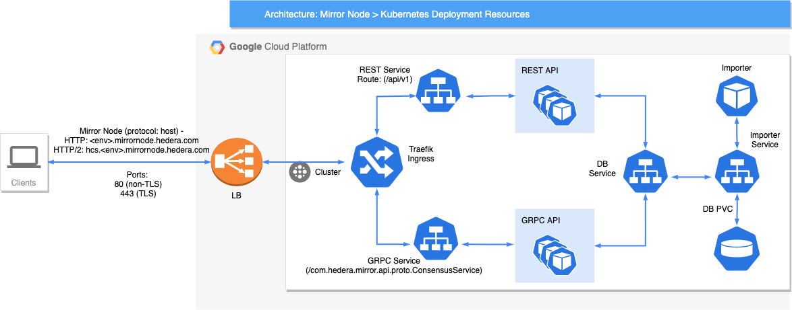

# Helm Chart

Installs the Hedera Mirror Node Helm wrapper chart. This chart will install the four mirror node components:

- [Hedera Mirror Importer](hedera-mirror-importer)
- [Hedera Mirror GRPC API](hedera-mirror-grpc)
- [Hedera Mirror Monitor](hedera-mirror-monitor)
- [Hedera Mirror REST API](hedera-mirror-rest)

## Requirements

- [Helm 3](https://helm.sh)
- [Kubernetes 1.17+](https://kubernetes.io)

Set environment variables that will be used for the remainder of the document:

```shell script
export RELEASE="mirror1"
```

## Install

To install the wrapper chart:

```shell script
$ helm repo add hedera https://hashgraph.github.io/hedera-mirror-node/charts
$ helm upgrade --install "${RELEASE}" charts/hedera-mirror
```

## Configure

### Scaling

At most one Importer pod can be run at time due to the potential to cause data inconsistencies. All other modules
support scaling up to more than one replica.

### PostgreSQL

In an effort to increase performance and reduce storage costs, the mirror node is switching to
[TimescaleDB](https://docs.timescale.com/latest/main) by default. To deploy the mirror node chart using PostgreSQL
instead of TimescaleDB:

```shell
$ helm upgrade --install "${RELEASE}" charts/hedera-mirror --set postgresql.enabled=true --set timescaledb.enabled=false
```

### Address Book

When running against a network other than a public network (demo/previewnet/testnet/mainnet), the network must be
updated with an initial address book file prior to deploying the chart.

1. First create the secret from the local address book file (`/Downloads/perf.bin` in this case):

```shell
$ kubectl create secret generic mirror-importer-addressbook --from-file=addressbook.bin=/Downloads/perf.bin
```

2. Then create a local values file (i.e. `custom.yaml`) to set the `network`, `initialAddressBook`, `volumes`,
   and `volumeMounts` properties:

```yaml
importer:
  config:
    hedera:
      mirror:
        importer:
          initialAddressBook: "/usr/etc/addressbook/addressbook.bin"
          network: "OTHER"
  volumeMounts:
    addressbook:
      mountPath: /usr/etc/addressbook
  volumes:
    addressbook:
      secret:
        defaultMode: 420
        secretName: mirror-importer-addressbook
```

> **_Note_** Ensure the configured `mountPath` matches the path in `initialAddressBook`

The secret data will be mounted as a file by the importer StatefulSet and placed at the `mountPath` location on the
importer filesystem. The `custom.yaml` should be referenced as a values file during chart deployment:

```shell
$ helm upgrade --install mirror charts/hedera-mirror -f charts/hedera-mirror/custom.yaml
```

### Production Environments
In non production environments, the mirror node chart uses the [Traefik subchart](https://github.com/traefik/traefik-helm-chart) to manage access to cluster services through an [Ingress](https://doc.traefik.io/traefik/providers/kubernetes-ingress/) and to route traffic through [Load Balancing](https://doc.traefik.io/traefik/routing/overview/).
The implemented configuration uses a [default self-signed certificate](https://doc.traefik.io/traefik/https/tls/#default-certificate) to secure traffic over the TLS protocol.

In production it is advised to use a CA signed certificate and an external load balancer to allow for more secure and intricate load balancing needs.
The following diagram illustrates a high level overview of the resources utilized in the recommended traffic flow.


#### GCP
When deploying in GCP, the following steps may be taken to use container-native load balancer through a [Standalone NEG](https://cloud.google.com/kubernetes-engine/docs/how-to/standalone-neg).


1. Create a Kubernetes cluster utilizing a custom subnet.

   This can be done by setting a unique name for the subnet in the UI or through the console with the following command
   ```shell script
   gcloud container clusters create mirrornode-lb \
       --enable-ip-alias \
       --create-subnetwork="" \
       --network=default \
       --zone=us-central1-a \
       --cluster-version=1.18.16-gke.502 \
       --machine-type=n1-standard-4
   ```

2. Configure the Traefik Subchart to use the external load balancer.

   The following default production setup configures the Standalone NEG.
   It exposes 2 ports (80 and 443) for http and TLS based traffic.

   Apply this config to your local values file (i.e. `custom.yaml`) for use in helm deployment.
   ```yaml
   traefik:
     service:
       annotations:
         # default load balancer is GCP container-native load balancer through standalone NEG. Modify for other cloud providers
         cloud.google.com/neg: '{
                "exposed_ports":{
                   "80":{"name": "<non_tls_neg_name>"},
                   "443":{"name": "<tls_neg_name>"}
                }
              }'
       spec:
         # externalTrafficPolicy cannot be set when service type is cluster
         externalTrafficPolicy:
       type: ClusterIP
   ```

    > **_Note:_** Ensure the NEG names are cluster unique to support shared NEGs across separate globally distributed clusters

   The annotation will ensure that a NEG is created for each name specified, with the endpoints pointing to the Traefik pod IPs in your cluster on the configured port.
   These ports should match the ports exposed by Traefik in the common chart `.Values.traefik.ports`.

3. Create a [Google Managed Certificate](https://cloud.google.com/load-balancing/docs/ssl-certificates/google-managed-certs) for use by the Load Balancer

4. Create an [External HTTPS load balancer](https://cloud.google.com/load-balancing/docs/https/ext-https-lb-simple) and create a Backend Service(s) that utilizes the automatically created NEGs pointing to the traffic pods.

## Testing

To verify the chart installation is successful, you can run the helm tests. These tests are not automatically executed
by helm on install/upgrade, they have to be executed manually:

```shell script
helm test "${RELEASE}"
```

## Using

All of the APIs and dashboards can be accessed via a single IP. To get the load balancer IP:

```shell script
  export SERVICE_IP=$(kubectl get service "${RELEASE}-traefik" -o jsonpath="{.status.loadBalancer.ingress[0].ip}")
```

To access the GRPC API (using [grpcurl](https://github.com/fullstorydev/grpcurl)):

```shell script
  grpcurl -plaintext ${SERVICE_IP}:80 list
```

To access the REST API:

```shell script
  curl -s "http://${SERVICE_IP}/api/v1/transactions?limit=1"
```

To view the Grafana dashboard:

```shell script
  open "http://${SERVICE_IP}/grafana"
```

## Uninstall

To remove all the Kubernetes components associated with the chart and delete the release:

```shell script
$ helm delete "${RELEASE}"
```

The above command does not delete any of the underlying persistent volumes. To delete all the data associated with this
release:

```shell script
$ kubectl delete $(kubectl get pvc -o name)
```

## Troubleshooting

To troubleshoot a pod, you can view its log and describe the pod to see its status. See the
[kubectl](https://kubernetes.io/docs/reference/kubectl/overview/) documentation for more commands.

```shell script
$ kubectl describe pod "${RELEASE}-importer-0"
$ kubectl logs -f --tail=100 "${RELEASE}-importer-0"
$ kubectl logs -f --prefix --tail=10 -l app.kubernetes.io/name=importer
```

To change application properties without restarting, you can create a
[ConfigMap](https://kubernetes.io/docs/tasks/configure-pod-container/configure-pod-configmap/#create-configmaps-from-files)
named `hedera-mirror-grpc` or `hedera-mirror-importer` and supply an `application.yaml` or `application.properties`.
Note that some properties that are used on startup will still require a restart.

```shell script
$ echo "logging.level.com.hedera.mirror.grpc=TRACE" > application.properties
$ kubectl create configmap hedera-mirror-grpc --from-file=application.properties
```

Dashboard, metrics and alerts can be viewed via [Grafana](https://grafana.com). See the [Using](#using) section for how
to connect to Grafana.

To connect to the database and run queries:

```shell script
$ kubectl exec -it "${RELEASE}-postgres-postgresql-0" -c postgresql -- psql -d mirror_node -U mirror_node
```

### Alerts

Prometheus AlertManager is used to monitor and alert for ongoing issues in the cluster. If an alert is received via a
notification mechanism like Slack or PagerDuty, it should contain enough details to know where to start the
investigation. Active alerts can be viewed via the `AlertManager` dashboard in Grafana that is exposed by the load
balancer. To see further details or to silence or suppress the alert it will need to be done via the AlertManager UI. To
access the AlertManager UI, expose it via kubectl:

```shell script
kubectl port-forward service/${RELEASE}-prometheus-alertmanager 9093:9093
```
