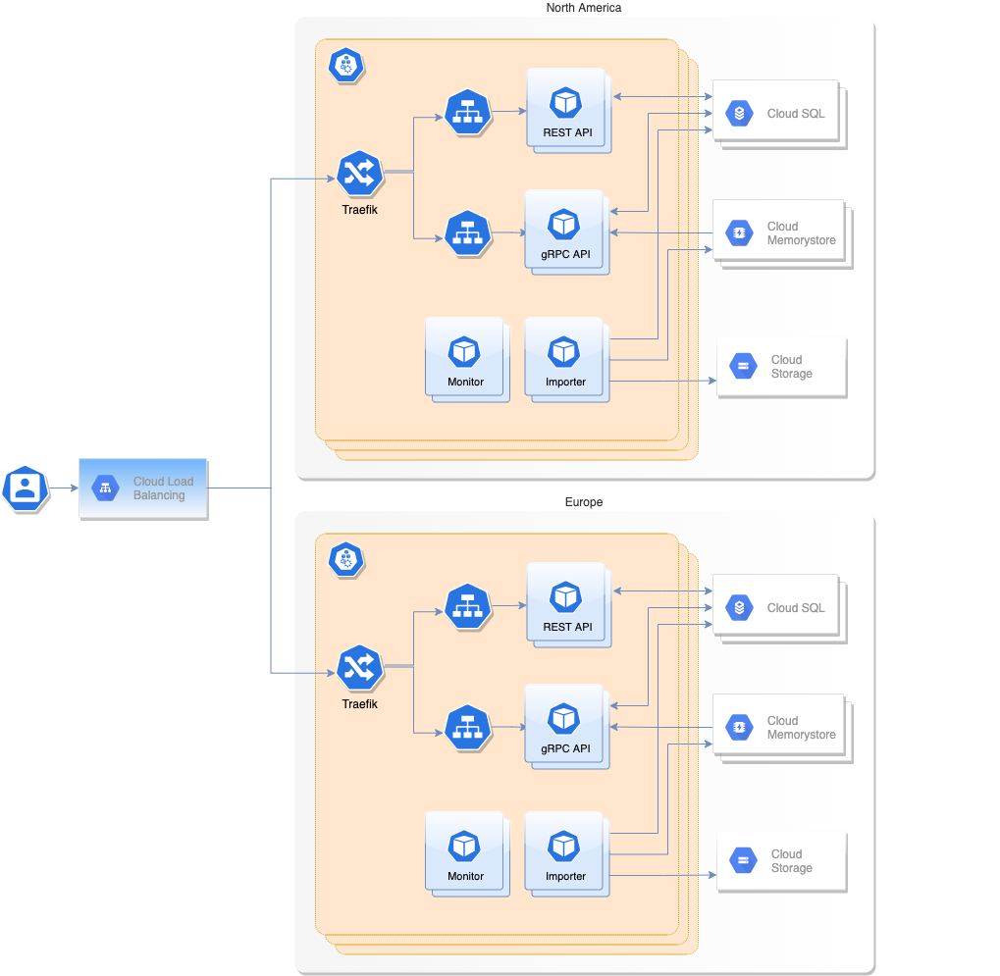

# Helm Chart

Installs the Hedera Mirror Node Helm wrapper chart. This chart will install the mirror node components:

- [Hedera Mirror GraphQL API](hedera-mirror-graphql)
- [Hedera Mirror GRPC API](hedera-mirror-grpc)
- [Hedera Mirror Importer](hedera-mirror-importer)
- [Hedera Mirror Monitor](hedera-mirror-monitor)
- [Hedera Mirror REST API](hedera-mirror-rest)
- [Hedera Mirror Rosetta API](hedera-mirror-rosetta)
- [Hedera Mirror Web3 API](hedera-mirror-web3)

## Requirements

- [Helm 3+](https://helm.sh)
- [Kubernetes 1.27+](https://kubernetes.io)

Set environment variables that will be used for the remainder of the document:

```shell script
export RELEASE="mirror1"
```

## Install

To install the wrapper chart:

```shell script
$ helm repo add hedera https://hashgraph.github.io/hedera-mirror-node/charts
$ helm upgrade --install "${RELEASE}" hedera/hedera-mirror
```

## Configure

### Passwords

This chart supports automatic generation of random passwords. On initial installation, a secure, random password for
each chart component will be generated and stored into a Kubernetes secret. During upgrades, Helm
will [lookup](https://helm.sh/docs/chart_template_guide/functions_and_pipelines/#using-the-lookup-function) the existing
secret and ensure the passwords stay the same between upgrades. You can retrieve the generated passwords in
the `mirror-passwords` Kubernetes secret. It's recommended to use [ksd](https://github.com/mfuentesg/ksd) to
automatically base64 decode secrets.

```shell
kubectl get password mirror-passwords -o yaml | ksd
```

### Non-Production Environments

When running against a network other than a public network (e.g., demo, previewnet, testnet, or mainnet), the network
must be updated with an initial address book file prior to deploying the chart.

1. First acquire the address book file and encode its contents to Base64:

```shell
$ base64 --input ~/addressbook.bin
```

2. Then populate the importer's `addressBook` property in the custom `values.yaml` with the Base64 output:

```yaml
importer:
  addressBook: CtYGGgUwLjAuN...
```

### Production Environments

The mirror node chart uses the [Traefik chart](https://github.com/traefik/traefik-helm-chart) to manage access to
cluster services through an [Ingress](https://doc.traefik.io/traefik/providers/kubernetes-ingress/) and
to [route](https://doc.traefik.io/traefik/routing/overview/) traffic through a load balancer. The implemented
configuration uses a default [self-signed certificate](https://doc.traefik.io/traefik/https/tls/#default-certificate) to
secure traffic over TLS.

In production, it is advised to use a certificate authority signed certificate, and an external load balancer to allow
for more secure and intricate load balancing needs. The following diagram illustrates a high level overview of the
resources utilized in the recommended traffic flow.



#### GCP

When deploying in GCP, the following steps may be taken to use a container-native load balancer through
a [Standalone NEG](https://cloud.google.com/kubernetes-engine/docs/how-to/standalone-neg).

1. Create a Kubernetes cluster utilizing a custom subnet.

   This can be done by setting a unique name for the subnet in the UI or through the console with the following command
   ```shell script
   gcloud container clusters create mirrornode-lb \
       --enable-ip-alias \
       --create-subnetwork="" \
       --network=default \
       --zone=us-central1-a \
       --cluster-version=1.21.5-gke.1802 \
       --machine-type=n1-standard-4
   ```

2. Configure Traefik to use the external load balancer.

   The following default production setup configures the Standalone NEG. It exposes port 443 for HTTPS based traffic.
   This load balancer is a GCP container-native load balancer through standalone NEG. Please modify for other cloud
   providers. Apply this config to your local values file (i.e. `custom.yaml`) for use in helm deployment:

   ```yaml
   traefik:
     service:
       annotations:
         cloud.google.com/neg: '{"exposed_ports": {"443": {"name": "<tls_neg_name>"}}}'
   ```

   > **_Note:_** Ensure the NEG names are cluster unique to support shared NEGs across separate globally distributed
   > clusters

   The annotation will ensure that a NEG is created for each name specified, with the endpoints pointing to the Traefik
   pod IPs in your cluster on the configured port. These ports should match the ports exposed by Traefik in the common
   chart `.Values.traefik.ports`.

3. Create
   a [Google Managed Certificate](https://cloud.google.com/load-balancing/docs/ssl-certificates/google-managed-certs)
   for use by the Load Balancer

4. Create an [External HTTPS load balancer](https://cloud.google.com/load-balancing/docs/https/ext-https-lb-simple) and
   create a Backend Service(s) that utilizes the automatically created NEGs pointing to the traffic pods.

## Testing

To verify the chart installation is successful, you can run the helm tests. These tests are not automatically executed
by helm on install/upgrade, they have to be executed manually. The tests require the `operatorId`,
and `operatorKey` properties be set in a local values file in order to execute, as well as `network` if using an
environment other than testnet, and `nodes` if using a custom environment.

To configure:

```yaml
test:
  config:
    hedera:
      mirror:
        test:
          acceptance:
            network:
            operatorId:
            operatorKey:
```

To execute:

```shell script
helm test "${RELEASE}" --timeout 10m
```

## Using

All the public APIs can be accessed via a single IP. First, get the load balancer IP address:

```shell script
export SERVICE_IP=$(kubectl get service "${RELEASE}-traefik" -o jsonpath="{.status.loadBalancer.ingress[0].ip}")
```

To access the GraphQL API:

```shell script
curl --location --request POST "http://${SERVICE_IP}/graphql/alpha" \
       --header 'Content-Type: application/json' \
       --data-raw '{"query":"{  account(input: {entityId: {shard: 0, realm: 0, num: 98}}) {alias autoRenewPeriod createdTimestamp declineReward createdTimestamp}}"}'
```

To access the GRPC API (using [grpcurl](https://github.com/fullstorydev/grpcurl)):

```shell script
grpcurl -plaintext ${SERVICE_IP}:80 list
```

To access the REST API:

```shell script
curl -s "http://${SERVICE_IP}/api/v1/transactions?limit=1"
```

To access the Rosetta API:

```shell script
curl -sL -d '{"metadata":{}}' "http://${SERVICE_IP}/network/list"
```

To access the Web3 API:

```shell script
curl -sL -H "Content-Type: application/json" -X POST -d '{"from": "0x0000000000000000000000000000000002edec80","to": "0x0000000000000000000000000000000002edec81","value": 500,"gas": 0,"gasPrice": 0}' "http://${SERVICE_IP}/api/v1/contracts/call"
```

To view the Grafana dashboard:

```shell
kubectl port-forward service/${RELEASE}-grafana 8080:80 &
open "http://localhost:8080"
```

To view the Stackgres UI:

```shell
kubectl get secret ${RELEASE}-restapi --template '{{ printf "%s / %s\n" (.data.k8sUsername | base64decode) (.data.clearPassword | base64decode) }}'
kubectl port-forward service/${RELEASE}-restapi 8443:443 &
open https://localhost:8443
```

## Uninstall

To remove all the Kubernetes components associated with the chart and delete the release:

```shell script
helm delete "${RELEASE}"
```

The above command does not delete any of the underlying persistent volumes. To delete all the data associated with this
release:

```shell script
kubectl delete $(kubectl get pvc -o name)
```

## Troubleshooting

To troubleshoot a pod, you can view its log and describe the pod to see its status. See the
[kubectl](https://kubernetes.io/docs/reference/kubectl/overview/) documentation for more commands.

```shell script
kubectl describe pod "${POD_NAME}"
kubectl logs -f --tail=100 "${POD_NAME}"
kubectl logs -f --prefix --tail=10 -l app.kubernetes.io/name=importer
```

To change application properties without restarting, you can create a
[ConfigMap](https://kubernetes.io/docs/tasks/configure-pod-container/configure-pod-configmap/#create-configmaps-from-files)
named `hedera-mirror-grpc` or `hedera-mirror-importer` and supply an `application.yaml` or `application.properties`.
Note that some properties that are used on startup will still require a restart.

```shell script
echo "logging.level.com.hedera.mirror.grpc=TRACE" > application.properties
kubectl create configmap hedera-mirror-grpc --from-file=application.properties
```

Dashboard, metrics and alerts can be viewed via [Grafana](https://grafana.com). See the [Using](#using) section for how
to connect to Grafana.

To connect to the database and run queries:

V1:

```shell script
kubectl exec -it "${RELEASE}-postgres-postgresql-0" -c postgresql -- psql -d mirror_node -U mirror_node
```

V2:

```shell
kubectl exec -it "${RELEASE}-citus-coord-0" -c postgres-util -- psql
```

A thread dump can be taken by sending a `QUIT` signal to the java process inside the container. The thread dump output
will be visible via container logs.

```shell
kubectl exec "${POD_NAME}" -- kill -QUIT 1
kubectl logs -f "${POD_NAME}"
```

### Alerts

Prometheus AlertManager is used to monitor and alert for ongoing issues in the cluster. If an alert is received via a
notification mechanism like Slack or PagerDuty, it should contain enough details to know where to start the
investigation. Active alerts can be viewed via the `AlertManager` dashboard in Grafana. To see further details or to
silence or suppress the alert it will need to be done via the AlertManager UI. To access the AlertManager UI, expose it
via kubectl:

```shell script
kubectl port-forward service/${RELEASE}-prometheus-alertmanager 9093:9093 &
open http://localhost:9093
```
