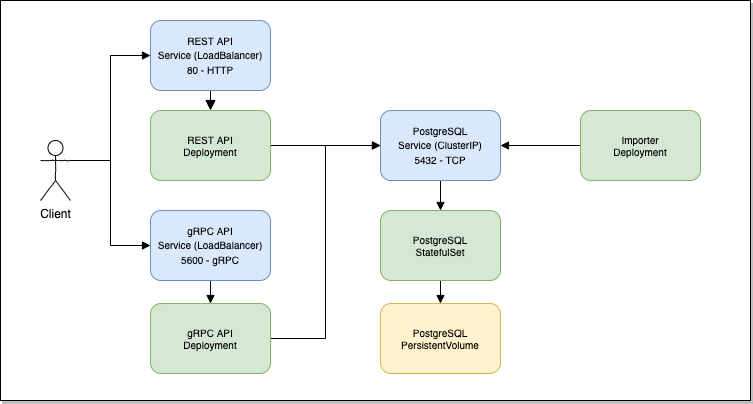

# Overview

Hedera Mirror Node receives and stores transactions generated by the [Hedera](https://hedera.com) network and exposes
them via gRPC and REST APIs. While mirror nodes receive information from the main nodes, they do not contribute to
consensus on the mainnet and their votes are not counted. Only the votes from the main nodes are counted for determining
consensus. The trust of Hedera mainnet is derived based on the the consensus reached by the mainnet nodes. That trust is
transferred to the mirror nodes using cryptographic signatures on a chain of records (account balances, events,
transactions, etc).

For more information, visit our [GitHub](https://github.com/hashgraph/hedera-mirror-node) project.

For one click deployment to Google Kubernetes Engine see our
[Google Cloud Platform Marketplace solution](https://console.cloud.google.com/marketplace/details/mirror-node-public/hedera-mirror-node)
.

For information on developing and testing the Marketplace solution, see [BUILDING.md](BUILDING.md).

## Architecture



The Hedera Mirror Node is composed of the following components:

### Importer

Receives data from the main nodes and persists it to the database. A Kubernetes
[Deployment](https://kubernetes.io/docs/concepts/workloads/controllers/deployment/) is used to manage the Importer
component. It does not currently support scaling to more than one replica.

### gRPC API

Serves the Hedera Consensus Service (HCS) streaming API. A Kubernetes
[Deployment](https://kubernetes.io/docs/concepts/workloads/controllers/deployment/) is used to manage the gRPC
component.
This API is exposed via a LoadBalancer Service on port 5600. It can be horizontally scaled by adjusting its replica
count.
See the gRPC API [documentation](https://docs.hedera.com/guides/docs/mirror-node-api/hedera-consensus-service-api-1)
for more information on how to invoke the API.

### REST API

Serves account, balance, topic message and transaction APIs. A Kubernetes
[Deployment](https://kubernetes.io/docs/concepts/workloads/controllers/deployment/) is used to manage the REST
component. This API is exposed via a LoadBalancer Service on port 80. It can be horizontally scaled by adjusting its
replica count. See the REST API [documentation](https://docs.hedera.com/guides/docs/mirror-node-api/cryptocurrency-api)
for more information on how to invoke the API.

### PostgreSQL

SQL database used to store the historical transaction data. The database is not exposed externally but you can connect
internally via port 5432. The current configuration does not currently support more than one replica. A
[PersistentVolume](https://kubernetes.io/docs/concepts/storage/persistent-volumes/) is associated with each Pod.

# Setup

## Command-line tools

You'll need the following tools in your development environment:

- [docker](https://docs.docker.com/install/)
- [git](https://git-scm.com/book/en/v2/Getting-Started-Installing-Git)
- [gcloud](https://cloud.google.com/sdk/gcloud/)
- [grpcurl](https://github.com/fullstorydev/grpcurl)
- [Helm 3](https://helm.sh/)
- [kubectl](https://kubernetes.io/docs/reference/kubectl/overview/)

> **NOTE:** We recommend using a `kubectl` version that is the same as the version of your cluster. Using the same
> version for `kubectl` and the cluster helps to avoid unforeseen issues.

## Set environment variables

Setup common environment variables that will be used for the remainder of the document:

```shell
export APP_NAME="mirror-1"
export CLUSTER="hedera-cluster"
export NAMESPACE="test"
export ZONE="us-central1-b"
```

## Create a Google Kubernetes Engine (GKE) cluster

Use `gcloud` to login to your Google account:

```shell
gcloud auth login
```

Create a new cluster from the command-line:

```shell
gcloud container clusters create "${CLUSTER}" --zone "${ZONE}"
```

Configure `kubectl` to connect to the new cluster:

```shell
gcloud container clusters get-credentials "${CLUSTER}" --zone "${ZONE}"
```

## Create Kubernetes namespace

If you use a different namespace than the `default`, run the command below to create a new namespace:

```shell
kubectl create namespace "${NAMESPACE}"
```

## Obtain the Helm chart

Clone this repository and checkout the latest stable tag:

```shell
git clone https://github.com/hashgraph/hedera-mirror-node.git
git checkout tags/v0.60.0 # Change version appropriately
```

## Install the Application resource definition

An Application resource is a collection of individual Kubernetes components, such as Services, StatefulSets, and so on,
that you can manage as a group.

To set up your cluster to understand Application resources, run the following command:

```shell
kubectl apply -f "https://raw.githubusercontent.com/GoogleCloudPlatform/marketplace-k8s-app-tools/master/crd/app-crd.yaml"
```

You only need to run this command once.

The Application resource is defined by the
[Kubernetes SIG-apps](https://github.com/kubernetes/community/tree/master/sig-apps)
community. You can find the source code at
[github.com/kubernetes-sigs/application](https://github.com/kubernetes-sigs/application).

# Installation

## Quick install with Google Cloud Marketplace

Get up and running with a few clicks! To install this app to a Google Kubernetes Engine cluster via Google Cloud
Marketplace, follow
these [on-screen instructions](https://console.cloud.google.com/marketplace/details/mirror-node-public/hedera-mirror-node)
.

## Command-line instructions

You can use [Google Cloud Shell](https://cloud.google.com/shell/) or a local workstation to follow the steps below.

[](https://console.cloud.google.com/cloudshell/editor?cloudshell_git_repo=https://github.com/hashgraph/hedera-mirror-node&cloudshell_open_in_editor=README.md&cloudshell_working_dir=charts/marketplace/gcp)

### Configure

Add the Hedera Mirror Node Helm chart repository:

```shell
helm repo add hedera https://hashgraph.github.io/hedera-mirror-node/charts
```

Optional: Use a function to generate the password for the components:

```shell
alias generate_password="cat /dev/urandom | LC_CTYPE=C tr -dc a-zA-Z0-9 | head -c 24"
```

Create a custom values.yaml that can be reused for both installs and upgrades:

```shell
cat <<EOF > custom-values.yaml
grpc:
  db:
    password: $(generate_password)
  rbac:
    enabled: true
  serviceAccount:
    create: true
importer:
  db:
    password: $(generate_password)
  rbac:
    enabled: true
  serviceAccount:
    create: true
postgresql:
  postgresql:
    password: $(generate_password)
    repmgrPassword: $(generate_password)
rest:
  db:
    password: $(generate_password)
  serviceAccount:
    create: true
EOF
```

Edit the `custom-values.yaml` with any other value you want to change. See the wrapper
chart's [values.yaml](/charts/hedera-mirror/values.yaml)
for additional configuration options. You can pass any application configuration option listed in
[docs/configuration.md](/docs/configuration.md) via `grpc.config`, `importer.config` and `rest.config`.

### Perform the install

Use `helm upgrade` to install and upgrade the application:

```shell
helm upgrade "${APP_NAME}" hedera/hedera-mirror \
  --namespace "${NAMESPACE}" \
  --install \
  -f charts/marketplace/gcp/values.yaml \
  -f custom-values.yaml
```

Wait for all pods to become ready before continuing.

### Verify the install

You can use Helm tests to automatically verify the installation was successful:

```shell
helm test "${APP_NAME}" --namespace "${NAMESPACE}"
```

# Basic Usage

## View the app in the Google Cloud Console

To get the Cloud Console URL for your app, run the following command:

```shell
echo "https://console.cloud.google.com/kubernetes/application/${ZONE}/${CLUSTER}/${NAMESPACE}/${APP_NAME}"
```

To view the app, open the URL in your browser.

## Access the gRPC API

Get the external IP of your mirror Node gRPC API using the following command:

```shell
GRPC_IP="$(kubectl get "service/${APP_NAME}-grpc" -n "${NAMESPACE}" -o jsonpath='{.status.loadBalancer.ingress[0].ip}')"
grpcurl -plaintext "${GRPC_IP}:5600" list
```

## Access the REST API

Get the external IP of your Mirror Node REST API using the following command:

```shell
REST_IP="$(kubectl get "service/${APP_NAME}-rest" -n "${NAMESPACE}" -o jsonpath='{.status.loadBalancer.ingress[0].ip}')"
curl -s "http://${REST_IP}/api/v1/transactions?limit=1"
```

## Access PostgreSQL

```shell
kubectl exec -it -n "${NAMESPACE}" "${APP_NAME}-postgres-postgresql-0" -c postgresql -- psql -d mirror_node -U postgres
```

# Backup and Restore

## Backup PostgreSQL

To backup PostgreSQL, you can use a similar technique with gcloud snapshots, or you can use pg_dumpall.
Replace the value of `PGPASSWORD` below with the password for the `postgres` superuser:

```shell script
kubectl exec -t -n "${NAMESPACE}" "${APP_NAME}-postgres-postgresql-0" -c postgresql -- \
  bash -c 'PGPASSWORD="password" pg_dumpall -c -l mirror_node -U postgres' > postgresql-backup.sql
```

> **Note:** You may want to scale the importer down before backing up the database so no writes are occurring

## Restore PostgreSQL

First ensure the components that write to the database like the importer are scaled down:

```shell
kubectl scale -n "${NAMESPACE}" --replicas=0 "statefulset/${APP_NAME}-importer"
```

Then use `psql` inside the container to restore. Replace `PGPASSWORD` below with the password for the `postgres`
superuser:

```shell
cat postgresql-backup.sql | \
  kubectl exec -it -n "${NAMESPACE}" "${APP_NAME}-postgres-postgresql-0" -c postgresql -- \
    bash -c 'PGPASSWORD="password" psql -U postgres'
```

Scale the importer back up

```shell
kubectl scale -n "${NAMESPACE}" --replicas=1 "statefulset/${APP_NAME}-importer"
```

# Upgrade

Obtain the version of the Helm chart you want to install by first changing to the directory
that contains the mirror node git repository then:

```shell
git checkout tags/v0.12.0 # Change version appropriately
```

The command to upgrade is the same to install. Make any necessary changes to the previously constructed
`custom-values.yaml` first, then run:

```shell
helm upgrade "${APP_NAME}" charts/hedera-mirror \
  --namespace "${NAMESPACE}" \
  --install \
  -f charts/marketplace/gcp/values.yaml \
  -f custom-values.yaml
```

## v0.27

The Marketplace solution update from v0.13 to v0.27+ includes many noteworthy improvements and changes.
Unfortunately, 2 such changes introduce breaking stateful set changes from the mirror node and postgres sub charts.
To ensure a smooth upgrade process:

1. Verify your importer is up to date on file processing by inspecting logs before beginning.
2. Delete the `${APP_NAME}-importer` and `${APP_NAME}-postgres` Stateful Set workloads.
3. Install the v0.27 solution

## v0.37

The Marketplace solution update from v0.27 to v0.37+ includes many noteworthy improvements and changes such as Scheduled
Transactions and NFT support. As part of these changes the importer db and rest db user names were modified
from `mirror_node` to `mirror_importer` and `mirror_api` to `mirror_rest` respectively. In the upgrade scenario these
values will need to be reverted by
a [Editing a Secret](https://kubernetes.io/docs/concepts/configuration/secret/#editing-a-secret).

To ensure a smooth upgrade process:

1. Verify your importer is up to date on file processing by inspecting logs before beginning.
2. Delete the `${APP_NAME}-importer` Stateful Set workload.
3. Install the v0.37 solution
4. Scale down the Importer Deployment resource
    ```shell
    kubectl scale deployment "${APP_NAME}-importer" --replicas=0
    ```
4. Scale down the REST API Deployment resource
    ```shell
    kubectl scale deployment "${APP_NAME}-rest" --replicas=0
    ```
5. Modify the `mirror-passwords` Kubernetes Secret resource
    ```shell
    kubectl edit secrets mirror-passwords
    ```
6. Set the `HEDERA_MIRROR_IMPORTER_DB_USERNAME` value to `bWlycm9yX25vZGU=` (the base64 encoded value of the
   default `mirror_node` value)
7. Set the `HEDERA_MIRROR_IMPORTER_DB_RESTUSERNAME` value to `bWlycm9yX2FwaQ==` (the base64 encoded value of the
   default `mirror_api` value)
8. Scale up the Importer Deployment resource
    ```shell
    kubectl scale deployment "${APP_NAME}-importer" --replicas=1
    ```
9. Scale up the REST API Deployment resource
    ```shell
    kubectl scale deployment "${APP_NAME}-rest" --replicas=1
    ```
10. Post importer and rest operation confirmation, delete the leftover `data-${APP_NAME}-importer-0` persistent volume
    claim (Importer is no longer stateful)
    ```shell
    kubectl delete pvc "data-${APP_NAME}-importer-0"
    ```

# Scaling

Scaling the Importer or PostgreSQL components is not currently supported. The gRPC and REST APIs support horizontal
scaling by setting their corresponding replica count property. To adjust their replicas:

```shell
helm upgrade "${APP_NAME}" charts/hedera-mirror \
  --namespace "${NAMESPACE}" \
  --install \
  --reuse-values \
  --set grpc.replicas=3 \
  --set rest.replicas=10
```

# Uninstall

## Using the Google Cloud Console

1. In the Cloud Console, open [Kubernetes Applications](https://console.cloud.google.com/kubernetes/application).

2. Navigate to the Applications page for the list of apps, choose your app installation.

3. Select ${APP_NAME}, click **Delete**.

4. Navigate to the Configuration page for the list of configurations.

5. Select the `leaders` Config Map, click **Delete**.

6. Navigate to the Storage page for the list of storage resources.

7. Select the `data-<NAMESPACE>-postgres-postgresql-0` Persistent Volume Claim, click **Delete**.

## Using the command-line

### Delete the application

Delete the Kubernetes resources using Helm:

```shell
helm delete "${APP_NAME}" --namespace "${NAMESPACE}"
```

### Delete the data

By design, removing StatefulSets in Kubernetes does not remove any PersistentVolumeClaims that were attached to their
Pods. This prevents your installations from accidentally deleting stateful data.

To remove the PersistentVolumeClaims with their attached persistent disks, run the following command:

```shell
kubectl delete persistentvolumeclaims --namespace "${NAMESPACE}" --selector "app.kubernetes.io/instance=${APP_NAME}"
```
