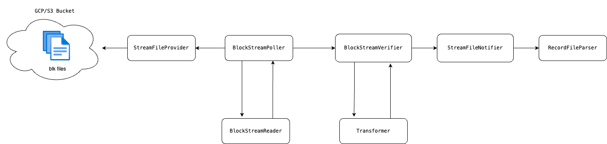

# HIP-1056 Block Streams

## Purpose

[HIP-1056](https://hips.hedera.com/hip/hip-1056) introduces a new output data format for consensus nodes, called block streams, that replaces the existing
record streams and signature files with one single stream. Support for block streams in the Mirror Node will be split
into two phases. This design document concerns the first phase which will transform the block streams into the existing
record stream format and parse the transformed record streams just as we do today. The second phase (to be detailed in a
separate design document) will remove the block to record transformation and parse the block streams directly and additionally
transform record streams into block streams to allow the mirror node to continue to ingest all record streams from the past.

## Goals

- Ingest block stream files downloaded from an S3/GCP bucket and transform them into record stream files.

## Non-Goals

- Refactoring the importer to support block streams natively and the removal of record stream parsing.
- Support for Block Nodes will be covered in a separate design document.

## Architecture

### Data Flow



## Domain

### Interfaces and Classes

#### BlockItem

```java
package com.hedera.mirror.common.domain.transaction;

// Multiple protobuf BlockItems will be combined into a single BlockItem
public record BlockItem(Transaction transaction,
                        TransactionResult transactionResult,
                        List<TransactionOutput> transactionOutput, // Note: List may be empty
                        List<StateChanges> stateChanges // Note: List may be empty
) implements StreamItem {}
```

#### BlockFile

```java
package com.hedera.mirror.common.domain.transaction;

public class BlockFile implements StreamFile<BlockItem> {
}
```

## Importer

Update the handling of the topic message `runningHashVersion`:

- Change TopicMessage.runningHashVersion from `int` to `Integer` to allow for null values.
- Update `ConsensusSubmitMessageTransactionHandler` to account for block streams no longer sending the runningHashVersion value:
  - If the TransactionReceipt runningHashVersion is 3 (the current value) set the runningHashVersion to null.
  - If the TransactionReceipt runningHashVersion is not 3 set the runningHashVersion to that value.
- The `ConsensusSubmitMessageTransformer`, when transforming a block item to a record item, will set the topic message receipt runningHashVersion to 3.

### Interfaces and Classes

#### BlockFileReader

```java
package com.hedera.mirror.importer.reader.block;

public interface BlockFileReader extends StreamFileReader<BlockFile, BlockItem> {
}
```

#### ProtoBlockFileReader

```java
package com.hedera.mirror.importer.reader.block;

public class ProtoBlockFileReader implements BlockFileReader {
    // Generates a BlockFile from a StreamFileData.
    // Converts the protobuf BlockItems into mirror node BlockItems.
    // Protobuf BlockItems that do not represent a transaction will be filtered out here.
    // Note that a protobuf BlockFile with no transactions will still produce a mirror node BlockFile and persist that block to the database.
    public BlockFile read(StreamFileData streamFileData);
}
```

#### StreamFileTransformer

```java
package com.hedera.mirror.importer.downloader;

public interface StreamFileTransformer<T extends StreamFile<?>, S extends StreamFile<?>> {
    // Used for transforming a block file into a record file in phase one and for transforming a record file into a block file in phase two.
    T transform(S s);
}
```

#### BlockFileTransformer

```java
package com.hedera.mirror.importer.downloader.block;

public class BlockFileTransformer implements StreamFileTransformer<RecordFile, BlockFile> {

    /**
     *   Transforms the block file into a record file. The transformation uses a mapping of block fields to record file
     *   fields. Block items are only iterated once in the transform method.
     */
    @Override
    public RecordFile transform(BlockFile block);
}
```

#### StreamPoller

```java
package com.hedera.mirror.importer.downloader;

public interface StreamPoller<StreamFile> {
    void poll();
}
```

#### BlockStreamPoller

```java
package com.hedera.mirror.importer.downloader.block;

public class BlockStreamPoller extends StreamPoller<BlockFile> {
    private final BlockFileReader blockFileReader;
    private final BlockStreamVerifier blockStreamVerifier;
    private final StreamFileProvider streamFileProvider;

    /**
     * Polls and downloads block stream files from an S3/GCP bucket
     * Uses the previous block number to derive the name of the next block file to download and should not use any bucket file list operations
     * Uses streamFileProvider to download the block file
     * Passes block files on to the blockStreamVerifier
     *
     * Also of note is that block file names are left padded:
     *    000000000000000000000000000000000001.blk.gz
     *
     * So we will want an efficient means of incrementing the block number
     */
    @Scheduled
    public void poll();
}
```

#### BlockStreamVerifier

```java
package com.hedera.mirror.importer.downloader.block;

public class BlockStreamVerifier {
    private final StreamFileTransformer<RecordFile, BlockFile> blockFileTransformer;
    private final RecordFileParser recordFileParser;
    private final StreamFileNotifier streamFileNotifier;

    /**
     * Verifies the block file, transforms it into a record file, and then notifies the parser
     */
    public void verify(@NotNull BlockFile blockFile);

    /**
     * Verifies the block number of the block file
     * - that the block number is one after the previous block number if exists
     * - that the block number from the file name matches the block number in the block
     */
    private void verifyBlockNumber(BlockFile blockFile);

    /**
     * The previous hash from the block must match the hash of the previous block
     */
    private void verifyHashChain(BlockFile blockFile);
}
```

### Database

- Add `software_version` to the `record_file` table. This is the consensus node version that generated the block.
- Add `round_start`, `round_end` to the `record_file` table, these come from the block.
- Add a migration that sets the `software_version` to the hapi version to populate those fields for previous records. The `software_version` is always the `hapi_version` for records prior to the introduction of block streams. Also add `software_version` to the existing RecordFileReaders at the same time.
- Update the `topic_message` table to allow for a null `running_hash_version`.
- Rename `record_file` to `block`. This will be a low priority task near the end of implementing phase one, as it requires a large number of changes.

```sql
alter table if exists record_file
    add column if not exists software_version_major        int          null,
    add column if not exists software_version_minor        int          null,
    add column if not exists software_version_patch        int          null,
    add column if not exists round_start                   bigint       null,
    add column if not exists round_end                     bigint       null;

alter table if exists topic_message
    alter column running_hash_version drop not null;
```

### Block to Record File Transformation

Blocks are composed of block items. A record item may be transformed from a set of multiple block items.
Beginning from an `EventTransaction` block item, a record item is composed of one `TransactionResult` block item, zero to N `TransactionOutput` block items and zero to one `StateChange` block items.


## Block protobuf to mirror node database mapping

### Record File

| Database           | Block Item                                                                                                                                       |
| ------------------ | ------------------------------------------------------------------------------------------------------------------------------------------------ |
| bytes              | raw bytes that comprise the blk file                                                                                                             |
| consensus_start    | block_header.first_transaction_consensus_time                                                                                                    |
| consensus_end      | consensus_timestamp of last transaction_output or transaction_result in the blk file. If block is empty, set to first_transaction_consensus_time |
| count              | Sum of the EventTransaction typed block items in the blk file                                                                                    |
| digest_algorithm   | block_header.hash_algorithm. Currently SHA2_384                                                                                                  |
| gas_used           | Sum of the gas_used of all block items of type 'transaction_output'                                                                              |
| hapi_version_major | block_header.hapi_proto_version.major                                                                                                            |
| hapi_version_minor | block_header.hapi_proto_version.minor                                                                                                            |
| hapi_version_patch | block_header.hapi_proto_version.patch                                                                                                            |
| hash               | Generated by the new mirror node class `BlockFileTransformer`. This calculated value must match the next block's previous_block_hash             |
| index              | block_header.number                                                                                                                              |
| load_start         | System.currentTimeMillis() at beginning of parsing                                                                                               |
| load_end           | System.currentTimeMillis() at end of parsing                                                                                                     |
| logs_bloom         | Aggregate calculated by mirror node                                                                                                              |
| name               | Name of the blk file                                                                                                                             |
| node_id            |                                                                                                                                                  |
| prev_hash          | block_header.previous_block_hash                                                                                                                 |
| sidecar_count      | Set to 0 as sidecar data is being integrated into the block                                                                                      |
| size               | byte size of the blk file                                                                                                                        |
| version            | Set to 7                                                                                                                                         |

### Contract Create Transaction

| Database                                      | Block Item                                                                                  |
| --------------------------------------------- | ------------------------------------------------------------------------------------------- |
| contract.id                                   | transaction_output.contract_create.bytecode.contract_id                                     |
| contract.initcode                             | transaction_output.contract_create.bytecode.initcode                                        |
| contract.runtime_bytecode                     | transaction_output.contract_create.bytecode.runtime_bytecode                                |
| contract_action.call_depth                    | transaction_output.contract_create.contract_actions.call_depth                              |
| contract_action.call_operation_type           | transaction_output.contract_create.contract_actions.call_operation_type                     |
| contract_action.call_type                     | transaction_output.contract_create.contract_actions.call_type                               |
| contract_action.caller                        | transaction_output.contract_create.contract_actions.caller                                  |
| contract_action.caller_type                   | transaction_output.contract_create.contract_actions.caller_case                             |
| contract_action.consensus_timestamp           | transaction_result.consensus_timestamp                                                      |
| contract_action.gas                           | transaction_output.contract_create.contract_actions[j].gas                                  |
| contract_action.gas_used                      | transaction_output.contract_create.contract_actions[j].gas_used                             |
| contract_action.index                         | Index j of transaction_output.contract_create.contract_actions[j]                           |
| contract_action.input                         | transaction_output.contract_create.contract_actions.input                                   |
| contract_action.recipient_account             | transaction_output.contract_create.contract_actions[j].recipient_account                    |
| contract_action.recipient_address             | transaction_output.contract_create.contract_actions[j].targeted_address                     |
| contract_action.recipient_contract            | transaction_output.contract_create.contract_actions[j].recipient_contract                   |
| contract_action.result_data                   | transaction_output.contract_create.contract_actions[j].result_data                          |
| contract_action.result_data_type              | transaction_output.contract_create.contract_actions[j].result_data_case                     |
| contract_action.value                         | transaction_output.contract_create.contract_actions[j].value                                |
| contract_log.bloom                            | transaction_output.contract_create.contract_function_result.log_info[i].bloom               |
| contract_log.consensus_timestamp              | transaction_result.consensus_timestamp                                                      |
| contract_log.contract_id                      | transaction_output.contract_create.contract_function_result.log_info[i].contract_id         |
| contract_log.data                             | transaction_output.contract_create.contract_function_result.log_info[i].data                |
| contract_log.index                            | Index i of transaction_output.contract_create.contract_function_result.log_info[i]          |
| contract_log.root_contract_id                 | transaction_output.contract_create.contract_function_result.contractID                      |
| contract_log.topic0                           | transaction_output.contract_create.contract_function_result.log_info[i].topic[0]            |
| contract_log.topic1                           | transaction_output.contract_create.contract_function_result.log_info[i].topic[1]            |
| contract_log.topic2                           | transaction_output.contract_create.contract_function_result.log_info[i].topic[2]            |
| contract_log.topic3                           | transaction_output.contract_create.contract_function_result.log_info[i].topic[3]            |
| contract_log.transaction_hash                 |                                                                                             |
| contract_log.transaction_index                |                                                                                             |
| contract_result.amount                        | transaction_output.contract_create.contract_function_result.amount                          |
| contract_result.bloom                         | transaction_output.contract_create.contract_function_result.bloom                           |
| contract_result.call_result                   | transaction_output.contract_create.contract_function_result.contract_call_result            |
| contract_result.consensus_timestamp           | transaction_result.consensus_timestamp                                                      |
| contract_result.contract_id                   | transaction_output.contract_create.contract_function_result.contractID                      |
| contract_result.created_contract_ids          | transaction_output.contract_create.contract_function_result.created_contract_ids            |
| contract_result.error_message                 | transaction_output.contract_create.contract_function_result.error_message                   |
| contract_result.failed_initcode               | transaction_output.contract_create.bytecode.initcode                                        |
| contract_result.function_parameters           | transaction_output.contract_create.contract_function_result.function_parameters             |
| contract_result.function_result               | transaction_output.contract_create.contract_function_result                                 |
| contract_result.gas_consumed                  | Calculated by mirror node                                                                   |
| contract_result.gas_limit                     | transaction_output.contract_create.contract_function_result.gas                             |
| contract_result.gas_used                      | transaction_output.contract_create.contract_function_result.gas_used                        |
| contract_result.sender_id                     | transaction_output.contract_create.contract_function_result.sender_id                       |
| contract_result.transaction_hash              |                                                                                             |
| contract_result.transaction_index             |                                                                                             |
| contract_result.transaction_nonce             | transaction_output.contract_create.contract_function_result.contract_nonces[i].nonce        |
| contract_result.transaction_result            |                                                                                             |
| constract_state.contract_id                   | transaction_output.contract_create.state_changes[j].contract_state_changes[k].contract_id   |
| constract_state.created_timestamp             |                                                                                             |
| constract_state.modified_timestamp            | transaction_output.contract_create.consensus_timestamp                                      |
| constract_state.slot                          | transaction_output.contract_create.state_changes[j].contract_state_changes[k].slot          |
| constract_state.value                         | transaction_output.contract_create.state_changes[j].contract_state_changes[k].value_written |
| contract_state_change.consensus_timestamp     | transaction_output.contract_create.consensus_timestamp                                      |
| contract_state_change.contract_id             | transaction_output.contract_create.state_changes[j].contract_state_changes[k].contract_id   |
| contract_state_change.migration               | transaction_output.contract_create.migration                                                |
| contract_state_change.slot                    | transaction_output.contract_create.state_changes[j].contract_state_changes[k].slot          |
| contract_state_change.value_read              | transaction_output.contract_create.state_changes[j].contract_state_changes[k].value_read    |
| contract_state_change.value_written           | transaction_output.contract_create.state_changes[j].contract_state_changes[k].value_written |
| contract_transaction_hash.consensus_timestamp |                                                                                             |
| contract_transaction_hash.hash                |                                                                                             |
| contract_transaction_hash.entity_id           |                                                                                             |
| contract_transaction_hash.transaction_result  |                                                                                             |
| entity.alias                                  | state_changes[i].state_change.map_update.value.account_value.alias                          |
| entity.auto_renew_account_id                  | state_changes[i].state_change.map_update.value.account_value.auto_renew_account_id          |
| entity.auto_renew_period                      | state_changes[i].state_change.map_update.value.account_value.auto_renew_seconds             |
| entity.balance                                | state_changes[i].state_change.map_update.value.account_value.tinybar_balance                |
| entity.balance_timestamp                      | state_changes.consensus_timestamp                                                           |
| entity.created_timestamp                      |                                                                                             |
| entity.decline_reward                         | state_changes[i].state_change.map_update.value.account_value.decline_reward                 |
| entity.deleted                                | state_changes[i].state_change.map_delete.key.accountId                                      |
| entity.ethereum_nonce                         | state_changes[i].state_change.map_update.value.account_value.ethereum_nonce                 |
| entity.evm_address                            | transaction_output.contract_create.contract_function_result.evm_address                     |
| entity.expiration_timestamp                   | state_changes[i].state_change.map_update.value.account_value.expiration_second              |
| entity.id                                     | state_changes[i].state_change.map_update.value.account_id_value                             |
| entity.key                                    | state_changes[i].state_change.map_update.value.account_value.key                            |
| entity.max_automatic_token_associations       | state_changes[i].state_change.map_update.value.account_value.max_auto_associations          |
| entity.memo                                   | state_changes[i].state_change.map_update.value.account_value.memo                           |
| entity.num                                    | state_changes[i].state_change.map_update.value.account_id_value.accountNum                  |
| entity.proxy_account_id                       |                                                                                             |
| entity.public_key                             |                                                                                             |
| entity.realm                                  | state_changes[i].state_change.map_update.value.account_id_value.realmNum                    |
| entity.receiver_sig_required                  | state_changes[i].state_change.map_update.value.account_value.receiver_sig_required          |
| entity.shard                                  | state_changes[i].state_change.map_update.value.account_id_value.shardNum                    |
| entity.staked_account_id                      | state_changes[i].state_change.map_update.value.account_value.staked_account_id              |
| entity.staked_node_id                         | state_changes[i].state_change.map_update.value.account_value.staked_node_id                 |
| entity.stake_period_start                     | state_changes[i].state_change.map_update.value.account_value.stake_period_start             |
| entity.submit_key                             | state_changes[i].state_change.map_update.value.account_value.submit_key                     |
| entity.type                                   | state_changes[i].state_change.map_update.value: hasAccountValue/hasTokenValue               |

### Contract Call Transaction

| Database                                | Block Item                                                                                                          |
| --------------------------------------- | ------------------------------------------------------------------------------------------------------------------- |
| contract.id                             | state_changes[i].state_change.map_update.value.account_value -Note: This is the contract id from TransactionReceipt |
| Updates to contract_action              | Similar to contract create, accessed at transaction_output.contract_call.contract_actions                           |
| Updates to contract_log/contract_result | Similar to contract create, accessed at transaction_output.contract_call.contract_function_result                   |

### CryptoCreate Transaction

| Database           | Block Item                                                         |
| ------------------ | ------------------------------------------------------------------ |
| entity.id          | state_changes[i].state_change.map_update.value.account_id_value    |
| entity.evm_address | state_changes[i].state_change.map_update.value.account_value.alias |

### CryptoTransfer Transaction

| Database                                        | Block Item                                                                                       |
| ----------------------------------------------- | ------------------------------------------------------------------------------------------------ |
| assessed_custom_fee.amount                      | transaction_output.crypto_transfer.assessedCustomFees[i].amount                                  |
| assessed_custom_fee.collector_account_id        | transaction_output.crypto_transfer.assessedCustomFees[i].feeCollectorAccountId                   |
| assessed_custom_fee.consensus_timestamp         | transaction_result.consensus_timestamp                                                           |
| assessed_custom_fee.effective_payer_account_ids | transaction_output.crypto_transfer.assessedCustomFees[i].effectivePayerAccountId                 |
| assessed_custom_fee.token_id                    | transaction_output.crypto_transfer.assessedCustomFees[i].tokenId                                 |
| token_account.account_id                        | transaction_output.crypto_transfer.automatic_token_associations[i].accountId                     |
| token_account.token_id                          | transaction_output.crypto_transfer.automatic_token_associations[i].tokenId                       |
| token_transfer.account_id                       | transaction_output.crypto_transfer.token_transfer_lists[i].transfers[j].accountAmount.accountID  |
| token_transfer.amount                           | transaction_output.crypto_transfer.token_transfer_lists[i].transfers[j].accountAmount.amount     |
| token_transfer.consensus_timestamp              | transaction_result.consensus_timestamp                                                           |
| token_transfer.is_approval                      | transaction_output.crypto_transfer.token_transfer_lists[i].transfers[j].accountAmount.isApproval |
| token_transfer.token_id                         | transaction_output.crypto_transfer.token_transfer_lists[i].token.tokenID                         |

### CryptoUpdate Transaction

| Database  | Block Item                                                      |
| --------- | --------------------------------------------------------------- |
| entity.id | state_changes[i].state_change.map_update.value.account_id_value |

### Ethereum Transaction

| Database                  | Block Item                                                      |
| ------------------------- | --------------------------------------------------------------- |
| ethereum_transaction.hash | transaction_output.ethereum.ethereum_hash                       |
| entity.id                 | transaction_output.ethereum.contract_function_result.contractId |

### File Create/Update

| Database                      | Block Item                                             |
| ----------------------------- | ------------------------------------------------------ |
| file_data.consensus_timestamp | transaction_result.consensus_timestamp                 |
| file_data.entity_id           | state_changes[i].state_change.map_update.key.fileIdKey |

### Node Create Transaction

| Database     | Block Item                                                     |
| ------------ | -------------------------------------------------------------- |
| node.node_id | state_changes[i].state_change.map_update.key.entity_number_key |

### Schedule Create Transaction

| Database    | Block Item                                                 |
| ----------- | ---------------------------------------------------------- |
| schedule.id | state_changes[i].state_change.map_update.key.scheduleIdKey |

### Schedule Sign Transaction

| Database  | Block Item                                                |
| --------- | --------------------------------------------------------- |
| entity.id | transaction_output.schedule_sign.scheduled_transaction_id |

### Token Airdrop

| Database                           | Block Item                                                                                        |
| ---------------------------------- | ------------------------------------------------------------------------------------------------- |
| token_airdrop.amount               | state_changes[i].state_change.map_update.value.accountPendingAirdropValue.pendingAirdropValue     |
| token_airdrop.receiver_account_id  | state_changes[i].state_change.map_update.key.receiverId                                           |
| token_airdrop.sender_account_id    | state_changes[i].state_change.map_update.key.senderId                                             |
| token_airdrop.serial_number        | state_changes[i].state_change.map_update.key.tokenReference.non_fungible_token.nftId.serialNumber |
| token_airdrop.token_id (fungible)  | state_changes[i].state_change.map_update.key.tokenReference.fungible_token_type                   |
| token_airdrop.token_id (nft)       | state_changes[i].state_change.map_update.key.tokenReference.non_fungible_token.nftId.tokenId      |
| assessed_custom_fee                | Similar to crypto_transfer, retrieved from transaction_output.token_airdrop                       |
| token_account.account_id           | transaction_output.token_airdrop.automatic_token_associations[i].accountId                        |
| token_account.token_id             | transaction_output.token_airdrop.automatic_token_associations[i].tokenId                          |
| token_transfer.account_id          | transaction_output.token_airdrop.token_transfer_lists[i].transfers[j].accountAmount.accountID     |
| token_transfer.amount              | transaction_output.token_airdrop.token_transfer_lists[i].transfers[j].accountAmount.amount        |
| token_transfer.consensus_timestamp | transaction_result.consensus_timestamp                                                            |
| token_transfer.is_approval         | transaction_output.token_airdrop.token_transfer_lists[i].transfers[j].accountAmount.isApproval    |
| token_transfer.token_id            | transaction_output.token_airdrop.token_transfer_lists[i].token.tokenID                            |

### Token Create Transaction

| Database  | Block Item                                              |
| --------- | ------------------------------------------------------- |
| entity.id | state_changes[i].state_change.map_update.key.tokenIdKey |

### Token Mint Transaction

| Database            | Block Item                                                           |
| ------------------- | -------------------------------------------------------------------- |
| token.serial_number | state_changes[i].state_change.map_update.key.nft_id_key.serialNumber |

### Token Update Transaction

| Database                 | Block Item                                                                   |
| ------------------------ | ---------------------------------------------------------------------------- |
| token_account.account_id | state_changes[i].state_change.map_update.value.token_value.treasuryAccountId |
| token_account.token_id   | state_changes[i].state_change.map_update.key.tokenIdKey                      |

### Token Wipe Transaction

| Database           | Block Item                                                                                             |
| ------------------ | ------------------------------------------------------------------------------------------------------ |
| token.total_supply | Existing supply minus the sum of state_changes[i].state_change.map_delete.key.nft_id_key.serial_number |

### Topic Create Transaction

| Database                          | Block Item                                                    |
| --------------------------------- | ------------------------------------------------------------- |
| topic_message.consensus_timestamp | state_changes.consensus_timestamp                             |
| topic_message.running_hash        | state_changes[i].state_change.map_update.value.runningHash    |
| topic_message.sequence_number     | state_changes[i].state_change.map_update.value.sequenceNumber |
| topic_message.topic_id            | state_changes[i].state_change.map_update.value.topicId        |

### Topic Delete Transaction

| Database       | Block Item                                             |
| -------------- | ------------------------------------------------------ |
| entity.id      | state_changes[i].state_change.map_update.value.topicId |
| entity.deleted | state_changes[i].state_change.map_delete.key.topicId   |

### Topic Submit Message

| Database                           | Block Item                                                                                                                                                    |
| ---------------------------------- | ------------------------------------------------------------------------------------------------------------------------------------------------------------- |
| topic_message.consensus_timestamp  | state_changes.consensus_timestamp                                                                                                                             |
| topic_message.running_hash         | state_changes[i].state_change.map_update.value.runningHash                                                                                                    |
| topic_message.running_hash_version | Map this value to the current value of 3. This value is no longer submitted by the block stream: This is a fixed value that is only updated with a HIP change |
| topic_message.sequence_number      | state_changes[i].state_change.map_update.value.sequenceNumber                                                                                                 |

### Transaction

| Database                               | Block Item                                              |
| -------------------------------------- | ------------------------------------------------------- |
| transaction.consensus_timestamp        | transaction_result.consensus_timestamp                  |
| transaction.nft_transfer               | transaction_result.token_transfer_list[i].nft_transfers |
| transaction.parent_consensus_timestamp | transaction_result.parent_consensus_timestamp           |
| transaction.result                     | transaction_result.status                               |
| transaction.scheduled                  | transaction_result.hasScheduleRef                       |

### UtilPrng Transaction

| Database            | Block Item                                       |
| ------------------- | ------------------------------------------------ |
| consensus_timestamp | transaction_result.consensus_timestamp           |
| prng_bytes          | transaction_output.util_prng.entropy.prng_bytes  |
| prng_number         | transaction_output.util_prng.entropy.prng_number |

## REST API

- Deprecate the REST API's State Proof Alpha. The record files and signature files will no longer be provided in the cloud buckets.

## Testing

- Add a BlockFile to RecordFile comparer class to the importer along with a configuration option to ingest both record and block files together and to compare the transformed record file to the corresponding record file and to log differences. This configuration can be run in test environments.
- Add block file to record file transform metrics to the Grafana dashboard.
- Add a performance test for the Performance environment that ingests block files instead of record files.
- Add `BlockFileBuilder` and `BlockItemBuilder` domain classes.
- Add downloader tests for block files similar to the existing downloader tests for record files in `com.hedera.mirror.importer.downloader.record`.

### BlockFileTransformer tests

- Add tests that verify that a record file generated from the `BlockFileTransformer` is equivalent to a non-transformed record file for each of the transaction types. The test constructs the block and passes it to the block to `BlockFileTransformer` and then compares the resulting record file to the original record file. For each transaction type also verify that the `BlockFileTransformer` calculated transaction hash matches the record file transaction hash.
  - ConsensusCreateTopic
  - ConsensusDeleteTopic
  - ConsensusSubmitMessage
  - ConsensusUpdateTopic
  - ContractCall
  - ContractCreate
  - ContractDelete
  - ContractUpdate
  - CryptoAddLiveHash
  - CryptoApproveAllowance
  - CryptoCreate
  - CryptoDelete
  - CryptoDeleteAllowance
  - CryptoDeleteLiveHash
  - CryptoTransfer
  - CryptoUpdate
  - EthereumTransaction
  - FileAppend
  - FileCreate
  - FileDelete
  - FileUpdate
  - Freeze
  - NodeCreate
  - NodeDelete
  - NodeUpdate
  - NodeStakeUpdate
  - ScheduleCreate
  - ScheduleDelete
  - ScheduleSign
  - SystemDelete
  - SystemUndelete
  - TokenAirdrop
  - TokenAssociate
  - TokenBurn
  - TokenCancelAirdrop
  - TokenClaimAirdrop
  - TokenCreate
  - TokenDelete
  - TokenDisassociate
  - TokenFeeScheduleUpdate
  - TokenFreeze
  - TokenGrantKyc
  - TokenMint
  - TokenPause
  - TokenReject
  - TokenRevokeKyc
  - TokenUnFreeze
  - TokenUpdate
  - TokenUpdateNfts
  - TokenUnPause
  - TokenWipe
  - UncheckedSubmit
  - Unknown
  - UtilPrng
- Add a test that verifies that a block with a wrapped record file is transformed to a record that is identical to a normal record file. The test constructs a block with a wrapped record file and passes it to the `BlockFileTransformer` and then compares the resulting record file to the original non-wrapped record file.
- Add a test that verifies that a block with no transactions is transformed to a record with no transactions. The test constructs a block with no transactions and passes it to the `BlockFileTransformer` and then compares the resulting record file to the original record file.

### BlockStreamVerifier tests

- Add a test that verifies the record stream hash chain with a series of blocks with wrapped record files.
- Add a test that verifies that a `HashMismatchException` is thrown with wrapped record files with a mismatched hash.
- Add a test with a block file that has a block number that does not match the block number in the file name. This test should verify that the `BlockStreamVerifier` throws an exception.
- Add a test that verifies the block number in the block file name matches the block number in the block file.
- Add a test that verifies that the `previousBlockHash` of block N matches the block hash of block N-1, and a test that verifies that a `HashMismatchException` is thrown when they do not match.

## Open Issues

- [ ] Details about TSS Signature block verification are a work in progress.
- [ ] Q: Shall we gather the Token Transfer Lists from State Changes? TokenAirdropOutput and CryptoTransferOutput have Token Transfer Lists, but Token Transfer Lists may also be represented in State Changes. We may need to gather the transfers from State Changes if the Token Transfer Lists are removed from the transaction outputs and the TransactionResult.
- [ ] `EventTransaction` is slated to be removed in favor of using `Transaction`. This will require changes to the `BlockFileTransformer`.
