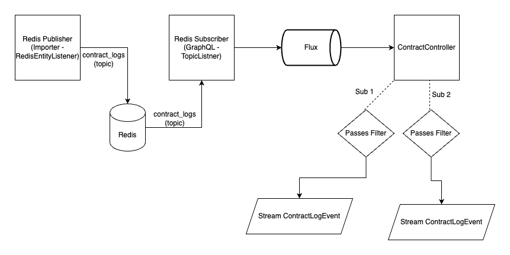

# GraphQL Contract Log Subscription

## Purpose

Provide a GraphQL equivalent of the Ethereum
JSON-RPC [eth_subscribe](https://docs.infura.io/infura/networks/ethereum/json-rpc-methods/subscription-methods/eth_subscribe)
in order to provide contract log notifications in almost real time.

## Goals

- Stream contract log notifications via a GraphQL subscription
- Ensure at most once delivery. Will drop messages on backpressure overflow

## Non-Goals

- Will not query historical logs

## Non-Functional Requirements

- Need to ensure resource consumption is within reasonable bounds (reasonable bounds TBD via experimentation)
- Ensure performance is within reasonable bounds (reasonable bounds TBD via experimentation)

## Architecture



### Importer

1. Update RedisEntityListener (or create new listener) to send contract logs to contract_logs topic
 - Populate the ContractLogEvent for topic message submission
 - Messages will be serialized via RedisSerializer using msgpack

### GraphQL

- Use reactive websockets
- We should implement rate limiting in the load balancer
- Use AtomicLong to track active subscriptions
- Uses msgpack for topic message serialization

1. Create GraphQL schema for Input / Output
2. Create ContractLogEvent Mapper
3. Create Controller with @SubscriptionMapping
4. Create RedisConfiguration to configure msgpack serializer
5. Create a Redis Subscriber to listen for messages on contract_logs topic
6. Capture metrics (Some of these may already be provided by Redis or GraphQL)
 - subscriber consumption rate
 - Active subscriptions counter
 - Messages received (From redis topic) rate

#### GraphQL Schema

```graphql

"Represents a Hedera Contract Log event"
type ContractLogEvent {
  "The address from which this log originated in the account-num alias format"
  address: String!

  "The hash of the block in which the transaction was included"
  blockHash: String!

  "The number of the block in which the transaction was included"
  blockNumber: Int64!

  "The contract entity id"
  contractId: EntityId!

  "Contains one or more 32 Bytes non-indexed arguments of the log"
  data: String!

  "The index or position of the log entry within the block"
  logIndex: Int64!

  """
  An array of 0 to 4 32 bytes topic hashes of indexed log arguments.
  """
  topics: [String!]!

  "The hash of the transaction (first 32-byte of the 48-byte HAPI transaction hash)"
  transactionHash: String!

  "The index or position of the transaction within the block"
  transactionIndex: Int64!
}

"Represents addresses and topics a subscriber wishes to subscribe to"
input ContractLogSubscription {
  "Only logs created from one of these EVM addresses will be emitted."
  addresses: [String!] @Pattern(regexp: "^(0x)?[a-fA-F0-9]{40}$")

  """
  Topic specifier for position 0. An empty array indicates any value is allowed for this position.
  [A,B] indicates a log will be emitted when either A or B is in that position
  """
  topic0: [String!] @Pattern(regexp: "^(0x)?[a-fA-F0-9]{64}$")

  """
  Topic specifier for position 1. An empty array indicates any value is allowed for this position.
  [A,B] indicates a log will be emitted when either A or B is in that position
  """
  topic1: [String!] @Pattern(regexp: "^(0x)?[a-fA-F0-9]{64}$")

  """
  Topic specifier for position 0. An empty array indicates any value is allowed for this position.
  [A,B] indicates a log will be emitted when either A or B is in that position
  """
  topic2: [String!] @Pattern(regexp: "^(0x)?[a-fA-F0-9]{64}$")

  """
  Topic specifier for position 0. An empty array indicates any value is allowed for this position.
  [A,B] indicates a log will be emitted when either A or B is in that position
  """
  topic3: [String!] @Pattern(regexp: "^(0x)?[a-fA-F0-9]{64}$")
}

"Subscription root of the Hedera GraphQL API"
type Subscription {
  contractLogs(subscription: ContractLogSubscription!): ContractLogEvent
}
```

#### Class Defs

```java
public class ContractController {
  /**
   * Use ContractLogTopicListener to begin streaming data to client
   * */
  @SubscriptionMapping
  public Publisher<ContractLogEvent> contractLogs(@Argument @Valid ContractLogSubscription subscription);
}

@Service
public class ContractLogTopicListener {
  private final Flux<ContractLogEvent> contractLogs;

  /**
   * Verifies can subscribe and returns error response if not
   * Uses shared lazy subscription to contractLogs
   * On backpressure overflow, drop messages
   * Filter events via addresses and/or topics param
   * calls unsubscribe on termination.
   * */
  public Flux<ContractLogEvent> listen(ContractLogSubscription subscription) {
  }

  /**
   * Filters messages by addresses and topics
   * */
  private boolean filterMessage(ContractLogEvent contractLogEvent, ContractLogSubscription subscription) {
  }

  /**
   * Checks subscriber count is less than maxActiveSubscriptions
   * contract with evm address in filter exists
   * we detect if this address input is account-num alias or evm address
   * alias and query the entity table for the latter to map it to its account-num alias.
   * */
  private boolean canSubscribe(ContractLogSubscription subscription) {
  }

  /**
   * Remove entry from cached listeners
   * Decrement subscription count
   */
  private void unsubscribe() {
  }

}
```

#### application.yml

```yaml
hedera:
  mirror:
    graphql:
      listener:
        contractLog:
          maxActiveSubscriptions: 10
          maxBufferSize: 16384
          keepAlive: 1m

```

#### Example Request Body

Addresses and topics are both optional filters

```graphql
{
  contractLogs(subscription: {
    addresses: ["EVM_ADDRESS_ALIAS OR ACCOUNT_NUM_ALIAS"],
    topics: [
      "ARRAY_OF_CONTRACT_TOPIC_IDS"
    ]
  }) {
    address
    blockHash
    blockNumber
    data
    logIndex
    topics
    transactionHash
    transactionIndex
  }
}
```

#### Example Event Response

```json
{
  "data": {
    "address": "0x000000000000000000000000000000000000000f",
    "blockHash": "0x61cdb2a09ab99abf791d474f20c2ea89bf8de2923a2d42bb49944c8c993cbf04",
    "blockNumber": 1000,
    "data": "0x00000000000000000000000000000000000000000000000000000000000000010000000000000000000000000000000000000000000000000000000000000003",
    "logIndex": 0,
    "topics": [
      "0xd78a0cb8bb633d06981248b816e7bd33c2a35a6089241d099fa519e361cab902"
    ],
    "transactionHash": "0xe044554a0a55067caafd07f8020ab9f2af60bdfe337e395ecd84b4877a3d1ab4",
    "transactionIndex": 0
  }
}
```

#### Event Response DB Mapping

| Response Field   | Source Field                                                                         |
|------------------|--------------------------------------------------------------------------------------|
| address          | account_num alias for contract entity                                                |
| blockHash        | record_file.hash                                                                     |
| blockNumber      | record_file.index                                                                    |
| data             | contract_log.data                                                                    |
| logIndex         | contract_log.index                                                                   |
| topics           | [contract_log.topic0, contract_log.topic1, contract_log.topic2, contract_log.topic3] |
| transactionHash  | contract_log.transaction_hash                                                        |
| transactionIndex | contract_log.transaction_index                                                       |


