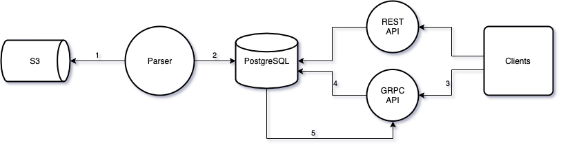
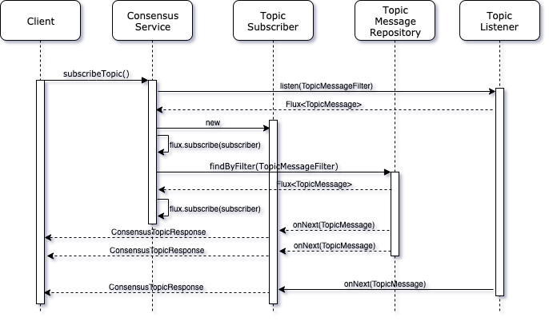

# Hedera Consensus Service Design

## Purpose

The Hedera Consensus Service (HCS) provides decentralized consensus on the validity and order of messages submitted to a
topic on the network and transparency into the history of these events over time. Since the Hedera mainnet does not
store history, the persistence and retrieval of these messages needs to be handled by the Mirror Node. This document
attempts to design a scalable solution to provide such functionality.

## Goals

- Ingest HCS related transactions from the mainnet and persist to the database
- Provide a streaming GRPC API to subscribe to HCS topics
- Persist a subset of entities or transaction types due to the potential increase in the volume of data caused by HCS
- Provide a listener interface so third parties can add custom code to be notified of validated transactions
- Make the Mirror Node easier for users to run to enable wider adoption by the community

## Non-Goals

These items are not currently in scope at this time in order to deliver a MVP, but can be revisited later as the need
arises:

- Provide a HCS REST API
- Provide a HCS WebSocket or Server Sent Events API
- Provide a non-HCS GRPC API
- Provide a "relay" service to publish to other downstream systems
- Provide higher level functionality like encryption, fragmentation or reassembly
- Gossip based Mirror Node

## Architecture



1. Downloader retrieves transactions from S3 and validates them
2. Parser persists to PostgreSQL
3. Client queries GRPC API for messages from a specific topic
4. GRPC API retrieves the current messages from PostgreSQL and returns to client
5. GRPC API is notified of new messages via PostgreSQL Notify

### Alternatives

- Replace step #5 above with the GRPC layer polling for new data
- Replace step #5 above with a message broker that parser publishes to and GRPC API consumes

## GRPC API

### Setup

- Create a new Maven module `mirror-protobuf`
- Create a new Maven module `mirror-grpc`
- Use [reactive-grpc](https://github.com/salesforce/reactive-grpc/tree/master/reactor) to compile the protobuf and
  provide service stubs
- Use `spring-boot-starter-data-r2dbc` and `io.r2dbc:r2dbc-postgresql` for reactive database access and asynchronous
  pg_notify support
- Create a Systemd unit file `mirror-grpc.sevice`
- Add to CI and deployment script

### Protobuf

```proto
message ConsensusTopicQuery {
  .proto.TopicID topicID = 1; // A required topic ID to retrieve messages for.
  .proto.Timestamp consensusStartTime = 2; // Include messages which reached consensus on or after this time. Defaults to current time if not set.
  .proto.Timestamp consensusEndTime = 3; // Include messages which reached consensus before this time. If not set it will receive indefinitely.
  uint64 limit = 4; // The maximum number of messages to receive before stopping. If not set or set to zero it will return messages indefinitely.
}

message ConsensusTopicResponse {
  .proto.Timestamp consensusTimestamp = 1; // The time at which the transaction reached consensus
  bytes message = 2; // The message body originally in the ConsensusSubmitMessageTransactionBody. Message size will be less than 6KiB.
  bytes runningHash = 3; // The running hash (SHA384) of every message.
  uint64 sequenceNumber = 4; // Starts at 1 for first submitted message. Incremented on each submitted message.
}

service ConsensusService {
  rpc subscribeTopic (ConsensusTopicQuery) returns (stream ConsensusTopicResponse);
}
```

### Consensus Service



> _Note:_ A [Flux](https://projectreactor.io/docs/core/release/reference/#flux) is a reactive publisher that emits an
> asynchronous sequence of 0..N items.

#### Domain/Repository

Implement a `TopicMesage` domain class and a `TopicMessageRepository`:

```java
public interface TopicMessageRepository extends ReactiveCrudRepository<TopicMessage, Long>, TopicMessageRepositoryCustom {
}
```

Implement a custom repository method that uses
R2DBC's [Fluent Data Access API](https://docs.spring.io/spring-data/r2dbc/docs/1.0.x/reference/html/#r2dbc.datbaseclient.fluent-api)
to build a dynamic query based upon the filter:

```java
public class TopicMessageRepositoryCustomImpl implements TopicMessageRepositoryCustom {
  public Flux<TopicMessage> findByFilter(TopicMessageFilter filter) {
    ...
  }
}
```

#### Topic Message Service

```java
public interface TopicMessageService {
  Flux<TopicMessage> subscribeTopic(TopicMessageFilter filter);
}
```

- Implement a `TopicMessageServiceImpl` to provide a reusable service layer for different transport protocols:
- Perform `topicMessageRepository.findByFilter(filter)`
- If the database goes down, `TopicMessageService` should continue retrying to connect
- If the listener misses any messages, `TopicMessageService` should manually query for them before continuing

#### GRPC Service

```java
public class ConsensusServiceGrpc extends ReactorConsensusServiceGrpc.ConsensusServiceImplBase {
  public Flux<ConsensusTopicResponse> subscribeTopic(Mono<ConsensusTopicQuery> consensusTopicQuery) {
      ...
  }
}
```

- Validate input
- Map `ConsensusTopicQuery` to `TopicMessageFilter`
- Perform `topicMessageService.subscribeTopic(filter)`
- Map `TopicMessage` to `ConsensusTopicResponse`

#### Topic Listener

```java
public interface TopicListener {
  Flux<TopicMessage> listen(TopicMessageFilter filter);
}
```

- Provide the ability to stream new topic messages from the database and notify open GRPC streams of new data:
- Implement a `TopicListener` that uses R2DBC's notify/listen support
- Register `TopicMessageService` with `TopicListener` to receive notifications of topic messages, filtering and
  buffering appropriately until current query finishes

## Parser

### Persist

Modify `RecordFileLogger` to handle HCS transactions

- Modify Entities to handle Topic ID and new fields
- Insert HCS transaction into `t_transactions`
- Insert `ConsensusSubmitMessage` transactions into `topic_message`

### Filter

Provide the ability to filter transactions before persisting via configuration:

- Add a new option `hedera.mirror.importer.parser.include`
- Add a new option `hedera.mirror.importer.parser.exclude` with higher priority than includes
- The structure of both will be a list of transaction filters and get turned into a single Predicate at runtime:

```yaml
include:
  - transaction: [ ConsensusCreateTopic, ConsensusDeleteTopic, ConsensusUpdateTopic, ConsensusSubmitMessage ]
    entity: [ 0.0.1001 ]
```

- Remove options `hedera.mirror.importer.parser.record.persist*` and convert defaults to newer format

### Notify

Provide the ability to notify components of new transactions:

```java
public interface TransactionListener {
  void onTransaction(TransactionEvent event);
}

@Value
public class TransactionEvent {
  private final Transaction transaction;
  private final TransactionRecord record;
}
```

- Rework `RecordFileLogger` to implement `TransactionListener`
- Decouple `RecordFileParser` and `RecordFileLogger` so that `RecordFileParser` invokes `TransactionListener`

## Database

- Add new `t_entity_types` row with name `topic`
- Add new columns to `t_entities`:
  - `submit_key bytea`
  - `auto_renew_account_id bigint`
- Add new `t_transaction_types`:
  - `CONSENSUSCREATETOPIC=24`
  - `CONSENSUSUPDATETOPIC=25`
  - `CONSENSUSDELETETOPIC=26`
  - `CONSENSUSSUBMITMESSAGE=27`
- Add new `t_transaction_result`:
  - `INVALID_TOPIC_ID = 150`
  - `INVALID_ADMIN_KEY = 155`
  - `INVALID_SUBMIT_KEY = 156`
  - `UNAUTHORIZED = 157`
  - `INVALID_TOPIC_MESSAGE = 158`
  - `INVALID_AUTORENEW_ACCOUNT = 159`
  - `AUTORENEW_ACCOUNT_NOT_ALLOWED = 160`
  - `TOPIC_EXPIRED = 162`
- Add new table `topic_message`:

```postgres-sql
create table if not exists topic_message (
  consensus_timestamp nanos_timestamp primary key not null,
  message bytea not null,
  realm_num entity_realm_num not null,
  running_hash bytea not null,
  sequence_number bigint not null,
  topic_num entity_num not null
);

create index if not exists topic_message_realm_num_timestamp
on topic_message (realm_num, topic_num, consensus_timestamp);
```

- Create a trigger that calls a new function on every insert of topic_message, serializes it to JSON and calls pg_notify
  - Alternative would be dynamically create trigger for each GRPC call, but deleting trigger would be racy and duplicate
    traffic for same topic
- Implement a retention period for `topic_message` using a Java `@Scheduled` thread and a config
  property `hedera.mirror.importer.parser.retention` of type `java.time.Duration`

## Non-Functional Requirements

See GitHub issue [374](https://github.com/hashgraph/hedera-mirror-node/issues/374)

## Open Questions

1. Will `pg_notify` be able to handle the scale of data and clients required? See [Alternatives](#alternatives) section
2. How will we optimize for multiple clients requesting the same topic ID?
