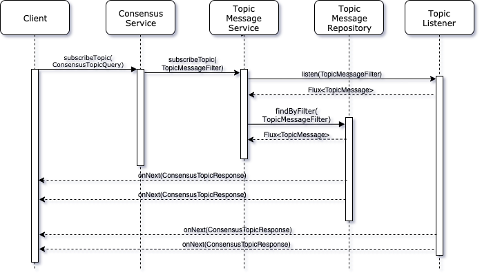

# Hedera Consensus Service Design

## Purpose

The Hedera Consensus Service (HCS) provides decentralized consensus on the validity and order of messages submitted to
a topic on the network and transparency into the history of these events over time. Since the Hedera mainnet does
not store history, the persistence and retrieval of these messages needs to be handled by the Mirror Node. This document
attempts to design a scalable solution to provide such functionality.

## Goals

- Ingest HCS related transactions from the mainnet and persist to the database
- Provide a streaming GRPC API to subscribe to HCS topics
- Provide a listener interface so third parties can add custom code to be notified of validated transactions
- Persist a subset of entities or transaction types

## Non-Goals

These items are not currently in scope at this time, but can be revisited later as the need arises:

- Provide a HCS REST API
- Provide a HCS WebSocket API
- Provide a non-HCS GRPC API
- Provide a "relay" service to publish to other downstream systems
- Provide higher level functionality like encryption, fragmentation or reassembly
- Gossip based Mirror Node

## Solution


Overall flow:
1. Downloader retrieves transactions from S3 and validates them
2. Parser persists to PostgreSQL
3. Client queries GRPC API for messages from a specific topic
4. GRPC API retrieves the current messages from PostgreSQL and returns to client
5. GRPC API is notified of new `ConsensusSubmitMessage` transactions via PostgreSQL Notify

### GRPC API

```proto
message ConsensusTopicQuery {
    .proto.TopicID topicID = 1; // A required topic ID to retrieve messages for.
    .proto.Timestamp startTime = 2; // Include messages which reached consensus on or after this time. Defaults to current time if not set.
    .proto.Timestamp endTime = 3; // Include messages which reached consensus before this time. If not set it will receive indefinitely.
    uint32 limit = 4; // The maximum number of messages to receive before stopping. If not set or set to zero it will return messages indefinitely.
}

message ConsensusTopicResponse {
    .proto.Timestamp consensusTimestamp = 1; // The time at which the transaction reach consensus
    bytes message = 2; // The message body originally in the ConsensusSubmitMessageTransactionBody
    uint64 sequenceNumber = 3; // Starts at 1 for first submitted message. Incremented on each submitted message.
}

service ConsensusService {
    rpc subscribeTopic (ConsensusTopicQuery) returns (stream ConsensusTopicResponse);
}
```



Steps:
- Create a new Maven sub-project `mirror-grpc`
- Use `com.github.os72:protoc-jar-maven-plugin` for protoc
- Use `net.devh:grpc-spring-boot-starter` to manage GRPC component lifecycle
- Use `io.r2dbc:r2dbc-postgresql` for reactive database access and asynchronous pg_notify support
- Implement a `ConsensusService`
- Register with `TopicListener` to receive notifications of topic messages, filtering and buffering appropriately until
current query finishes
- Map `ConsensusTopicQuery` to `TopicMessageFilter`
- Implement a `interface TopicMessageRepository extends ReactiveCrudRepository`
- Implement a `Flux<TopicMessage> TopicMessageRepository.findByFilter(TopicMessageFilter topicMessageFilter)` custom
method that uses R2DBC's Fluent Data Access API to build a dynamic query based upon the filter.
- Map `TopicMessage` to `ConsensusTopicResponse`

### Parser

- Modify `RecordFileLogger` to handle consensus transactions
- Add [configuration](#configuration) options to filter transaction
- Provide a `TransactionListener.notify(Transaction, Record)` interface to be notified of incoming transactions (if
more parameters are need, wrap in an immutable event)
- Rework `RecordFileLogger` to implement `TransactionListener`
- Decouple `RecordFileParser` and `RecordFileLogger` so that `RecordFileParser` invokes `TransactionListener`

### Database

- Add new `t_entity_types` row with name `topic`
- Add new column `submit_key` to t_entities
- Add new `t_transaction_types`:
  - `CONSENSUSCREATETOPIC=24`
  - `CONSENSUSUPDATETOPIC=25`
  - `CONSENSUSDELETETOPIC=26`
  - `CONSENSUSSUBMITMESSAGE=27`
- Add new `t_transaction_result`:
  - `INVALID_TOPIC_ID = 150`
  - `TOPIC_DELETED = 151`
  - `MESSAGE_TOO_LONG = 152`
  - `TOPIC_NOT_ENABLED = 153`
  - `INVALID_TOPIC_VALID_START_TIME = 154`
  - `INVALID_TOPIC_EXPIRATION_TIME = 155`
  - `INVALID_TOPIC_ADMIN_KEY = 156`
  - `INVALID_TOPIC_SUBMIT_KEY = 157`
  - `UNAUTHORIZED = 158`
  - `INVALID_TOPIC_MESSAGE = 159`
- Add new table consensus_topic
```postgres-sql
create table if not exists topic_message (
  consensus_timestamp bigint primary key not null,
  message bytea not null,
  running_hash bytea not null,
  sequence_number bigint not null,
  topic_entity_id bigint not null references t_entities (id) on delete cascade on update cascade
);

create index if not exists topic_message_entity_id_timestamp
on topic_message (topic_entity_id, consensus_timestamp);
```
- Create a trigger that calls a new function on every insert of topic_message, serializes it to JSON and calls pg_notify
- Alternative would be dynamically create trigger for each GRPC call, but deleting trigger would be difficult and duplicate traffic for same topic

### Configuration

- Add a new option `hedera.mirror.parser.include`
- Add a new option `hedera.mirror.parser.exclude` with higher priority than includes
- The structure of both include and exclude would be a list of transaction filters and get turned into a single Predicate
at runtime:
```yaml
include/exclude:
  - transaction: [ConsensusCreateTopic, ConsensusDeleteTopic, ConsensusUpdateTopic, ConsensusSubmitMessage]
    entity: [0.0.1001]
```
- Remove options `hedera.mirror.parser.record.persist*` and convert defaults to newer format
