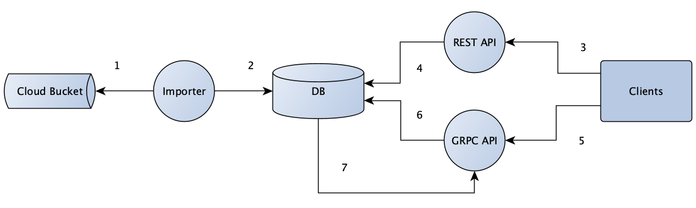

# Hedera Token Service Design

## Purpose

The Hedera Token Service (HTS) builds upon the Cryptocurrency Service to provide decentralized issuance of custom tokens on the Hedera Network.
The behavior will be similar to that of the native HBAR token and as such the Mirror Node will persist token balances and transfer lists and support the retrieval of information through the API's.

This document highlights the architecture and design changes to be made on top of v0.19.0 code to support HTS.
Changes should be applied in order of
1.  Database Schema Updates
2.  Importer Updates for Ingestion
3.  Existing REST API Updates
4.  Additional Token REST API additions
5.  Protobuf updates to TokenService
6.  GRPC Token Service

## Goals
-   Ingest HTS related transactions from record streams from the mainnet and persist information to the database
-   Ingest token balances from balances streams from the mainnet and persist to the database
-   Expose token balance of accounts in existing REST APIs that show balance
-   Provide a HTS REST API to return all tokens (Token Discovery)
-   Provide a HTS REST API to return all accounts holding a specific token (Token Supply Distribution)
-   Provide a streaming GRPC API to subscribe to HTS transfers for an account

## Non Goals
-   Provide a streaming GRPC API to subscribe to HTS transfers for all accounts and or all tokens

## Architecture



1. Downloader retrieves transactions and balances (HBAR & Tokens) from stream files in cloud bucket and validates them
2. Parser persists to database
3. Client queries balance or token APIs for details
4. REST API retrieves token details and balances from database
5. Client subscribes to GRPC API for token transfers
6. GRPC API retrieves token transfers from database and returns to client
7. GRPC API is notified of new token transfers via database streaming logic

## Alternatives

## Database
To support the goals the following schema changes should be made
1. `t_entities` and ` t_entity_types` need to be update to represent new TOKEN entity
2. New `token_balance` table is added to persist token only balances
3. New `token` table is added to capture token specific entity items
4. `crypto_transfer` table should be updated to persist token transfers and also distinguish between HBAR and other token transfers
5. Update transaction types and results to handle token transactions from network.

### Crypto Transfer
-   Add columns to `crypto_transfer` table. Symbol can be pulled from a `TransactionReceipt#tokenId` of transaction
```sql
    alter table if exists crypto_transfer
        add column token_id entity_id
        add column symbol   character varying(96) not null;
```
-   Add migration logic to insert default "HBAR" for `symbol` column in `crypto_transfer` for historic data

### Token Balance
-   Create `token_balance` table to distinctly capture token balances vs HBAR balances

```sql
    create table if not exists token_balance
        consensus_timestamp bigint      primary key not null,
        symbol              character   varying(96),
        token_id            entity_id   not null,
        balance             bigint;
```

### Entity Types
-   Add new `t_entity_types` row with name `token`
```sql
    insert into t_entity_types (id, name) values (5, 'token');
```

### Transaction Types
-   Add new `t_transaction_types`:
```sql
    insert into t_transaction_types (proto_id, name) values
        (56, 'TOKENCREATE'),
        (57, 'TOKENTRANSACT'),
        (58, 'TOKENGETINFO'),
        (59, 'TOKENFREEZEACCOUNT'),
        (60, 'TOKENUNFREEZEACCOUNT'),
        (61, 'TOKENGRANTKYCTOACCOUNT'),
        (62, 'TOKENREVOKEKYCFROMACCOUNT'),
        (63, 'TOKENDELETE'),
        (64, 'TOKENUPDATE'),
        (65, 'TOKENMINT'),
        (66, 'TOKENBURN'),
        (67, 'TOKENACCOUNTWIPE');
```

### Transaction Results
-   Add new `t_transaction_result`:
```sql
    insert into t_transaction_results (proto_id, result) values
        (165, 'ACCOUNT_FROZEN_FOR_TOKEN'),
        (166, 'TOKENS_PER_ACCOUNT_LIMIT_EXCEEDED'),
        (167, 'INVALID_TOKEN_ID'),
        (168, 'INVALID_TOKEN_DIVISIBILITY'),
        (169, 'INVALID_TOKEN_FLOAT'),
        (170, 'INVALID_TREASURY_ACCOUNT_FOR_TOKEN'),
        (171, 'INVALID_TOKEN_SYMBOL'),
        (172, 'TOKEN_HAS_NO_FREEZE_KEY'),
        (173, 'TRANSFERS_NOT_ZERO_SUM_FOR_TOKEN'),
        (174, 'MISSING_TOKEN_SYMBOL'),
        (175, 'TOKEN_SYMBOL_TOO_LONG'),
        (176, 'TOKEN_SYMBOL_ALREADY_IN_USE'),
        (177, 'INVALID_TOKEN_REF'),
        (178, 'ACCOUNT_KYC_NOT_GRANTED_FOR_TOKEN'),
        (179, 'TOKEN_HAS_NO_KYC_KEY'),
        (180, 'INSUFFICIENT_TOKEN_BALANCE'),
        (181, 'TOKEN_WAS_DELETED'),
        (182, 'TOKEN_HAS_NO_SUPPLY_KEY'),
        (183, 'TOKEN_HAS_NO_WIPE_KEY'),
        (184, 'INVALID_TOKEN_MINT_AMOUNT'),
        (185, 'INVALID_TOKEN_BURN_AMOUNT'),
        (186, 'ACCOUNT_HAS_NO_TOKEN_RELATIONSHIP')
        (187, 'CANNOT_WIPE_TOKEN_TREASURY_ACCOUNT')
        (188, 'INVALID_KYC_KEY')
        (189, 'INVALID_WIPE_KEY')
        (190, 'INVALID_FREEZE_KEY')
        (191, 'INVALID_SUPPLY_KEY')
        (192, 'INVALID_TOKEN_EXPIRY')
        (193, 'TOKEN_HAS_EXPIRED')
        (194, 'TOKEN_IS_IMMUTABlE');
```

### Entities
-   Update `t_entities` table with token entity info, from the `TokenCreation.proto` object insert `adminKey` as `key`, `expiry` as `exp_time_ns`, `autoRenewAccount` as `auto_renew_account_id` and `autoRenewPeriod` as `auto_renew_period`.

### Token
-   Create `token` class to split out the non shared entity items into a new table. Most API calls may not require this information and therefore additional sql joins may be avoided.
```sql
    create table if not exists token
        consensus_timestamp bigint  primary key not null,
        symbol              character varying(96),
        token_id            entity_id,
        initial_supply      bigint,
        divisibility        bigint,
        treasury            entity_id,
        kyc_key             bytea,
        freeze_key          bytea,
        wipe_key            bytea,
        supply_key          bytea,
        freeze_default      boolean,
        kyc_default         boolean,
        freeze_default      boolean;
```

## Importer

### Converter
-   Add `TokenBalanceSerializer` converter to handle object to JSON string serialization
```java
   @Named
   public class TokenBalanceSerializer extends JsonSerializer<List<TokenBalance>> {
       @Override
       public void serialize(List<TokenBalance> tokens, JsonGenerator gen, SerializerProvider serializers) throws IOException {
           if (value != null) {
               gen.writeStartArray();
               for (TokenBalance token: tokens) {
                   gen.writeStartObject();
                   gen.writeObjectField("token", token);
                   gen.writeEndObject();
               }
               gen.writeEndArray();
           }
       }
   }
   ```

or

```java
    @Named
    public class TokenBalanceSerializer extends JsonSerializer<List<TokenBalance>> {
        @Override
        public void serialize(List<TokenBalance> tokens, JsonGenerator gen, SerializerProvider serializers) throws IOException {
            if (value != null) {
                gen.writeStartArray();
                for (TokenBalance token: tokens) {
                    gen.writeObject(token);
                }
                gen.writeEndArray();
            }
        }
    }
```
### Converter
-   Add a `TokenIdConverter`
```java
    package com.hedera.mirror.importer.converter;
    ...
    public class TokenIdConverter extends AbstractEntityIdConverter {

        public FileIdConverter() {
            super(EntityTypeEnum.TOKEN);
        }
    }
```

### Domain

-   Add `TokenBalance` with `tokens` private class member
```java
    public class TokenBalance implements Persistable<TokenBalance.Id> {

        private long balance;

        private String symbol;

        @EmbeddedId
        @JsonUnwrapped
        private Id id;

        @Override
        public boolean isNew() {
            return true; // Since we never update balances and use a natural ID, avoid Hibernate querying before insert
        }

        @Data
        @AllArgsConstructor
        @NoArgsConstructor
        @Embeddable
        public static class Id implements Serializable {

            private static final long serialVersionUID = -2399552489266593375L;

            private long consensusTimestamp;

            @Convert(converter = TokenIdConverter.class)
            @JsonSerialize(using = EntityIdSerializer.class)
            private EntityId tokenId;

            @Convert(converter = AccountIdConverter.class)
            @JsonSerialize(using = EntityIdSerializer.class)
            private EntityId accountId;
        }
    }
```

-   Update `CryptoTransfer` to have a `token_id` and `symbol` class members, to allow it to represent both HBARs and Tokens

-   Add `Token` class to hold Token specific metadata outside of the base entity
```java
    public class Token {
        private EntityId tokenId;
        private String symbol;
        private Long initialSupply;
        private Long  divisibility;
        @Convert(converter = AccountIdConverter.class)
        private EntityId treasury;
        private byte[] kycKey;
        private byte[] freezeKey;
        private byte[] wipeKey;
        private byte[] supplyKey;
        private boolean freezeDefault;
        private boolean kycDefault;
    }
```

-   Update `EntityTypeEnum` with `Token` type
```java
    public enum EntityTypeEnum {

        ACCOUNT(1),
        CONTRACT(2),
        FILE(3),
        TOPIC(4),
        TOKEN(5);

        private final int id;
    }
```


### Balance Persistence

-   Update `AccountBalanceLineParser.parse` to parse additional token columns representing `TokenRelationships`.
-   Add `INSERT_TOKEN_BALANCE_STATEMENT` in `AccountBalancesFileLoader` to persist each `TokenRelationship`
```java
    private static final String INSERT_TOKEN_BALANCE_STATEMENT = "insert into token_balance " +
                "(consensus_timestamp, account_id, token_id, balance, symbol) values (?, ?, ?, ?, ?) on conflict do " +
                "nothing;";
```
-   Add `UPDATE_TOKEN_STATUS` in `AccountBalancesFileLoader` to update changes to `kycStatus` and `freezeStatus`
```java
    private static final String UPDATE_TOKEN_STATUS = "update token_balance set kyc_status = ?, " +
                "freeze_status = ? where token_id = ?";
```

### Token Transfer Parsing

Modify `EntityRecordItemListener` to handle parsing HTS transactions

-   Modify `OnItem()` to check for `TransactionBody.hasTokenCreation()`
-   Add `insertTokenCreateTransferList()` and `insertTokenTransferList()` to parse out `txRecord.getTokenTransferListsList()`. Create a new CryptoTransfer object for each `TokenTransferList` item and pass it to `entityListener.onCryptoTransfer`. Also pulling out `tokenID` from `TokenTransferList.token`
-   Add `insertTransfer()` that can be shared for `TransferList` and `TokenTransferList`
```java
    private void insertTransfer(long consensusTimestamp, AccountAmount aa, EntityId account, EntityId token, String symbol) {
        entityListener.onEntityId(account);
        entityListener.onCryptoTransfer(new CryptoTransfer(consensusTimestamp, aa.getAmount(), account, tokenId, symbol));
    }
```
-   Add `insertTokenTransferList()` to handle `TokenTransferList` returned by `txRecord.getTokenTransferListsList()`
-   Update `insertTransferList(...)` to utilize `insertTransfer` and set defaults for tokenId and symbol

> _Note 1:_ For improved API calls it would be valuable to insert the symbol for cryptoTransfers. This is only available on the tokenCreate transaction, so a caching mechanism can be explored ot make this available for transfers

> _Note 2:_ There's an opportunity to refactor the `OnItem()` to focus better on different TransactionBody types but not necessarily within scope

## REST API
To achieve the goals and for easy integration with existing users the REST API should be updated in the following order
1.  The `accounts` REST API must be updated to support `tokenBalances`
2.  The `balances` REST API must be updated to support `tokenBalances`
3.  The `transactions` REST API must be updated to support `tokenTransfers`
4.  Add a Token Supply distribution REST API to show token distribution across accounts
5.  Add a Token Discovery REST API to show available tokens on the network


### Accounts Endpoint
-   Update `/api/v1/accounts` response to add token balances
```json
{
    "accounts": [
      {
        "balance": {
          "timestamp": "0.000002345",
          "balance": 80,
          "tokenBalances": [
            {
              "symbol": "FOOBAR",
              "balance": 80
            },
            {
              "symbol": "FOOCOIN",
              "balance": 50
            }
          ]
        },
        "account": "0.0.8",
        "expiry_timestamp": null,
        "auto_renew_period": null,
        "key": null,
        "deleted": false
      }
    ],
    "links": {
      "next": null
    }
  }
```

To achieve this
-   Update `accounts.js` `getAccountss()` to add an additional join to pull the `balance` and `symbol` columns from `token_balance` where `token_balance.id` = <tokenId> and assign each row to an element of `tokenBalances`


### Balances Endpoint
-   Update `/api/v1/balances` response to add token balances
```json
    {
        "timestamp": "0.000002345",
        "balances": [
          {
            "account": "0.0.8",
            "balance": 100,
            "tokenBalances": []
          },
          {
            "account": "0.0.10",
            "balance": 100,
            "tokenBalances": [
              {
                "symbol": "FOOBAR",
                "balance": 80
              }
            ]
          },
          {
            "account": "0.0.13",
            "balance": 100,
            "tokenBalances": [
              {
                "symbol": "FOOBAR",
                "balance": 80
              },
              {
                "symbol": "FOOCOIN",
                "balance": 50
              }
            ]
          }
        ],
        "links": {
          "next": null
        }
    }
```
To achieve this
-   Update `balances.js` `getBalances()` to pull the `balance` and `symbol` columns from `token_balance` where `token_balance.id` = <tokenId> and assign each row to an element of `tokenBalances`

### Transactions Endpoint
-   Update `/api/v1/transactions` response to add token transfers
```json
    {
      "transactions": [
        {
          "consensus_timestamp": "1234567890.000000001",
          "valid_start_timestamp": "1234567890.000000000",
          "charged_tx_fee": 7,
          "memo_base64": null,
          "result": "SUCCESS",
          "transaction_hash": "aGFzaA==",
          "name": "CRYPTOTRANSFER",
          "node": "0.0.3",
          "transaction_id": "0.0.10-1234567890-000000000",
          "valid_duration_seconds": "11",
          "max_fee": "33",
          "transfers": [
            {
              "account": "0.0.9",
              "amount": 10
            },
            {
              "account": "0.0.10",
              "amount": -11
            },
            {
              "account": "0.0.98",
              "amount": 1
            }
          ],
          "tokenTransfers": [
            {
              "currency":"0.0.5555",
              "transfers": [
                {"account": "0.0.1111", "amount": -10},
                {"account": "0.0.2222", "amount": 10}
              ]
            },
            {
              "currency": "0.0.6666",
              "transfers": [
                {"account": "0.0.3333", "amount": -10},
                {"account": "0.0.4444", "amount": 10}
               ]
            }
          ]
        }
      ]
    }
```

To achieve this
-   Update `transactions.js` sql queries for `crypto_transfer` to pull the `token_id` and `symbol` columns
-   Update `createTransferLists()` in `transactions.js` to build a `tokenTransfers` list if `symbol` isn't HBAR or if `token_id` is empty


### Token Supply distribution

`/api/v1/tokens/<symbol>/balances` this could be the equivalent of `/api/v1/balances?symbol=<symbol>` currently and would return a list of account and the token balances
```json
    {
        "timestamp": "0.000002345",
        "tokenBalances": [
          {
            "account": "0.15.10",
            "balance": 100
          },
          {
            "account": "0.15.9",
            "balance": 90
          },
          {
            "account": "0.15.8",
            "balance": 80
          }
        ],
        "links": {
          "next": null
        }
    }
```

To achieve this similar to balances
-   Create a `tokenBalance.js`
-   Add a `getTokenBalances()` which based on the time range provided (default to latest timestamp) and token `symbol` pulls out all the  `balance` and `symbol` values and returns them as an element in `tokenBalances` array

```sql
    select account_id, balance from token_balance where symbol = ? and consensus_timestamp = (select max(consensus_timestamp) from token_balance);
```

Query parameters should include
-   `/api/v1/tokens/<symbol>/balances?id=0.0.1000`
-   `/api/v1/tokens/<symbol>/balances?balance=gt:1000`
-   `/api/v1/tokens/<symbol>/balances?timestamp=1566562500.040961001`

### Token Discovery
`/api/v1/tokens` this would return all tokens present on the network

```json
    {
        "timestamp": "0.000002345",
        "tokens": [
          {
            "symbol": "FOOBAR",
            "tokenId": "0.15.10",
            "key": {
              "_type": "ProtobufEncoded",
              "key": "7b2233222c2233222c2233227d"
            }
          },
          {
            "symbol": "FOOCOIN",
            "tokenId": "0.15.10",
            "key": {
              "_type": "ProtobufEncoded",
              "key": "9c2233222c2233222c2233227d"
            }
          }
        ],
        "links": {
          "next": null
        }
    }
```

To achieve this
-   Add a `getTokens()` to `tokenBalance.js` which pull the unique `symbol`, `tokenId` from the `token` table and joins with the `t_entities` table for the matching admin_key

```sql
    select symbol, tokenId e.key from token t
          join t_entities e on t.token_id = e.id and e.fk_entity_type_id = ${utils.ENTITY_TYPE_TOKEN};
```

Additions
-   `/api/v1/tokens?adminkey=HJ^&8` - All tokens with matching admin key
-   `/api/v1/tokens?account.id=0.0.8` - All tokens for matching account

## Protobuf

```proto
    message TokenQuery {
        .proto.TokenID tokenID = 1; // The token ID to retrieve transfers for
        .proto.AccountID accountID = 2; // An account ID to retrieve transfers for. Required if no tokenID is specified
        .proto.Timestamp consensusStartTime = 3; // Include messages which reached consensus on or after this time. Defaults to current time if not set.
        .proto.Timestamp consensusEndTime = 4; // Include messages which reached consensus before this time. If not set it will receive indefinitely.
        uint64 limit = 5; // The maximum number of messages to receive before stopping. If not set or set to zero it will return messages indefinitely.
    }

    message TokenResponse {
        .proto.Timestamp consensusTimestamp = 1; // The time at which the transaction reached consensus
        .proto.TokenTransfers transfer = 2; // Multiple list of AccountAmount pairs, each of which has an account and an amount to transfer into it (positive) or out of it (negative)
    }

    service TokenService {
        rpc subscribeTokenTransfers (TokenQuery) returns (stream TokenResponse);
    }
```

## GRPC API

### Controller
-   Add a `TokenController` that extends protobuf reactor stubs and implements `subscribeTokenTransfers`
```java
    package com.hedera.mirror.grpc.controller;

    public class TokenController extends ReactorTokenServiceGrpc.TokenServiceImplBase {
            @Override
            public Flux<TokenResponse> subscribeTokenTransfers(Mono<TokenQuery> request) {
                ...
            }
    }
```

### Domain

-   Add `CryptoTransfer` class with class members `consensusTimestamp`, `entityId`, `amount`, `symbol`. Also add necessary methods to support conversion from domain to protobuf TokenResponse
-   Add a `StreamItemFilter` base class that can be shared by `TopicMessageFilter` and `CryptoTransferFilter` with support for `startTime`, `endTime`, `limit` and `subscriberId`
```java
    package com.hedera.mirror.grpc.domain;

    public class StreamItemFilter {
        private Instant endTime;
        private long limit;
        private int realmNum;
        private Instant startTime;
        private String subscriberId;

        public boolean hasLimit() {
            return limit > 0;
        }
    }
```
-   Update `TopicMessageFilter` to extend `StreamItemFilter` and add `topicNum`
-   Add `CryptoTransferFilter` to extend `StreamItemFilter` and add `tokenNum`
```java
    package com.hedera.mirror.grpc.domain;

    public class CryptoTransferFilter extends StreamItemFilter {
        @Min(0)
        private int tokenNum;
    }
```


-   Update `EntityType` with `TOKEN` option
```java
    package com.hedera.mirror.grpc.domain;

    public enum EntityType {

        UNKNOWN, // Filler value to offset next values by one to match database values
        ACCOUNT,
        CONTRACT,
        FILE,
        TOPIC,
        TOKEN
    }
```

### Repository
-   Add a `StreamItemRepository`
```java
    package com.hedera.mirror.grpc.repository;

    public interface StreamItemRepository extends CrudRepository<StreamItem, Long> {
        List<StreamItem> findLatest(long consensusTimestamp, Pageable pageable);
        List<StreamItem> findByFilter(StreamItemFilter filter);
    }
```
-   Add `CryptoTransferRepository` which implements `StreamItemRepository`
-   Update `TopicMessageRepository` to implement `StreamItemRepository`

### Streaming : Listener & Retriever
The GRPC module currently supports listen and retrieval logic for incoming and historic topic messages respectively.
A lot of this logic can be shared for the equivalent `CryptoTransfer` listeners and retriever

-   Add a `StreamItem` interface that stream-able domain objects can implement with get methods for `realm`, `entityNum` and `consensusTimestamp`
```java
    package com.hedera.mirror.grpc.domain;

    public interface StreamItem {
        int getRealmNum();
        int getEntityNum();
        Long getConsensusTimestamp();
    }
```

-   Update `TopicListener` to be `SharedListener`. Replace `TopicMessage` and `TopicMessageFilter` with generic type for StreamItem
```java
    package com.hedera.mirror.grpc.listener;

    public interface SharedListener<T extends StreamItem> {
        Flux<T> listen(S filter);
    }
```
-   Update `CompositeTopicListener` to set generic types `T` and `S` as `TopicMessage` and `TopicMessageFilter` when creating `SharedListener` implementations.
-   Create `CompositeCryptoListener` similar to `CompositeTopicListener` that sets generic types of `T` and `S` as `CryptoTransfer` and `CryptoTransferFilter` when creating `Listener` implementations.
-   Update `NotifyTopicListener` to be `NotifyListener` and use generics `T` and `S` in place of `TopicMessage` and `TopicMessageFilter`
```java
    package com.hedera.mirror.grpc.listener;

    public class NotifyingListener<T extends StreamItem, S extends StreamItemFilter> implements SharedListener<T, S> {
        ...
    }
```
-   Extract `PollingContext` from `SharedPollingTopicListener` and use `StreamItem` and `StreamItemFilter` in place of `TopicMessage` and `TopicMessageFilter`
```java
    package com.hedera.mirror.grpc.listener;

    private class PollingContext {
        private final StreamItemFilter filter;
        private volatile StreamItem last;
        ...
    }
```
-   Update `PollingTopicListener` to `PollingListener` and use `StreamItem` and `StreamItemFilter` in place of `TopicMessage` and `TopicMessageFilter`. Also swap/add `streamItemRepository` private member.
```java
    package com.hedera.mirror.grpc.listener;

    public class PollingListener implements SharedListener {
        ...
        private final StreamItemRepository streamItemRepository;
        ...
    }
```
-   Update `SharedPollingTopicListener` to `SharedPollingListener` and use `StreamItem` and `StreamItemFilter` in place of `TopicMessage` and `TopicMessageFilter`
```java
    package com.hedera.mirror.grpc.listener;

    public class SharedPollingListener implements SharedListener {
        ...
        private final StreamItemRepository streamItemRepository;
        ...
    }
```
-   Update `TopicMessageRetriever` to be `Retriever` and use `StreamItem` and `StreamItemFilter` in place of `TopicMessage` and `TopicMessageFilter`
```java
    package com.hedera.mirror.grpc.retriever;

    public interface Retriever {
        Flux<StreamItem> retrieve(StreamItemFilter filter);
    }
```
-   Update `PollingTopicMessageRetriever` to be `PollingRetriever` and use `StreamItem`, `StreamItemFilter` and `StreamItemRepository` in place of `TopicMessage`, `TopicMessageFilter` and `TopicMessageRepository`.

### Service
> _Note:_ ***Sequence diagram to be added

-   Add `CryptoTransferService` interface
```java
    package com.hedera.mirror.grpc.service;

    public interface TokenService {
        Flux<StreamItem> subscribeTokenTransfers(@Valid StreamItemFilter filter);
    }
```

-   Add `AbstractServiceImpl` that pulls out the common logic from `TopicMessageServiceImpl` `entityExists()`, `incomingMessages()` and `missingMessages()` and uses `StreamItem`, `StreamItemFilter` and `Retriever` in place of `TopicMessage`, `TopicMessageFilter` and `TopicRetriever`.
-   Update `TopicMessageServiceImpl` to extend `AbstractServiceImpl` and still implement `TopicMessageService`
-   Add `TokenServiceImpl` to extend `AbstractServiceImpl` and implement `TokenService`
```java
    package com.hedera.mirror.grpc.service;

    public class TokenServiceImpl extends AbstractServiceImpl implements TokenService {
        ...
        private final Retriever retriever;
        Flux<StreamItem> subscribeTokenTransfers(@Valid StreamItemFilter filter){
            ...
        }

        ...
    }
```

## Non-Functional Requirements

## Open Questions
-   What's the maximum character size of the token `symbol` string
-   Will a `token_id` and `symbol` be assigned a value for HBARs?
-   Should token only entity items exist in their own table or be added to `t_entities`?
-   Should `account_balance` `accountNum` and `accountRealmNum` be migrated into `entityId` or should token_balance also use `accountNum` and `accountRealmNum` instead of `entityId`?


