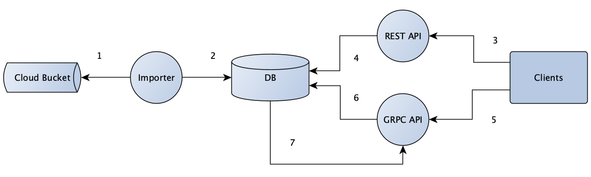

# Hedera Token Service Design

## Purpose

The Hedera Token Service (HTS) builds upon the Cryptocurrency Service to provide decentralized issuance of custom tokens on the Hedera Network.
The behavior will be similar to that of the native HBAR token and as such the Mirror Node will persist token balances and transfer lists and support the retrieval of information through its APIs.

This document highlights the architecture and design changes to be made to support HTS.
Changes should be applied in order of the following order to support easy third party integration.
1.  Database Schema Updates
2.  Importer Updates for Ingestion - Token balance and token transactions
3.  Existing REST API Updates - Accounts, Balances and Transactions
4.  Token REST API additions
5.  Protobuf update for TokenService
6.  GRPC Token Service addition

## Goals
-   Ingest HTS Token transactions from record stream rcd files from the mainnet and persist information to the database
-   Ingest account token balances from balance stream CSV files from the mainnet and persist to the database
-   Expose token balance of accounts in existing REST APIs that show balance
-   Provide a HTS REST API to return all tokens (Token Discovery)
-   Provide a HTS REST API to return all accounts holding a specific token (Token Supply Distribution)
-   Provide a streaming GRPC API to subscribe to token transfers for an account

## Non Goals
-   Provide a streaming GRPC API to subscribe to HTS transfers for all accounts and/or all tokens

## Architecture



1. Downloader retrieves transactions and balances (HBAR & Tokens) from stream files in cloud bucket and validates them
2. Parser persists to database
3. Client queries balance or token APIs for details
4. REST API retrieves token details and balances from database
5. Client subscribes to GRPC API for token transfers
6. GRPC API retrieves token transfers from database and returns to client
7. GRPC API is notified of new token transfers via database streaming logic

## Alternatives

## Database
To support the goals the following database schema changes should be made
1. `t_entity_types` updated to represent new `TOKEN` entity
2. `t_transaction_types` updated to handle token transactions from network.
3. New `token_balance` table added to persist token only balances
4. New `token` table added to capture token specific entity properties
5. New `token_transfer` table to persist token transfers
6. `t_transaction_results` updated to handle token transactions results from network.
7.  New `token_account` table added to persist token specific account state

### Token Transfer
-   Add `token_transfer` table table. Similar to `crypto_transfer` but with additional `token_id` column of `entity_id` type
-   Add `token_transfer__timestamp` and `token_transfer__token_account_timestamp` indexes

### Token Balance
-   Create `token_balance` table to distinctly capture token balances with the following columns
    -   `consensus_timestamp` (primary key)
    -   `account_id`
    -   `balance`
    -   `token_id`
-   Create index of `token_balance__token_account_timestamp`

### Token Account Info
-   Create `token_account` table to distinctly capture token account metadata changes with the following columns
    -   `id` (primary key)
    -   `account_id`
    -   `create_timestamp`
    -   `frozen`
    -   `kyc`
    -   `modify_timestamp`
    -   `token_id`
    -   `wiped`
-   Create unique index `token_account__token_account`
-   Create index of `token_account__token_account_timestamp`

> _Note:_  `frozen` and `kyc` are set by `TokenCreation.freezeDefault` and `TokenCreation.kycDefault` respectively

### Entity Types
-   Add new `t_entity_types` row with `id` value of 5 and `name `token`
```sql
    insert into t_entity_types (id, name) values (5, 'token');
```

### Transaction Types
-   Add new `t_transaction_types`:
```sql
    insert into t_transaction_types (proto_id, name) values
         (28, 'UNCHECKEDSUBMIT'),
         (29, 'TOKENCREATE'),
         (30, 'TOKENTRANSFER'),
         (31, 'TOKENFREEZE'),
         (32, 'TOKENUNFREEZE'),
         (33, 'TOKENGRANTKYC'),
         (34, 'TOKENREVOKEKYC'),
         (35, 'TOKENDELETE'),
         (36, 'TOKENUPDATE'),
         (37, 'TOKENMINT'),
         (38, 'TOKENBURN'),
         (39, 'TOKENWIPE'),
         (40, 'TOKENASSOCIATE'),
         (41, 'TOKENDISSOCIATE');
```

### Transaction Results
-   Add new `t_transaction_result`:
```sql
    insert into t_transaction_results (proto_id, result) values
        (165, 'ACCOUNT_FROZEN_FOR_TOKEN'),
        (166, 'TOKENS_PER_ACCOUNT_LIMIT_EXCEEDED'),
        (167, 'INVALID_TOKEN_ID'),
        (168, 'INVALID_TOKEN_DIVISIBILITY'),
        (169, 'INVALID_TOKEN_FLOAT'),
        (170, 'INVALID_TREASURY_ACCOUNT_FOR_TOKEN'),
        (171, 'INVALID_TOKEN_SYMBOL'),
        (172, 'TOKEN_HAS_NO_FREEZE_KEY'),
        (173, 'TRANSFERS_NOT_ZERO_SUM_FOR_TOKEN'),
        (174, 'MISSING_TOKEN_SYMBOL'),
        (175, 'TOKEN_SYMBOL_TOO_LONG'),
        (176, 'TOKEN_SYMBOL_ALREADY_IN_USE'),
        (177, 'INVALID_TOKEN_REF'),
        (178, 'ACCOUNT_KYC_NOT_GRANTED_FOR_TOKEN'),
        (179, 'TOKEN_HAS_NO_KYC_KEY'),
        (180, 'INSUFFICIENT_TOKEN_BALANCE'),
        (181, 'TOKEN_WAS_DELETED'),
        (182, 'TOKEN_HAS_NO_SUPPLY_KEY'),
        (183, 'TOKEN_HAS_NO_WIPE_KEY'),
        (184, 'INVALID_TOKEN_MINT_AMOUNT'),
        (185, 'INVALID_TOKEN_BURN_AMOUNT'),
        (186, 'ACCOUNT_HAS_NO_TOKEN_RELATIONSHIP'),
        (187, 'CANNOT_WIPE_TOKEN_TREASURY_ACCOUNT'),
        (188, 'INVALID_KYC_KEY'),
        (189, 'INVALID_WIPE_KEY'),
        (190, 'INVALID_FREEZE_KEY'),
        (191, 'INVALID_SUPPLY_KEY'),
        (192, 'TOKEN_NAME_ALREADY_IN_USE'),
        (193, 'MISSING_TOKEN_NAME'),
        (194, 'TOKEN_NAME_TOO_LONG'),
        (195, 'INVALID_WIPING_AMOUNT'),
        (196, 'TOKEN_IS_IMMUTABlE'),
        (197, 'TOKEN_ALREADY_ASSOCIATED_TO_ACCOUNT');
```

### Entities
-   Insert token entity info into `t_entities` table from `TokenCreation.proto` transaction object. Insert `adminKey` as `key`, `expiry` as `exp_time_ns`, `autoRenewAccount` as `auto_renew_account_id` and `autoRenewPeriod` as `auto_renew_period`.

### Token
-   Create `token` table with the following columns. Table will capture non shared `entity` items, most API calls may not require this information and therefore additional sql joins may be avoided.
    -   `token_id` (primary key)
    -   `create_timestamp`
    -   `divisibility`
    -   `freeze_default`
    -   `freeze_key`
    -   `initial_supply`
    -   `kyc_default`
    -   `kyc_key`
    -   `modify_timestamp`
    -   `supply_key`
    -   `symbol`
    -   `treasury_account_id`
    -   `wipe_key`

## Importer

### Converter
-   Add a `TokenIdConverter`
```java
    package com.hedera.mirror.importer.converter;
    ...
    public class TokenIdConverter extends AbstractEntityIdConverter {

        public TokenIdConverter() {
            super(EntityTypeEnum.TOKEN);
        }
    }
```

### Domain

#### AccountBalance
-   Update `AccountBalance` to have a `tokenBalances` class member, to represent all the token balances of the account
```java
public class AccountBalance implements Persistable<AccountBalance.Id> {
    ...
    @OneToMany(cascade = {CascadeType.ALL}, orphanRemoval = true, fetch = FetchType.EAGER)
    @JoinColumns({
        @JoinColumn(name="tokenBalance_consensusTimestamp", referencedColumnName="consensusTimestamp"),
        @JoinColumn(name="tokenBalance_accountId", referencedColumnName="accountId")
    })
    private List<TokenBalance> tokenBalances;
    ...
}
```

#### TokenTransfer
-   Create new `TokenTransfer` with the following class members
    -   `accountId`
    -   `amount`
    -   `consensusTimestamp`
    -   `tokenId`

#### EntityTypeEnum
-   Update `EntityTypeEnum` with `Token` type
```java
    public enum EntityTypeEnum {
        ...
        TOKEN(5);

        ...
    }
```

#### Token
-   Add `Token` class to hold Token specific metadata outside of the base entity class with the following class members
    -   `createTimestamp`
    -   `divisibility`
    -   `freezeDefault`
    -   `freezeKey`
    -   `initialSupply`
    -   `kycDefault`
    -   `kycKey`
    -   `modifyTimestamp`
    -   `supplyKey`
    -   `symbol`
    -   `tokenId`
    -   `treasuryAccountId`
    -   `wipeKey`

#### TokenAccount
-   Add `TokenAccount` class with the following class members
    -   `id`
    -   `accountId`
    -   `createTimestamp`
    -   `frozen`
    -   `kyc`
    -   `modifyTimestamp`
    -   `tokenId`
    -   `wiped`

#### TokenBalance
-   Add `TokenBalance` class with the following class members
    -   `accountId`
    -   `balance`
    -   `consensusTimestamp`
    -   `tokenId`

### Balance Parsing
To support HTS the balance CSV adds a version comment to the file, comments the Timestamp and adds a `accountMetadata` column which is the Base64 encoding of the serialized bytes of `TokenBalances` proto.
To allow the mirror node to support both V1 and V2 balance files
-   Rename `BalanceFileReaderImpl` to `BalanceFileReaderImplV1`
-   Add a `BalanceFileReaderImplV2` class to parse `shardNum,realmNum,accountNum,balance,accountMetadata`.  Reader should set `tokenBalances` in `AccountBalance`.
-   Add a `CompositeBalanceFileReader` that implements `BalanceFileReader` and reads the first few headers lines of the CSV
    -   If the first line is `TimeStamp` use `BalanceFileReaderImplV1` as the reader
    -   If the first line is `# version:2` use `BalanceFileReaderImplV2` as the reader
    -   If no `version` and `Timestamp` found throw an `InvalidDatasetException`
-   Add `INSERT_TOKEN_BALANCE_STATEMENT` in `AccountBalancesFileLoader` to persist each `TokenBalance` in the `TokenBalances`
-   Update `AccountBalancesFileLoader.loadAccountBalances()` to handle new `tokenBalances` member in `AccountBalance` returned by stream. Add logic to use `INSERT_TOKEN_BALANCE_STATEMENT` for every `tokenBalance` if not null;

### Transaction Handlers
Additional handlers will be needed to support the added Token transaction types.
In all cases override `getEntity()`, pulling entity info from appropriate transactionBody

-   Add `TokenCreateTransactionsHandler`
    -   override `updatesEntity()` to return true
-   Add `TokenTransferTransactionsHandler`
-   Add `TokenFreezeTransactionsHandler`
-   Add `TokenUnfreezeTransactionsHandler`
-   Add `TokenGrantKycTransactionsHandler`
-   Add `TokenRevokeKycTransactionsHandler`
-   Add `TokenDeleteTransactionsHandler`
    -   override `updatesEntity()` to return true
-   Add `TokenUpdateTransactionsHandler`
    -   override `updatesEntity()` to return true
-   Add `TokenMintTransactionsHandler`
-   Add `TokenBurnTransactionsHandler`
-   Add `TokenWipeTransactionsHandler`
-   Add `TokenAssociateTransactionsHandler`
    -   override `updatesEntity()` to return true
-   Add `TokenDissociateTransactionsHandler`
    -   override `updatesEntity()` to return true


### Token Transfer Parsing

#### EntityListener
-   Add a `onToken()` to handle a `Token` object
```java
    default void onToken(Token token) throws ImporterException {
    }
```

-   Add a `onTokenTransfer()` to handle a `TokenTransfer` object
```java
    default void onTokenTransfer(TokenTransfer tokenTransfer) throws ImporterException {
    }
```

#### EntityRecordItemListener
Modify `EntityRecordItemListener` to handle parsing HTS transactions

-   Add logic to check for `TransactionBody.hasTokenCreation()` and parse `TokenCreateTransactionBody` out from the record. Create a new `Token` object and pass it to `entityListener.onToken()`.
-   Add logic to check for `TransactionBody.hasTokenTransfers()` and parse `TokenTransferLists` out from the record. Create a new `TokenTransfer` object for each `AccountAmount` in the `TokenTransferList` object and pass it to `entityListener.onTokenTransfer()`.
-   Add logic to check for `TransactionBody.hasTokenDissociate()` and parse `TokenDissociateBody` out from the record. Set the matching `token_account` db entry `associate` column to false
-   Add logic to check for `TransactionBody.hasTokenFreeze()` and parse `TokenFreezeAccountTransactionBody` and `TokenUnFreezeAccountTransactionBody` out from the record. Set the matching `token_account` db entry `frozen` column to true if `TokenFreezeAccountTransactionBody` and false if `TokenUnFreezeAccountTransactionBody`
-   Add logic to check for `TransactionBody.hasTokenGrantKyc()` and parse `TokenGrantKycTransactionBody` out from the record. Set the matching `token_account` db entry `kyc` column to true
-   Add logic to check for `TransactionBody.hasTokenRevokeKyc()` and parse `TokenRevokeKycTransactionBody` out from the record. Set the matching `token_account` db entry `kyc` column to false
-   Add logic to check for `TransactionBody.hasTokenUnfreeze()` and parse `TokenUnFreezeAccountTransactionBody` out from the record. Set the matching `token_account` db entry `frozen` column to false
-   Add logic to check for `TransactionBody.hasTokenUpdate()` and parse `TokenUpdateTransactionBody` out from the record. Update the matching `t_entities` and `token` db entry
-   Add logic to check for `TransactionBody.hasTokenWipe()` and parse `TokenWipeAccountTransactionBody` out from the record. Set the matching `token_account` db entry `wipe` column to true

## REST API
To achieve the goals and for easy integration with existing users the REST API should be updated in the following order
1.  The `transactions` REST API must be updated to support `tokenTransfers`
2.  The `balances` REST API must be updated to support `tokenBalances`
3.  The `accounts` REST API must be updated to support `tokenBalances`
4.  Add a Token Supply distribution REST API to show token distribution across accounts - `/api/v1/tokens/<token>/balances`
5.  Add a Token Discovery REST API to show available tokens on the network - `/api/v1/tokens`
6.  Add a Token Info REST API to show details for a token on the network - `/api/v1/tokens/<token>`

### Accounts Endpoint
-   Update `/api/v1/accounts` response to add token balances
```json
{
    "accounts": [
      {
        "balance": {
          "timestamp": "0.000002345",
          "balance": 80,
          "tokenBalances": [
            {
              "symbol": "FOOBAR",
              "balance": 80
            },
            {
              "symbol": "FOOCOIN",
              "balance": 50
            }
          ]
        },
        "account": "0.0.8",
        "expiry_timestamp": null,
        "auto_renew_period": null,
        "key": null,
        "deleted": false
      }
    ],
    "links": {
      "next": null
    }
  }
```

### Balances Endpoint
-   Update `/api/v1/balances` response to add token balances
```json
    {
        "timestamp": "0.000002345",
        "balances": [
          {
            "account": "0.0.8",
            "balance": 100,
            "tokenBalances": []
          },
          {
            "account": "0.0.10",
            "balance": 100,
            "tokenBalances": [
              {
                "symbol": "FOOBAR",
                "balance": 80
              }
            ]
          },
          {
            "account": "0.0.13",
            "balance": 100,
            "tokenBalances": [
              {
                "symbol": "FOOBAR",
                "balance": 80
              },
              {
                "symbol": "FOOCOIN",
                "balance": 50
              }
            ]
          }
        ],
        "links": {
          "next": null
        }
    }
```

### Transactions Endpoint
-   Update `/api/v1/transactions` response to add token transfers
```json
    {
      "transactions": [
        {
          "consensus_timestamp": "1234567890.000000001",
          "valid_start_timestamp": "1234567890.000000000",
          "charged_tx_fee": 7,
          "memo_base64": null,
          "result": "SUCCESS",
          "transaction_hash": "aGFzaA==",
          "name": "CRYPTOTRANSFER",
          "node": "0.0.3",
          "transaction_id": "0.0.10-1234567890-000000000",
          "valid_duration_seconds": "11",
          "max_fee": "33",
          "transfers": [
            {
              "account": "0.0.9",
              "amount": 10
            },
            {
              "account": "0.0.10",
              "amount": -11
            },
            {
              "account": "0.0.98",
              "amount": 1
            }
          ],
          "token_transfers": [
            {
              "symbol":"FOOBAR",
              "transfers": [
                {"account": "0.0.1111", "amount": -10},
                {"account": "0.0.2222", "amount": 10}
              ]
            },
            {
              "symbol":"FOOCOIN",
              "transfers": [
                {"account": "0.0.3333", "amount": -10},
                {"account": "0.0.4444", "amount": 10}
               ]
            }
          ]
        }
      ]
    }
```

### Token Supply distribution

`/api/v1/tokens/<symbol>/balances` this could be the equivalent of `/api/v1/balances?token=<symbol>` currently and would return a list of account and the token balances
```json
    {
        "timestamp": "0.000002345",
        "balances": [
          {
            "account": "0.15.10",
            "balance": 100
          },
          {
            "account": "0.15.9",
            "balance": 90
          },
          {
            "account": "0.15.8",
            "balance": 80
          }
        ],
        "links": {
          "next": null
        }
    }
```

Optional Filters
-   `/api/v1/tokens/<symbol>/balances?id=0.0.1000`
-   `/api/v1/tokens/<symbol>/balances?balance=gt:1000`
-   `/api/v1/tokens/<symbol>/balances?timestamp=1566562500.040961001`

### Token Discovery
`/api/v1/tokens` this would return all tokens present on the network

```json
    {
        "tokens": [
          {
            "symbol": "FOOBAR",
            "tokenId": "0.15.10",
            "key": {
              "_type": "ProtobufEncoded",
              "key": "7b2233222c2233222c2233227d"
            }
          },
          {
            "symbol": "FOOCOIN",
            "tokenId": "0.15.11",
            "key": {
              "_type": "ProtobufEncoded",
              "key": "9c2233222c2233222c2233227d"
            }
          }
        ],
        "links": {
          "next": null
        }
    }
```

Optional Filters
-   `/api/v1/tokens?adminkey=HJ^&8` - All tokens with matching admin key
-   `/api/v1/tokens?account.id=0.0.8` - All tokens for matching account

### Token Info
-   Add a `getTokenInfo()` to `tokens.js` to retrieve token info from `token` table
```json
    {
      "symbol": "FOOCOIN",
      "tokenId": "0.15.10",
      "treasury_account": "0.15.10",
      "adminKey": {
        "_type": "ProtobufEncoded",
        "key": "9c2233222c2233222c2233227d"
      },
      "kycKey": {
        "_type": "ProtobufEncoded",
        "key": "9c2233222c2233222c2233227d"
      },
      "freezeKey": {
        "_type": "ProtobufEncoded",
        "key": "9c2233222c2233222c2233227d"
      },
      "wipeKey": {
        "_type": "ProtobufEncoded",
        "key": "9c2233222c2233222c2233227d"
      },
      "supplyKey": {
        "_type": "ProtobufEncoded",
        "key": "9c2233222c2233222c2233227d"
      },
      "freezeDefault": false,
      "kycDefault": false,
      "expiryTimestamp": null,
      "autoRenewAccount": "0.0.6",
      "autoRenewPeriod": null
    }
```


## Protobuf
- Add a `TokenQuery` proto message to describe query format
- Add a `TokenResponse` proto message to describe response
- Add `TokenService` rpc endpoints as needed based on desired `tokenId` and `accountId` combinations


## GRPC API

### Controller
-   Add a `TokenController` that extends protobuf reactor stubs and implements `subscribeTokenTransfers`
```java
    package com.hedera.mirror.grpc.controller;

    public class TokenController extends ReactorTokenServiceGrpc.TokenServiceImplBase {
            @Override
            public Flux<TokenResponse> subscribeTokenTransfers(Mono<TokenQuery> request) {
                ...
            }
    }
```

### Domain

-   Add `TokenTransfer` class as defined in Importer
-   Add `TokenTransferFilter` with similar design to `TopicMessageFilter`
-   Update `EntityType` with `TOKEN` option
```java
    package com.hedera.mirror.grpc.domain;

    public enum EntityType {

        UNKNOWN, // Filler value to offset next values by one to match database values
        ACCOUNT,
        CONTRACT,
        FILE,
        TOPIC,
        TOKEN
    }
```

### Streaming : Listener & Retriever
The GRPC module currently supports listen and retrieval logic for incoming and historic topic messages respectively.
A lot of this logic can be shared for the equivalent `TokenTransfer` listeners and retriever

TBD

### Token Transfer Service
TBD
> _Note:_ ***Sequence diagram to be added


## Non-Functional Requirements

## Open Questions
-   [x] What's the maximum character size of the token `symbol` string
    -   A: Max length is currently 100 chars to match memo, https://github.com/hashgraph/hedera-services/blob/separate-tokenrels-fcm/hedera-node/src/main/resources/bootstrap.properties#L56
-   [x] Will a `token_id` and `token` be assigned a default value for HBARs across the network e.g. i.e. '1' and 'HBAR' respectively
    -   A: Currently no since hbar is not treated as an entity like tokens will be.
-   [x] Should token only entity items exist in their own table or be added to `t_entities`?
    -   A: Will split out into `token` table
-   [x] Should `account_balance` `accountNum` and `accountRealmNum` be migrated into `entityId` or should token_balance also use `accountNum` and `accountRealmNum` instead of `entityId`?
    -   A: Should be migrated to use `account_id` only
-   [ ] What filter options should be provided for new Token API's
-   [ ] How should frozen account and kyc'd account for a token be represented?
    -   A: As columns in `token` table
-   [ ] Should balance returns for `accounts`, `balances` and `transactions` contain `token` or `tokenId` or both?
-   [x] Should `EntityRecordItemListener.OnItem()` be refactored to more easily focus on different TransactionBody types. May be valuable to testing but not necessarily within scope
    - A: Will leave to implementation task and sprint scheduling limits


