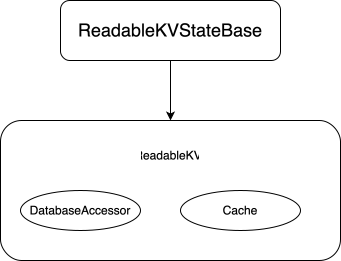

# `Integrate reusable services in hedera-mirror-web3`

## Overview

Currently in order for archive nodes to execute json-rpc calls such
as `eth_call`, `eth_estimateGas`, `eth_debugTraceTransaction`
via
REST API calls they simulate the transaction via business logic nested in `hedera-mirror-web3`. It copies code base from
the mono `hedera-services` code
that is now obsolete. Doing so, it has the necessary Hedera specific logic wrapping the besu evm dependency.

The `hedera-services` started utilizing new modularized code base and is going to integrate new Hedera precompile
calls over it. This makes the consensus node and
archive node business logic diverging and have different support of precompiles.

In addition, the copied mono code in `hedera-mirror-web3` required maintaining the same code base on 2 different places.

With the modularized code now in place, we are going to have a published dependency for the `hedera.app` code
base including all services and smart contract logic, which can be
directly integrated into `hedera-mirror-web3` with the old copied mono code base removed. This document will
describe the needed steps to achieve this goal.

## Entry point

The new modularized code base will be added as a dependency to the `hedera-mirror-web3` project. The entry point for
simulating a transaction will be a special
component named `TransactionExecutor`. This component will be responsible for executing the transaction and returning
the result. First, we will need to create
an instance of this executor for each new transaction with a factory pattern via `TransactionExecutors` class that
accepts
a `State` implementation and `Map` of system properties.

Having the initialized executor, we can call the `execute` method with the `transaction body`, `consensus timestamp` and
specific `OperationTracers` we want. The executor will return list of `transaction records`
produced, where the transaction output can be extracted from.

Since archive nodes execute transactions asynchronously, each new transaction will create its own `TransactionExecutor`
with its own managed writable state, keeping the existing `ContractCallContext` logic.


## State implementation

Having this new design, the most important part will be the custom mirror node `State` implementation. It will have the
necessary mediator logic
that will back the `ReadableStates` (part of the State design for read only access to state) with the mirror node DB. To
implement this logic,
we will reuse some of existing `StackedStateFrames` logic, but most of the changes will include new code.

The State implementation in services utilizes a twofold mechanism where each individual service, e.g. `account service`,
`token service`, `file service`, etc.
has its own state and no other state can directly interact with it. For example - in order to get the specific state for
account service from ReadableState,
you should use `states.get("ACCOUNTS")` that will return you object of type `ReadableKVStateBase`. It holds a mapping
between a key and a value that are PBJ types and
implements `ReadableKVState` interface with the definition of the needed methods.
Concrete implementation of how these mappings are stored and handled is needed, so we will have to implement a
custom `ReadableKVStateBase` component - `DatabaseReadableKVStateBase`.

To summarize the `ReadableStates` behaviour in services we can take the following example.

I want to fetch an account with `AccountID 0.0.1` from the account service state.
I should perform the following calls:

```java
ReadableKVState accountState = states.get("ACCOUNTS");
Account account = accountState.get(accountId);
```

### ReadableKVStateBase

This class will construct the base of the `ReadableKVState` component and will be the linking point between the
`ReadableStates` implementation and the mirror node DB. We will define mirror node
specific `DatabaseReadableKVStateBase` that will
have a concrete `DatabaseAccessor` for the type of values it will return and a cache that will keep the only read
values.

For each PBJ type we want to read from DB we will have a separate `DatabaseReadableKVStateBase` instance.



### DatabaseAccessor

With the `StackedStateFrames` design, we already have `DatabaseAccessors` that are used to access the DB. We will reuse
most of the existing ones and
add new accessors for the types that don't have one, such as Storage, Bytecode, Files.

In addition, the database accessors should be modified to map the DB entities to the generated PBJ types of the models,
instead of the models from the hedera-services mono
code base.


### State

The `State` will implement the main interface from services. It will contain mappings for `ReadableStates` and
`WritableStates` and have methods to get these resources, as well as possibility to register services with their
schemas,
register listeners and commit changes.

In the `getReadableStates` method, we will iterate over each registered service and create a new `ReadableKVStateBase`
instance
for each state type for this service.
For example, for the `ACCOUNTS` state of token service, we will create a new `DatabaseReadableKVStateBase` instance with
the `DatabaseAccessor` for the account type (e.g. `AccountDatabaseAccessor`).


### Needed components

Apart from the `State`, several other components are needed to be implemented. These are:

- `ServicesRegistry` - a component that will hold all the registered services and their schemas
- `ServiceMigrator` - a component that will be responsible for migrating the data and data structure from a given schema
  into the state
- `NetworkInfo` - a component that will have a dummy address book and methods that throw Unsupported exception. This
  component is required in the methods downstream and cannot be null

### Workflow of State initialization

Before we can pass the `State` implementation to the `TransactionExecutors`, so that it creates
the `TransactionExecutor`,
we need to initialize it and migrate data
from a given schema.

These are the steps for the minimal amount of `State` setup, so that we can use it for transaction simulations.

1. Create a `State` instance
2. Initialize a dummy `NetworkInfo` object
3. Initialize a `ServicesRegistry` object
4. Register all the services we will need for the transaction simulation, using the registry from step 3
5. Initialize a `ServiceMigrator` object
6. Migrate the data from a chosen schema (default to latest) into the state. This step will initialize the system
   accounts and will create a
   skeleton of the state definition for each service with empty initial data, so that they are ready to be populated
7. Create genesis files with system data such as `feeSchedules` and `exchangeRates` and commit them to the state

The state is then initialized and populated and can be used to create a `TransactionExecutor` instance.

For performance reasons, we can keep a single instance of the `State` with this system genesis information, since it
will be the same for all calls and keep a new
instance of `WritableStates` in `ContractCallContext` for each new transaction.


### Development phases

The efforts of integrating the reusable services logic into `hedera-mirror-web3` will be split into different releases.
Thus, we should
temporarily keep the old copied mono code base for execution, so that calls
for `eth_call`, `eth_estimateGas`, `eth_debugTraceTransaction` are
still supported.

We can define a feature flag that will control which flow to be used (old mono code base or new reusable services code
base). The deviation point will be inside `ContractCallService.doProcessCall`, where:

- if the feature flag is enabled, we will call the new `TransactionExecutor.execute` method
- if the feature flag is disabled, we will call the `MirrorEvmTxProcessor.execute` method

After the new code base is fully integrated and tested, we will remove the old mono code base and the feature flag.

### Testing

The testing of the new code base from services will include only checks for potential regression. This covers the
following tests:

- Integration tests inside `hedera-mirror-web3` testing the behaviour of ContractCallService
- Acceptance tests covering web3 logic

In all cases - the existing behaviour and expected results should remain the same.

### Legacy code deletion

After all changes are fully integrated and tested, the final step will be removing of obsolete code that won't be used
anymore. This will include the following packages and files:

- com.hedera.node.app.service
- com.hedera.services
- com.hedera.mirror.web3.evm.account
- com.hedera.mirror.web3.evm.config.ServicesConfiguration
- com.hedera.mirror.web3.evm.contracts - all files except `OpcodesProcessingResult`
- com.hedera.mirror.web3.evm.contracts.operations
- com.hedera.mirror.web3.evm.contracts.store - all files except the `DatabaseAccessors`
- com.hedera.mirror.web3.evm.contracts.store.token

Apart from these classes, all unit tests related to them should also be removed.
