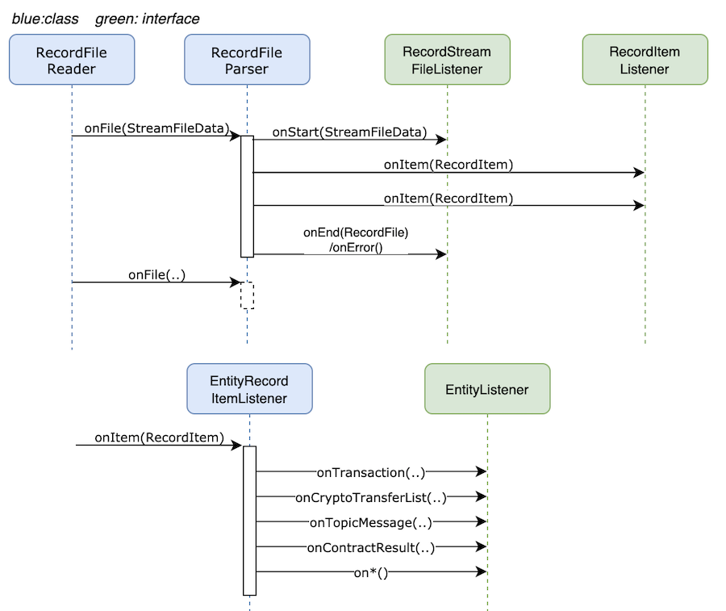

# Parser design

## Problems in current design

SQL Database client is tightly coupled with transaction & record's processor which makes:

- ingesting mirror node date into other types of database like Cassandra, Bigtable, etc. very hard
- benchmarking only parser's or only database ingestion performance in impossible

## Goal

1. Decouple parsing of stream from ingestion into a database
2. Abstractions should support measuring (a) parser's performance and (b) database ingestion performance, in isolation

## Non-goals

- Change importer from filesystem based to in-memory streaming
- Parsing multiple rcd/balance/etc files in parallel. Parser is far from being bottleneck, there is no need to optimize
  it
- Accommodate possibility of publishing transactions/topic messages/etc to GRPC server directly
- Support writing to multiple databases from single importer
- Update balance file parser code immediately
- Make mirror node be ran without PostgreSQL. It will still require it to store application state.

## Architecture

#### Data Flow


- Similar flows will exist for balance and event.

#### Control Flow



## Interfaces and Classes

### StreamItemListener

```java
package com.hedera.mirror.importer.parser.domain;

public interface StreamItem {
}
```

```java
package com.hedera.mirror.importer.parser;

public interface StreamItemListener<T extends StreamItem> {
    void onItem(T item) throws ImporterException;
}
```

### RecordItemListener

```java
package com.hedera.mirror.importer.parser.domain;

@Value
public class RecordItem implements StreamItem {
    private final Transaction transaction;
    private final TransactionRecord record;
    private final byte[] transactionBytes;
    private final byte[] recordBytes;
    // ... other fields...
}
```

```java
package com.hedera.mirror.importer.parser.record;

public interface RecordItemListener extends StreamItemListener<RecordItem> {
}
```

- Similarly for balance and event streams

### EntityRecordItemListener

```java
package com.hedera.mirror.importer.parser.record;

public class EntityRecordItemListener implements RecordItemListener {
    private final EntityListener entityListener;  // injected dependency

    public void onItem(RecordItem recordItem) throws ImporterException {
        // process recordItem
    }
}
```

1. Parse `Transaction` and `TransactionRecord` in the `recordItem`
2. Calls `onTransaction`/`onTopicMessage`/`onCryptoTransferLists` etc

### EntityListener

```java
package com.hedera.mirror.importer.parser.record;

public interface EntityListener {
    void onTransaction(c.h.m.i.d.Transaction transaction) throws ImporterException;

    void onCryptoTransfer(c.h.m.i.d.CryptoTransfer cryptoTransfer) throws ImporterException;

    void onTopicMessage(c.h.m.i.d.TopicMessage topicMessage) throws ImporterException;

    void onContractResult(c.h.m.i.d.ContractResult contractResult) throws ImporterException;

    void onFileData(c.h.m.i.d.FileData fileData) throws ImporterException;

    void onLiveHash(c.h.m.i.d.LiveHash liveHash) throws ImporterException;
}
```

1. There will be following implementations for `EntityListener`:
   1. `SqlEntityListener`:
      - For writing entities to SQL database
      - Useful for testing database insert performance in isolation from parser

### RecordFileParser

```java
package com.hedera.mirror.importer.parser.domain;

@Value
public class StreamFileData {
    private final String filename;
    private final InputStream inputStream;
}
```

```java
package com.hedera.mirror.importer.parser.record;

// Parses transactions in a *stream file*
public class RecordFileParser {

    private final RecordItemListener recordItemListener;  // injected dependency
    private final RecordStreamFileListener recordStreamFileListener;  // injected dependency

    void onFile(StreamFileData streamFileData) {
        // process stream file
    }
}
```

1. On each call to `onFile(streamFileData)`:
   1. Validate prev hash
   2. For each set of `Transaction` and `TransactionRecord` in record file,
      call `recordItemListener.onItem(recordItem)`.
   3. Finally call `recordStreamFileListener.onEnd(recordFile)`

## Outstanding questions:

1. Does Spring Data repository has support for Postgres COPY command? Couldn't find sources that suggest it does. If
   that indeed turns out to be the case, then I see at least two possibilities:
   - Use manual connection(s) to COPY to transaction, crypto_transfer, topic_message, other write heavy tables.
     And use Spring Repositories for other tables. However, that raises the question of consistency of data across
     multiple
     transactions (since there are multiple connections).
   - Use COPY and PreparedStatement over single connection
