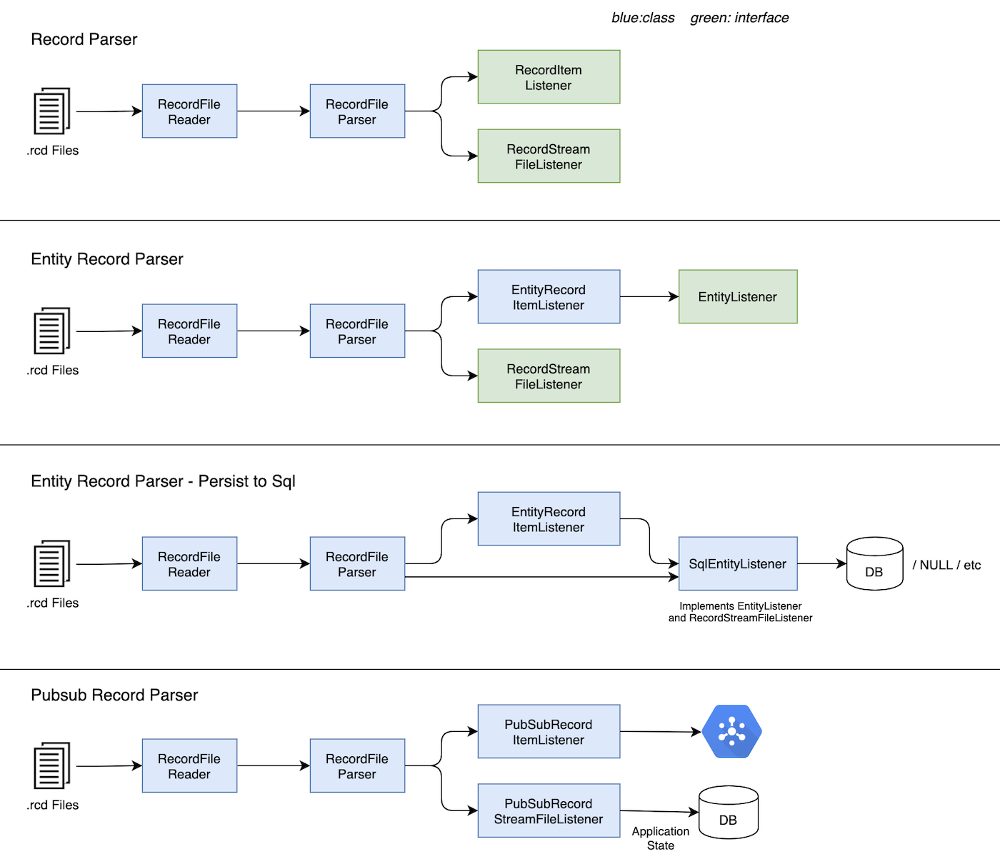

# Parser design

## Problems in current design

SQL Database client is tightly coupled with transaction & record's processor which makes:

-   ingesting mirror node date into other types of database like Cassandra, Bigtable, etc. very hard
-   benchmarking only parser's or only database ingestion performance in impossible

## Goal

1. Decouple parsing of stream from ingestion into a database
1. Abstractions should support measuring (a) parser's performance and (b) database ingestion performance, in isolation

## Non-goals

-   Change importer from filesystem based to in-memory streaming
-   Parsing multiple rcd/balance/etc files in parallel. Parser is far from being bottleneck, there is no need to optimize it
-   Accommodate possibility of publishing transactions/topic messages/etc to GRPC server directly
-   Support writing to multiple databases from single importer
-   Update balance file parser code immediately
-   Make mirror node be ran without PostgreSQL. It will still require it to store application state.

## Architecture

#### Data Flow



-   Similar flows will exist for balance and event.

#### Control Flow


## Interfaces and Classes

### StreamItemListener

```java
package com.hedera.mirror.importer.parser.domain;

public interface StreamItem {
}
```

```java
package com.hedera.mirror.importer.parser;

public interface StreamItemListener<T extends StreamItem> {
    void onItem(T item) throws ImporterException;
}
```
### RecordItemListener

```java
package com.hedera.mirror.importer.parser.domain;

@Value
public class RecordItem implements StreamItem {
    private final Transaction transaction;
    private final TransactionRecord record;
    private final byte[] transactionBytes;
    private final byte[] recordBytes;
    // ... other fields...
}
```

```java
package com.hedera.mirror.importer.parser.record;

public interface RecordItemListener extends StreamItemListener<RecordItem> {
}
```

-   Similarly for balance and event streams

### EntityRecordItemListener

```java
package com.hedera.mirror.importer.parser.record;

public class EntityRecordItemListener implements RecordItemListener {
    private final EntityListener entityListener;  // injected dependency

    public void onItem(RecordItem recordItem) throws ImporterException {
        // process recordItem
    }
}
```

1. Parse `Transaction` and `TransactionRecord` in the `recordItem`
1. Calls `onTransaction`/`onTopicMessage`/`onCryptoTransferLists` etc

### EntityListener

```java
package com.hedera.mirror.importer.parser.record;

public interface EntityListener {
    void onTransaction(c.h.m.i.d.Transaction transaction) throws ImporterException;
    void onCryptoTransfer(c.h.m.i.d.CryptoTransfer cryptoTransfer) throws ImporterException;
    void onNonFeeTransfer(c.h.m.i.d.NonFeeTransfer nonFeeTransfer) throws ImporterException;
    void onTopicMessage(c.h.m.i.d.TopicMessage topicMessage) throws ImporterException;
    void onContractResult(c.h.m.i.d.ContractResult contractResult) throws ImporterException;
    void onFileData(c.h.m.i.d.FileData fileData) throws ImporterException;
    void onLiveHash(c.h.m.i.d.LiveHash liveHash) throws ImporterException;
}
```

1. There will be following implementations for `EntityListener`:
    1. `SqlEntityListener`:
        - For writing entity to SQL database
        - Useful for testing database insert performance in isolation from parser
    1. `NullEntityListener`: No-op implementation
        - For micro-benchmarking parser performance

Note that there are no function for `onEntity`. Updating `entity` table in batches is not possible right now since
`transaction` table uses foreign keys. For entity, first, schema changes are needed to remove entity ids,
then `onEntity` and `onEntityUpdate` functions will be added to insert/update entity in bulk. For the purpose of
immediate refactor, we can leave entity in `EntityRecordItemListener` (until perf optimizations via schema change in
milestone 2).

### RecordFileParser

```java
package com.hedera.mirror.importer.parser.domain;

@Value
public class StreamFileData {
    private final String filename;
    private final InputStream inputStream;
}
```

```java
package com.hedera.mirror.importer.parser.record;

// Parses transactions in a *stream file*
public class RecordFileParser {

    private final RecordItemListener recordItemListener;  // injected dependency
    private final RecordStreamFileListener recordStreamFileListener;  // injected dependency

    void onFile(StreamFileData streamFileData) {
        // process stream file
    }
}
```

1. On each call to `onFile(streamFileData)`:
    1. Validate prev hash
    1. Call `recordStreamFileListener.onStart(streamFileData)`
    1. For each set of `Transaction` and `TransactionRecord` in record file, call `recordItemListener.onItem(recordItem)`.
    1. Finally call `recordStreamFileListener.onEnd(recordFile)`
    1. On exceptions, call `recordStreamFileListener.onError(error)`

### RecordFileReader

```java
package com.hedera.mirror.importer.parser.record;

public class RecordFileReader extends FileWatcher {

    private final RecordFileParser recordFileParser; // injected dependency

    @Override
    public void onCreate() {
        // List files
        // Open the file on disk, create InputStream on it. Keep RecordFileParser filesystem agnostic.
        StreamFileData streamFileData = new StreamFileData(filename, inputStream);
        recordFileParser.onFile(streamFileData);
    }
}
```

## Outstanding questions:

1. Does Spring Data repository has support for Postgres COPY command? Couldn't find sources that suggest it does. If
   that indeed turns out to be the case, then I see at least two possibilities:
    - Use manual connection(s) to COPY to transaction, crypto_transfer, topic_message, other write heavy tables.
      And use Spring Repositories for other tables. However, that raises the question of consistency of data across multiple
      transactions (since there are multiple connections).
    - Use COPY and PreparedStatement over single connection

## Tasks (in suggested order):

#### Milestone 1 (done)

1. Finalize design
1. Refactoring
    1. Add the interfaces and domains ([#564](https://github.com/hashgraph/hedera-mirror-node/issues/564))
    1. Split `RecordFileLogger` class into two
        1. Create `SqlEntityListener`. Move existing sql writer code from `RecordFileLogger`
           to new class as-is. ([#566](https://github.com/hashgraph/hedera-mirror-node/issues/566))
        1. Change `RecordFileLogger` to `class EntityRecordItemListener implements RecordItemListener {...}`
           ([#567](https://github.com/hashgraph/hedera-mirror-node/issues/567))

#### Milestone 2

All top level tasks can be done in parallel.

1. Implement `PubSubRecordItemListner` for `blockchain-etl` project (done)
1. Split `RecordFileParser` class into two ([#568](https://github.com/hashgraph/hedera-mirror-node/issues/568))
    - Move FileSystem related code into `RecordFileReader`
    - Keep `RecordFileParser` agnostic of source of stream files
1. Perf
    1. Hook up `SqlEntityListener` with `data-generator` to test db insert performance and
       establish baseline ([#569](https://github.com/hashgraph/hedera-mirror-node/issues/569))
    1. Optimize `SqlEntityListener` ([#570](https://github.com/hashgraph/hedera-mirror-node/issues/570))
        - Schema changes to remove entity ids (while at it, remove `fildId` from `transaction`)
        - Get rid of all `SELECT` queries in parser
        - Use of `COPY`
        - Concurrency using multiple jdbc connections
1. Refactor `EntityRecordItemListener` class. Split parsing logic into re-usable helper functions.
   ([#571](https://github.com/hashgraph/hedera-mirror-node/issues/571))
   - Will make it easy for mirror node users to write custom parsers
   - Will make it possible to have filtering logic less loosely coupled with parsing logic

#### Milestone 3 (followup tasks to tie loose ends)

-   Remove event parser code: Doesn't have tests. Not used in last 6 months. No likelihood of needed in next couple months
    There is no need to pay tech-rent on this debt. Can be dont right once when it is really needed.
    ([#572](https://github.com/hashgraph/hedera-mirror-node/issues/572)) (done)
-   Delete files once they are parsed ([#259](https://github.com/hashgraph/hedera-mirror-node/issues/259)) (done)
-   Update balance file parser code to new design ([#573](https://github.com/hashgraph/hedera-mirror-node/issues/573))
    -   Share as much filesystem related code as possible between `RecordFileReader` and `BalanceFileParser`
        (to be renamed to `BalanceStreamReader`)
