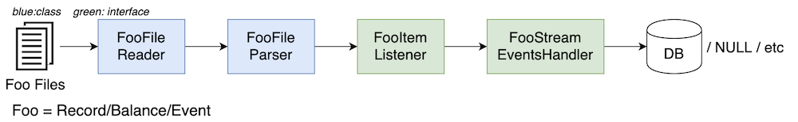
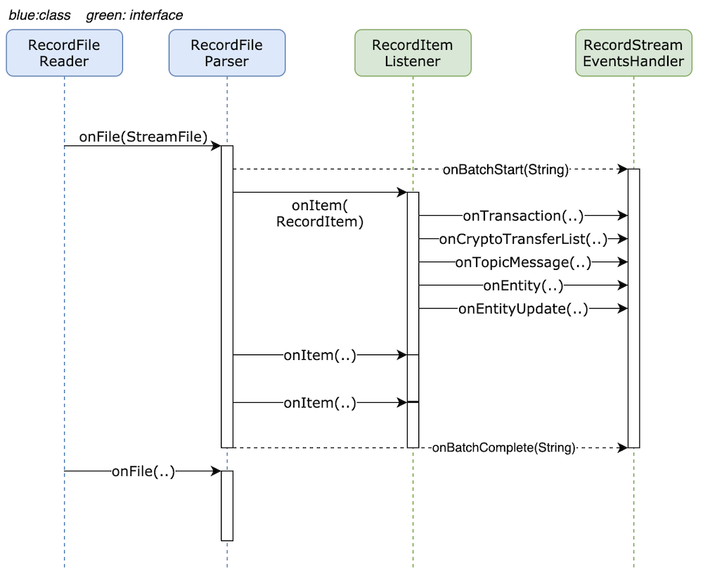

# Parser design

## Problems in current design

SQL Database client is tightly coupled with transaction & record's processor which makes:

-   ingesting mirror node date into other types of database like Cassandra, Bigtable, etc. very hard
-   benchmarking only parser's or only database ingestion performance in impossible

## Goal

1. Decouple parsing of stream from ingestion into a database
1. Abstractions should support measuring (a) parser's performance and (b) database ingestion performance, in isolation

## Non-goals

-   Change importer from filesystem based to in-memory streaming
-   Parsing multiple rcd/balance/etc files in parallel. Parser is far from being bottleneck, there is no need to optimize it
-   Accommodate possibility of publishing transactions/topic messages/etc to GRPC server directly
-   Support writing to multiple databases from single importer
-   Update balance file parser code immediately

## Architecture

#### Data Flow



-   Record files --> RecordFileReader --> RecordFileListener --> RecordItemListener --> RecordStreamEventsHandler --> DB

#### Control Flow



### EventsHandler

```java
package com.hedera.mirror.importer.parser;

public interface StreamEventsHandler {
    void onBatchStart(String batchName) throws ImporterException;
    void onBatchComplete(String batchName) throws ImporterException;
    void onError(Throwable e);
}
```

```java
package com.hedera.mirror.importer.parser.record;

public interface RecordStreamEventsHandler extends StreamEventsHandler {
    void onTransaction(c.h.m.i.d.Transaction) throws ImporterException;
    void onEntity(c.h.m.i.d.Entities) throws ImporterException;
    void onEntityUpdate(c.h.m.i.d.Entities) throws ImporterException;
    void onCryptoTransferList(c.h.m.i.d.CryptoTransfer) throws ImporterException;
    void onTopicMessage(c.h.m.i.d.TopicMessage) throws ImporterException;
}
```

```java
package com.hedera.mirror.importer.parser.balance;

public interface BalanceEventsHandler extends StreamEventsHandler {
    void onBalance(c.h.m.i.d.Balance) throws ImporterException;
}
```

1. There will be following implementations for `RecordStreamEventsHandler`:
    1. `PostgresWritingRecordStreamEventsHandler`:
        - For writing stream data to Postgres database
        - For `data-generator` to test database insert performance in isolation (from parser)
    1. `NullRecordStreamEventsHandler`: Discards all events and do nothing.
        - For micro-benchmarking parser performance
    1. `StreamFileWriterRecordStreamEventsHandler`: Package stream data into .rcd/balance/etc file.
        - For `data-generator` to generate custom stream files for testing: end-to-end importer perf test, parser + db
          perf test, isolated parser micro-benchmark, etc

### RecordItemListener

```java
package com.hedera.mirror.importer.parser.record;

public interface RecordItemListener {
    void onRecordItem(RecordItem recordItem) throws ImporterException;
}
```

```java
package com.hedera.mirror.importer.parser.record;

@Value
public class RecordItem {
    private final Transaction transaction;
    private final TransactionRecord record;
    private final byte[] transactionRawBytes;
}
```

#### RecordItemParser

```java
package com.hedera.mirror.importer.parser.record;

public class RecordItemParser implements RecordItemListener {
    private final RecordStreamEventsHandler RecordStreamEventsHandler;  // injected dependency

    public void onRecordItem(RecordItem recordItem) throws ImporterException {
        // process recordItem
    }
}
```

1. Parse `Transaction` and `TransactionRecord` in the `recordItem`
1. Calls `onTransaction`/`onEntity`/`onEntityUpdate`/`onTopicMessage`/`onCryptoTransferLists` etc

### RecordBatchListener

```java
package com.hedera.mirror.importer.parser.record;

// 'Batch' can be stream file, or gossip events (in future).
public interface RecordBatchListener {
    void onBatch(String batchName, InputStream inputStream);
}
```

#### RecordFileParser

```java
package com.hedera.mirror.importer.parser.record;

// Parses transactions batched together in a *stream file*
public class RecordFileParser implements RecordBatchListener {

    private final RecordItemListener recordItemListener;  // injected dependency
    private final StreamEventsHandler streamEventsHandler;  // injected dependency

    void onBatch(String filename, InputStream inputStream) {
        // process stream file
    }
}
```

1. On each call to `onBatch(filename, inputStream)`:
    1. Call `streamEventsHandler.onBatchStart(filename)`
    1. Validate prev hash
    1. For each set of `Transaction` and `TransactionRecord` in record file, call `recordItemListener.onRecordItem(recordItem)`.
    1. Finally call `streamEventsHandler.onBatchComplete(filename)`
    1. On exceptions, call `streamEventsHandler.onError(error)`

### RecordFileReader

```java
package com.hedera.mirror.importer.parser.record;

public class RecordFileReader extends FileWatcher {

    private final RecordFileParser recordFileParser; // injected dependency

    @Override
    public void onCreate() {
        // List files
        // Open the file on disk, create InputStream on it. Keep RecordFileParser filesystem agnostic.
        recordFileParser.onBatch(filename, inputStream);
    }
}
```

## Outstanding questions:

1. Does Spring Data repository has support for Postgres COPY command? Couldn't find sources that suggest it does. If
   that indeed turns out to be the case, then I see at least two possibilities: - Use manual connection(s) to COPY to t_transactions, t_cryptotransferlists, topic_message, other write heavy tables.
   And use Spring Repositories for other tables. However, that raises the question of consistency of data across multiple
   transactions (since there are multiple connections). - Use COPY and PreparedStatement over single connection

## Tasks (in suggested order):

#### Milestone 1

1. Finalize design
1. Refactoring
    1. Add the interfaces `StreamEventsHandler` and `RecordStreamEventsHandler`
    1. Split `RecordFileLogger` class into two
        1. Create `PostgresWritingRecordStreamEventsHandler`. Move existing postgres writer code from `RecordFileLogger` to new class as-is.
        1. Rename `RecordFileLogger` to `RecordItemParser`. Add `.. implements RecordItemListener`

#### Milestone 2

All top level tasks can be done in parallel

1. Perf
    1. Replace `PostgresCSVDomainWriter` by `PostgresWritingRecordStreamEventsHandler` to test db insert performance and establish baseline
    1. Optimize `PostgresWritingRecordStreamEventsHandler`
        - Schema changes to remove entity ids
        - Get rid of all `SELECT` queries in parser
        - Use of `COPY`
        - Concurrency using multiple jdbc connections
1. Refactor `RecordItemParser` class. Split parsing logic into re-usable helper functions.
    - Will make it easy for mirror node users to write custom parsers
    - Will make it possible to have filtering logic less loosely coupled with parsing logic
1. Split `RecordFileParser` class into two
    - Move FileSystem related code into `RecordFileReader`
    - Keep `RecordFileParser` agnostic of source of stream files
1. Implement `BigQueryWritingRecordStreamEventsHandler` for `blockchain-etl` project (if needed)

#### Milestone 3 (followup tasks to tie loose ends)

-   Remove event parser code: Doesn't have tests. Not used in last 6 months. No likelihood of needed in next couple months
    There is no need to pay tech-rent on this debt. Can be dont right once when it is really needed
-   Delete files once they are parsed
-   Update balance file parser code to new design
    -   Share as much filesystem related code as possible between `RecordFileReader` and `BalanceFileParser` (to be renamed to `BalanceStreamReader`)
