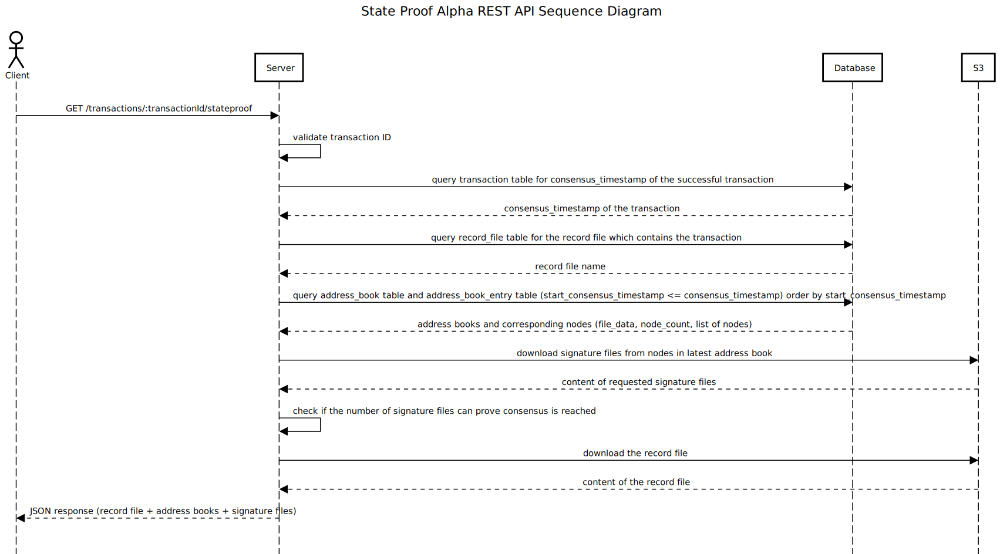

# State Proof Alpha Design

## Purpose

State Proof Alpha provides the data to prove a transaction is valid on Hedera Network. It's the interim solution
until [full state proof](https://www.hedera.com/blog/state-proofs-on-hedera) is implemented.

## Goals

- Provide a State Proof REST API for clients to retrieve the record file containing the transaction, the corresponding
signature files, and the address book at the time of the transaction to prove its validity


## REST API

```
GET /transactions/:transactionId/stateproof
```

where `transactionId` is in the format of `shard.realm.num-sss-nnn`, in which `sss` are seconds and `nnn` are
nanoseconds of the valid start timestamp of the transaction.

### Optional Filters

* `/transactions/:transactionId/stateproof?scheduled=true` Get stateproof for the scheduled transaction. The default is
  false.

The [version 5 record file and signature file](https://docs.hedera.com/guides/docs/record-and-event-stream-file-formats)
enable the stateproof REST API to create a more compact record file by replacing any record stream object but the one of
interest with its hash. As a result, depending on the format of the record file, the REST API returns either the full
format response or the compact format response.

The full format response in JSON:

```json
{
    "address_books": [
      "address book content"
    ],
    "record_file": "record file content",
    "signature_files": {
      "0.0.3": "signature file content of node 0.0.3",
      "0.0.4": "signature file content of node 0.0.4",
      "0.0.n": "signature file content of node 0.0.n"
    },
    "version": 2
}
```

The compact format response in JSON:

```json
{
    "address_books": [
      "address book content"
    ],
    "record_file": {
      "head": "content of the head",
      "start_running_hash_object": "content of the start running hash object",
      "hashes_before": [
        "hash of the 1st record stream object",
        "hash of the 2nd record stream object",
        "hash of the (m-1)th record stream object"
      ],
      "record_stream_object": "content of the mth record stream object",
      "hashes_after": [
        "hash of the (m+1)th record stream object",
        "hash of the (m+2)th record stream object",
        "hash of the nth record stream object"
      ],
      "end_running_hash_object": "content of the end running hash object",
    },
    "signature_files": {
      "0.0.3": "signature file content of node 0.0.3",
      "0.0.4": "signature file content of node 0.0.4",
      "0.0.n": "signature file content of node 0.0.n"
    },
    "version": 5
}
```

- All string values are in base64 encoding
- The hash algorithm is the same in `start_running_hash_object`, the hashes of record stream objects, and
  `end_running_hash_object`.
- In the compact format, for the stateproof query of the m<sup>th</sup> transaction in an n-transaction record file, the
  `hashes_before` array contains the hashes of the record stream objects before the m<sup>th</sup> transaction and the
  `hashes_after` array contains the hashes after the m<sup>th</sup> transaction respectively. The hashes are in the same
  order as their corresponding record stream objects. `hashes_before`/`hashes_after` can be empty if there are no record
  stream objects before/after the m<sup>th</sup> transaction.

Upon receiving the JSON response, a client proves the transaction is valid as follows:

1. Validate the address book
2. Validate the signatures of the record file using the validated address book
3. Validate the record file
4. Parse the record file and check for the transaction in the parsed records

## Architecture


1. Client requests state proof data for a transaction from state proof alpha REST API
2. State proof alpha REST API queries data for the transaction from PostgreSQL: the name of the record file containing
the transaction, and the address book at the consensus timestamp of the transaction
3. State proof alpha REST API downloads the record file and the corresponding signature files from S3
4. State proof alpha REST API sends the record file, signature files, and address book to Client

### Sequence Diagram

