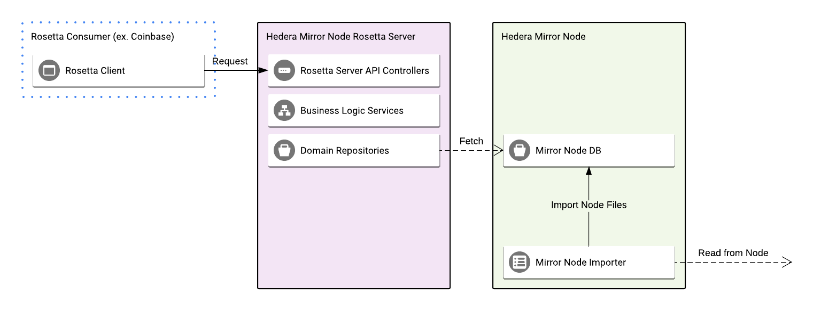

# Overview

The rosetta server is a REST API complying with the Rosetta API
Specification [Rosetta API Specification](https://www.rosetta-api.org/docs/welcome.html). This server enables
exchanges (ex. Coinbase) to be able to integrate and work with Hedera Hashgraph. The server is written in Golang and is
largely based on [rosetta-sdk-go](https://github.com/coinbase/rosetta-sdk-go). Its main job is to respond to the Rosetta
Specified requests, to the extent allowed by Hedera, while fetching information from the mirror node database.

## Architecture


The server is largely based on [rosetta-sdk-go](https://github.com/coinbase/rosetta-sdk-go) provided by Rosetta. It
takes care of significant part of the entity model definitions and some of the API work. It assumes the request and
response models provided by Rosetta.

As General structure the Rosetta API server has 4 main components.

### Domain models

These are models internal to the system allowing for safe and easy serialization and passing off information. These are
ultimately converted to/from Rosetta models or are marshaled from Database records.

### Domain Repositories

These are repositories used for fetching data from the Mirror node database and Marshaling it into the Domain Models.
They are providing an abstraction into the persistence layer and allowing the Services to request the necessary data.

### Business Logic Services

These are services executing the business logic in response to the request from the client side applications. They make
use of the Repositories to gather the necessary domain models, convert them to the necessary Rosetta types and return
them back to the client.

### Rosetta API Controllers

These are structures coming out of the box with rosetta-sdk-go. These are handling the raw requests,
marshaling/unmarshaling the data and triggering the business logic services.

## Integration Tests

The Rosetta module supports integration tests that can be run against deployed instances

### Postman API Tests

[Postmans](https://www.postman.com/) [Newman](https://learning.postman.com/docs/running-collections/using-newman-cli/command-line-integration-with-newman/)
command-line collection runner is utilized for easy configuration and sharing.

#### Install Postman newman CLI

```shell
npm install -g newman
```

#### Test Configuration

Configuration properties are set in
the [hedera_network.postman_environment.json](../hedera-mirror-rosetta/scripts/validation/postman/hedera_network.postman_environment.json)
file. Available properties include:

- `network_domain` - The network https domain url e.g. `http://localhost:5700`

#### Run Rosetta Postman API Tests

Tests can be run using the `newman run <collectionFile>` command.

```shell
newman run mirror-rosetta-api-tests.postman_collection.json -e hedera_network.postman_environment.json
```
