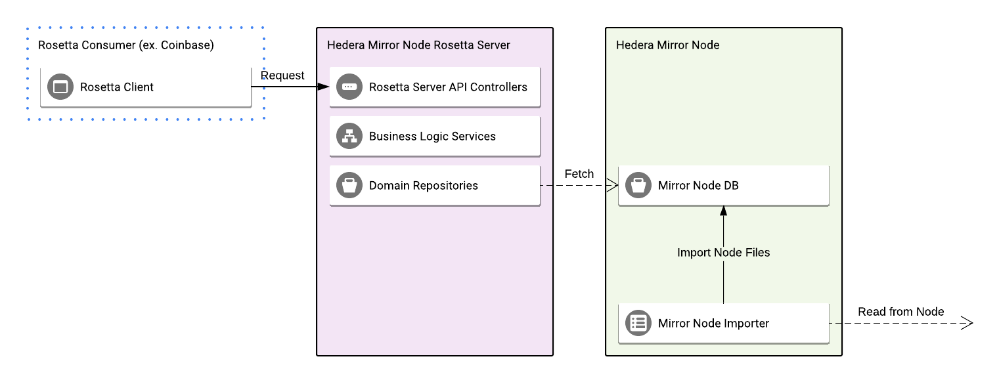

# Rosetta API

## Overview

The Rosetta API is a REST API complying with
the [Rosetta API Specification](https://www.rosetta-api.org/docs/welcome.html) with a focus on blockchain data
integration. This server enables exchanges to be able to integrate and work with the Hedera Hashgraph network. The
server is written in Golang and is largely based on the [rosetta-sdk-go](https://github.com/coinbase/rosetta-sdk-go).
Its main job is to respond to Rosetta requests, to the extent allowed by Hedera, while fetching information from the
mirror node database.

## Architecture



The rosetta-sdk-go takes care of a significant part of the entity model definitions and API work. The rosetta API server
has four main components:

### Domain models

These are models internal to the system allowing for safe and easy serialization and passing off information. These are
ultimately converted to/from rosetta models or are marshaled from database records.

### Repositories

These are repositories used for fetching data from the mirror node database and marshaling it into the domain models.
They provide an abstraction from the persistence layer and allow the services to request the necessary data.

### Business Logic Services

These services execute business logic in response to requests from client applications. They make use of the
repositories to gather the necessary domain models, convert them to the rosetta types, and return them back to the
client.

### API Controllers

These are structures coming out of the box with rosetta-sdk-go. These handle the raw requests, marshaling/unmarshaling
the data, and triggering the business logic services.

## Getting Started

### Running Locally

The recommended way to run Rosetta locally is to use the all-in-one docker image. Below are the steps to build the image
for a Hedera mirror node release. Please replace the example release `v0.60.0` with the latest release from
our [releases page](https://github.com/hashgraph/hedera-mirror-node/releases).

1. Download the [Dockerfile](/hedera-mirror-rosetta/build/Dockerfile).

2. Run `docker build --build-arg GIT_REF=v0.60.0 -t hedera-mirror-rosetta:0.60.0 .`

Configure and run the server in online mode:

1. Follow the [guide](https://docs.hedera.com/guides/mirrornet/run-your-own-beta-mirror-node) to configure requester
   pays for Hedera testnet.

2. Set the desired configuration for both the [Importer](/docs/configuration.md#importer)
   and [Rosetta API](/docs/configuration.md#rosetta-api) in a new `application.yml` file to be mounted to the container.
   Alternatively, every property can be also be set via corresponding environment variables that can be passed to the
   container. For example, the YAML property `hedera.mirror.importer.startDate` can be set
   as `-e HEDERA_MIRROR_IMPORTER_STARTDATE=1970-01-01T01:01:00Z`.

3. Set `hedera.mirror.importer.startDate` to 15 minutes before UTC now and zero the seconds, for example, if UTC now is
   `2021-12-06T15:25:20Z`, startDate should set to `2021-12-06T15:10:00Z`. Setting `startDate` properly can make the
   importer get the genesis account balance file faster.

4. To automatically restore the embedded PostgreSQL database to a particular database snapshot, pass a URL to a backup
   file via `-e RESTORE=https://example.com/db.tar`. The database dump should be in the format specified in
   the [backup](/docs/database/README.md#backup) section of the database upgrade documentation. The container database should
   be empty otherwise the restore process will be skipped.

5. To use custom passwords for the database owner (used by importer) and the rosetta user (used by rosetta server), set
   env variables `OWNER_PASSWORD` and `ROSETTA_PASSWORD` accordingly.

6. Run the server from the all-in-one docker image with the appropriate `NETWORK` specified:

```shell
docker run -d -e MODE=online -e NETWORK=testnet \
  -v ${PWD}/application.yml:/app/importer/application.yml \
  -p 5432:5432 -p 5700:5700 hedera-mirror-rosetta:0.60.0
```

The server should be reachable at http://localhost:5700. Note the server can also run in offline mode by
passing `-e MODE=offline`.

Before running any tests, we need to make sure the server has ingested the genesis balance file and the genesis block.
This can be done using the shell
script [wait-for-mirror-node.sh](/hedera-mirror-rosetta/scripts/wait-for-mirror-node.sh). The script will report that
mirror node syncing has started when the genesis information is available.

A sample [configuration file](/hedera-mirror-rosetta/scripts/validation/testnet/validation.json) is provided to run
rosetta-cli tests. Please refer to [the official guide](https://docs.cloud.coinbase.com/rosetta/docs/configuration-file)
for the options.

You can run the rosetta-cli `check:data` command as is. The data configuration section is set with `"start_index": 1`
to work around the known `rosetta-cli` performance issue of loading large genesis account balance file.

#### Genesis Balance File

As an alternative, run the [script](/hedera-mirror-rosetta/scripts/validation/get-genesis-balance.sh) script to get the
genesis account balance file.

The `get-genesis-balance.sh` script takes the following form

`./get-genesis-balance.sh <network> <account_limit> <transfer_window_ns>`

- `network` - The Hedera network to validate against. Options include `demo` or `testnet` with a default of `demo`
- `account_limit` - The max number of accounts to list in the file. Default is 20.
- `transfer_window_ns` - The additional ns duration added to the `starting_timestamp` to search for accounts when an
  account limit is used. Default is 1 week i.e. 604800000000000 ns

Once the `get-genesis-balance.sh testnet` command is executed, it'll write the file
to `testnet/data_genesis_balances.json`. Note the script uses PostgreSQL's command line client psql to query the
database for genesis account balance information, so please install psql beforehand.

#### check:data

In order to run the rosetta-cli `check:data` command, run the following after obtaining the `data_genesis_balances.json`
file.

`./run-validation.sh testnet data`

#### check:construction

In order to run the rosetta-cli `check:construction` command with the DSL spec in `testnet`/`testnet.ros`, you need two
testnet accounts with the private keys and set `prefunded_accounts` in `testnet/validation.json` as follows:

```json
{
  "construction": {
    "prefunded_accounts": [
      {
        "privkey": "key1",
        "account_identifier": {
          "address": "0.0.xxx"
        },
        "curve_type": "edwards25519",
        "currency": {
          "symbol": "HBAR",
          "decimals": 8,
          "metadata": {
            "issuer": "Hedera"
          }
        }
      },
      {
        "privkey": "key2",
        "account_identifier": {
          "address": "0.0.yyy"
        },
        "curve_type": "edwards25519",
        "currency": {
          "symbol": "HBAR",
          "decimals": 8,
          "metadata": {
            "issuer": "Hedera"
          }
        }
      }
    ]
  }
}
```

Note you can follow the [account creation guide](https://help.hedera.com/hc/en-us/articles/360000664678) to get testnet
accounts.

After updating the `validation.json` file run

`./run-validation.sh testnet construction`

## Acceptance Tests

The Rosetta API uses [Postman](https://www.postman.com) tests to verify proper operation. The
[Newman](https://learning.postman.com/docs/running-collections/using-newman-cli/command-line-integration-with-newman)
command-line collection runner is used to execute the tests against a remote server. To use newman, either the
executable binary or Docker approach can be used. With either approach, a `base_url` variable can be supplied to
customize the target server.

### Executable

First ensure newman is installed locally using `npm`, then execute `newman`.

```shell
npm install -g newman
newman run charts/hedera-mirror-rosetta/postman.json --env-var base_url=https://previewnet.mirrornode.hedera.com/rosetta
```

### Docker

```shell
docker run --rm -v "${PWD}/charts/hedera-mirror-rosetta/postman.json:/tmp/postman.json" -t postman/newman run /tmp/postman.json --env-var base_url=https://previewnet.mirrornode.hedera.com/rosetta
```

_Note:_ To test against an instance running on the same machine as Docker use your local IP instead of 127.0.0.1.

## Data Retention

Data retention is disabled in the rosetta docker image with the following defaults:

```shell
export DATA_RETENTION_BATCHPERIOD=1d
export DATA_RETENTION_ENABLED=false
export DATA_RETENTION_FREQUENCY=7d
export DATA_RETENTION_PERIOD=90d
```

The configuration can be overridden when creating the rosetta container, for example, to enable it and set the
retention period to 30 days,

```shell
docker run -d -e MODE=online -e NETWORK=testnet \
  -e DATA_RETENTION_ENABLED=true -e DATA_RETENTION_PERIOD=30d \
  -p 5432:5432 -p 5700:5700 hedera-mirror-rosetta:0.60.0
```
