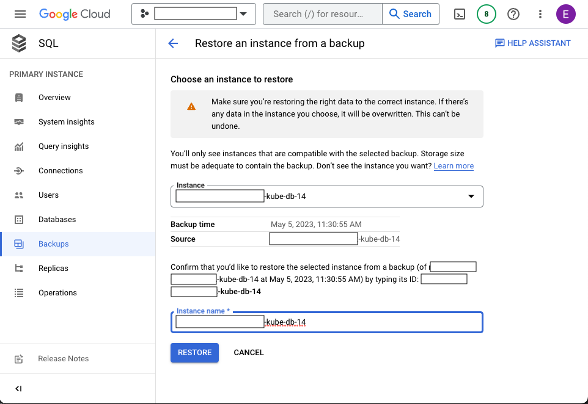

# Restore Importer database from a backup

## Problem

Consensus nodes have produced invalid data and the Importer has persisted the data. Restore the database to a previous point in time where the data was valid. The Importer will then read the corrected record stream files and persist the corrected data. 

## Setup
* Set the kubectl context to the correct cluster and namespace. 
* In a multicluster environment, perform these steps on one cluster (testnet-eu) in full before performing them on the other cluster (testnet-na).


## Procedure

1. Shut down the Monitor to stop the load balancer from routing requests to the cluster.
    
    ```shell
    kubectl scale --replicas=0 deployment/mirror-monitor
    ```  

2. Shut down the Importer pod while monitoring the Importer logs.

   ```shell
   kubectl scale --replicas=0 deployment/mirror-importer
   ```

   The Importer logs show the shutdown and the last processed record file: 
   ```shell
   [pod/mirror-importer-54c477748d-mmxhm/importer] 2023-05-10T10:38:31.723-0600 INFO scheduling-3 c.h.m.i.p.r.RecordFileParser Successfully processed 174 items from 2023-05-10T16_38_28.618260003Z.rcd.gz in 23.11 ms
   [pod/mirror-importer-54c477748d-mmxhm/importer] 2023-05-10T10:38:31.896-0600 INFO Thread-6 c.h.m.i.u.ShutdownHelper Shutting down.......waiting 10s for internal processes to stop.
   ```

3. Verify that the Importer has stopped persisting data by querying the REST API multiple times. The block `number` and record file `name` should stop on the last processed record file:

   ```shell
    curl "https://<mirror-rest-ingress>/api/v1/blocks?limit=1" | json_pp | grep -E "name|number"
   
    "name" : "2023-05-10T16_38_28.618260003Z.rcd.gz",
    "number" : 820492,
   ``` 

4. In the Google Console, restore the database from the backup. Restore to a backup that was created before the invalid data was persisted. 

&nbsp;&nbsp;&nbsp;&nbsp;&nbsp;&nbsp;&nbsp;&nbsp;[](backup1.png "Google Cloud Backups")
[](backup2.png "Restore from Backup")

5. After the Restore process has completed verify that the database has been restored to a prior point in time.

   ```shell
   mirror_node=> select max(consensus_end) from record_file;
    1683300509619621003      --> Friday, May 5, 2023 15:28:29.619
   ```

6. Restart all pods to clear their cache. The command below will delete all pods in the current namespace.
 
   ```shell
   kubectl delete --all pods
   
   pod "mirror-graphql-7784c9f798-c4zzj" deleted
   pod "mirror-graphql-7784c9f798-f7q8f" deleted
   pod "mirror-grpc-68c794678d-n7xk5" deleted
   pod "mirror-grpc-68c794678d-pkkqj" deleted
   pod "mirror-rest-64fb7f4fb7-7dclv" deleted
   pod "mirror-rest-64fb7f4fb7-lf4st" deleted
   pod "mirror-rest-monitor-cdb8b4fcd-fkc54" deleted
   pod "mirror-rosetta-6d4f6b798f-bs7vb" deleted
   pod "mirror-rosetta-6d4f6b798f-hjhjf" deleted
   pod "mirror-web3-7b5444dcb7-lhr5c" deleted
   pod "mirror-web3-7b5444dcb7-ps45v" deleted
    ```

7. Restart the Importer Pod.

   ```shell
   kubectl scale --replicas=1 deployment/mirror-importer
   ```

8. Verify that the Importer is running and processing record files. The log should show the Importer beginning from the last process record file from the restored database.

   ```shell
   [pod/mirror-importer-54c477748d-9kdxr/importer] 2023-05-10T11:04:40.766-0600 INFO main c.h.m.i.MirrorImporterApplication Started MirrorImporterApplication in 16.723 seconds (JVM running for 18.504)
   [pod/mirror-importer-54c477748d-9kdxr/importer] 2023-05-10T11:04:40.945-0600 INFO scheduling-4 c.h.m.i.c.MirrorDateRangePropertiesProcessor RECORD: downloader will download files in time range (2023-05-05T15:28:28.044896003Z, 2262-04-11T23:47:16.854775807Z]
   [pod/mirror-importer-54c477748d-9kdxr/importer] 2023-05-10T11:04:40.945-0600 INFO scheduling-3 c.h.m.i.c.MirrorDateRangePropertiesProcessor BALANCE: downloader will download files in time range (2023-05-05T15:15:00.168045Z, 2262-04-11T23:47:16.854775807Z]
   ```
   
8. Start the Monitor. 

    ```shell
    kubectl scale --replicas=1 deployment/mirror-monitor
    ```
     
9. Verify that traffic is being routed to the cluster. Query the REST API and verify that the Importer is processing record files again and that the `name` of the record file and the block `number` are at a point in time prior to the date of the invalid data.
    
      ```shell
      curl "https://dev.mirrornode.hedera-ops.com/api/v1/blocks?limit=1" | json_pp | grep -E "name|number"
   
      "name" : "2023-05-07T06_25_08.284136003Z.rcd.gz",
      "number" : 672492,
      ```

  10. Perform these steps on the other cluster.