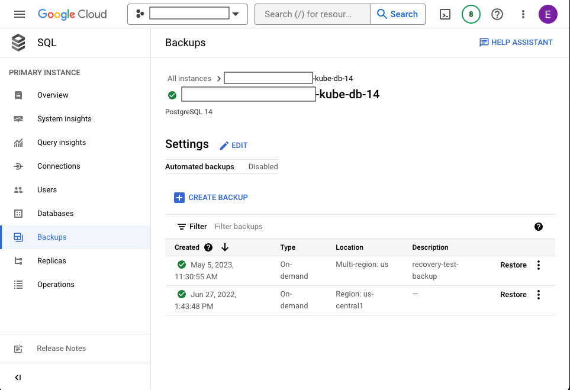

# Restore Importer database from a backup

## Problem

Consensus nodes have produced invalid data and the Importer has persisted the data. Restore the database to a previous point in time where the data was valid. The Importer will then read the corrected record stream files and persist the corrected data. 

## Setup
* Set the kubectl context to the correct cluster and namespace. 
* In a multicluster environment, perform these steps on one cluster (testnet-eu) in full before performing them on the other cluster (testnet-na).


## Procedure

1. Shut down the Monitor to stop the load balancer from routing requests to the cluster.
    
    ```shell
    kubectl scale --replicas=0 deployment/mirror-monitor
    ```  

2. Shut down the Importer pod while monitoring the Importer logs.

   ```shell
   kubectl scale --replicas=0 deployment/mirror-importer
   ```

   The Importer logs show the shutdown and the last processed record file: 
   ```shell
   [pod/mirror-importer-54c477748d-mmxhm/importer] 2023-05-10T10:38:31.723-0600 INFO scheduling-3 c.h.m.i.p.r.RecordFileParser Successfully processed 174 items from 2023-05-10T16_38_28.618260003Z.rcd.gz in 23.11 ms
   [pod/mirror-importer-54c477748d-mmxhm/importer] 2023-05-10T10:38:31.896-0600 INFO Thread-6 c.h.m.i.u.ShutdownHelper Shutting down.......waiting 10s for internal processes to stop.
   ```

3. Verify that the Importer has stopped persisting data by querying the REST API multiple times. The record file name should stop changing and show the name of the last processed record file:

   ```shell
    curl -sL "https://<hostname>/api/v1/blocks?limit=1&order=desc" | jq -r '.blocks[0].name'
    2023-05-10T16_38_28.618260003Z.rcd.gz
   ``` 
4. In the Google Console, click on the database replica and note all the values in the <i>Configuration</i> section and the IP in the <i>Connect to this instance</i> section. It may be helpful to take a screenshot of the values and to click Edit and view every section in detail as the values will be used to recreate the Replica in step 8. 

&nbsp;&nbsp;&nbsp;&nbsp;&nbsp;&nbsp;&nbsp;&nbsp;[](replicaConfig.png "Google Cloud Replica Config")   

&nbsp;&nbsp;&nbsp;&nbsp;Here is a list of the values in particular that will be needed to recreate the Replica:
- IP - Note the IP. If it is not the same after the Replica is recreated than any config using the old IP will need to be updated.
- Region
- Machine Type: vCPUs and Memory
- Connections (Public IP checked or unchecked)
- Data Protection: (Enable deletion protection checked or unchecked)
- Flags: Each flags and its value
- Query Insights (Values for each of the checkboxes)
- Labels

5. In the Google Console Delete the Replica by clicking the Delete button at the top of the page and then confirming the deletion in the next window.

[](deleteReplica1.png "Google Cloud Replica Delete part 1")
[](deleteReplica2.png "Google Cloud Replica Delete part 2")

6. In the Google Console, restore the database from the backup. Restore to a backup that was created before the invalid data was persisted. 

[](backup1.png "Google Cloud Backups")
[](backup2.png "Restore from Backup")

7. After the Restore process has completed verify that the database has been restored by running the command from step 3, it should show that the record file is now at a point in time prior to the invalid data.

8. Create the Replica with the values from step 4. 

9. Restart all pods to clear their cache. The command below will delete all pods in the current namespace.
 
   ```shell
   kubectl delete --all pods
   
   pod "mirror-graphql-7784c9f798-c4zzj" deleted
   pod "mirror-graphql-7784c9f798-f7q8f" deleted
   pod "mirror-grpc-68c794678d-n7xk5" deleted
   pod "mirror-grpc-68c794678d-pkkqj" deleted
   pod "mirror-rest-64fb7f4fb7-7dclv" deleted
   pod "mirror-rest-64fb7f4fb7-lf4st" deleted
   pod "mirror-rest-monitor-cdb8b4fcd-fkc54" deleted
   pod "mirror-rosetta-6d4f6b798f-bs7vb" deleted
   pod "mirror-rosetta-6d4f6b798f-hjhjf" deleted
   pod "mirror-web3-7b5444dcb7-lhr5c" deleted
   pod "mirror-web3-7b5444dcb7-ps45v" deleted
    ```

10. Restart the Importer pod.

   ```shell
   kubectl scale --replicas=1 deployment/mirror-importer
   ```

11. Verify that the Importer is running and processing record files. The log should show the Importer beginning from the last process record file from the restored database.

   ```shell
   [pod/mirror-importer-54c477748d-9kdxr/importer] 2023-05-10T11:04:40.766-0600 INFO main c.h.m.i.MirrorImporterApplication Started MirrorImporterApplication in 16.723 seconds (JVM running for 18.504)
   [pod/mirror-importer-54c477748d-9kdxr/importer] 2023-05-10T11:04:40.945-0600 INFO scheduling-4 c.h.m.i.c.MirrorDateRangePropertiesProcessor RECORD: downloader will download files in time range (2023-05-05T15:28:28.044896003Z, 2262-04-11T23:47:16.854775807Z]
   [pod/mirror-importer-54c477748d-9kdxr/importer] 2023-05-10T11:04:40.945-0600 INFO scheduling-3 c.h.m.i.c.MirrorDateRangePropertiesProcessor BALANCE: downloader will download files in time range (2023-05-05T15:15:00.168045Z, 2262-04-11T23:47:16.854775807Z]
   ```
   
12. Start the Monitor. 

    ```shell
    kubectl scale --replicas=1 deployment/mirror-monitor
    ```

13. Watch the logs of the REST pods while querying the REST API multiple times. 

- Verify that traffic is being routed to the cluster by looking at the pod names in the logs.
- Verify that the record file is at a point in time prior to the date of the invalid data.


   This can be setup in three terminals:

   13.1. In terminal 1 initiate port forwarding to the REST service:
   ```shell
   kubectl port-forward service/mirror-rest 8080:80   
   ```
   13.2. In terminal 2 output the REST logs:
   ```shell
   kubectl logs -f --prefix -l app.kubernetes.io/name=rest
   ```
   13.3. In terminal 3 query the REST API multiple times through the port forward:
   ```shell
   curl -sL "http://localhost:8080/api/v1/blocks?limit=1&order=desc" | jq -r '.blocks[0].name'
   2023-05-05T15_35_28.044896003Z.rcd.gz
   ```

   The logs in terminal 2 should show the traffic being routed to the REST pods: 
   ```shell
   [pod/mirror-rest-bb68f656-h8vhv/rest] 2023-05-10T11:01:24.827Z INFO 1ad53fb6 ::ffff:127.0.0.1 GET /api/v1/blocks?limit=1&order=desc in 3 ms: 200
   [pod/mirror-rest-bb68f656-rwdx9/rest] 2023-05-10T11:01:25.433Z INFO ad06c293 ::ffff:127.0.0.1 GET /api/v1/blocks?limit=1&order=desc in 3 ms: 200
   [pod/mirror-rest-bb68f656-rwdx9/rest] 2023-05-10T11:01:26.063Z INFO 83d6cafe ::ffff:127.0.0.1 GET /api/v1/blocks?limit=1&order=desc in 2 ms: 200
   ```

14. Perform these steps on the other cluster.