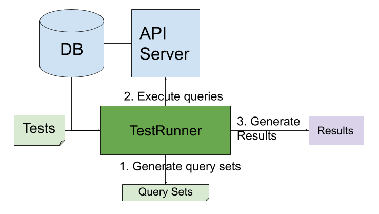
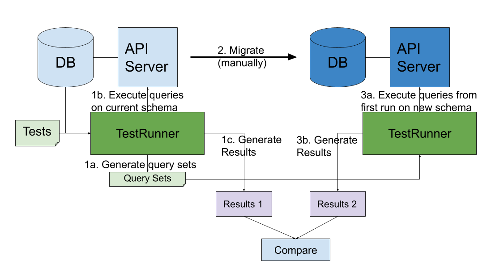

# Testing

## REST API performance testing

To run REST API performance tests against an existing set of database and REST server, follow the steps below. To setup
a database and a REST server for testing purpose, see `Setup Postgres and REST Server` section below. \
_All steps below are assuming `hedera-mirror-rest/` is working directory._

1. Configure database, REST server, and other configurations in `__performancetests__/perfTestConfig.yml`.
   See `configuration` section below for more details.
2. Setup tests in `__performancetests__/tests.yml`. \
   (Optional, needed only when running custom tests)
3. Run perf test `npm run perftest`.

Code for REST API performance tests is in `hedera-mirror-rest/__performancetests__/`.

### Configuration

Configure database, REST server, etc in `__performancetests__/perfTestConfig.yml`. It supports following configurations.

| Name                           | Default                     | Description                                                                                                                                                           |
| ------------------------------ | --------------------------- | --------------------------------------------------------------------------------------------------------------------------------------------------------------------- |
| `hedera.mirror.rest.db.host`        | 127.0.0.1                   | The IP or hostname used to connect to the database                                                                                                                    |
| `hedera.mirror.rest.db.port`        | 5432                        | The port used to connect to the database                                                                                                                              |
| `hedera.mirror.rest.db.name`        | mirror_node                 | The name of the database                                                                                                                                              |
| `hedera.mirror.rest.db.password`    | mirror_api_pass             | The database password REST Server uses to connect                                                                                                                     |
| `hedera.mirror.rest.db.username`    | mirror_api                  | The username REST Server uses to connect to the database                                                                                                              |
| `hedera.mirror.rest.apiServer`      | 127.0.0.1:5551              | `host:port` of REST server to send queries                                                                                                                            |
| `hedera.mirror.rest.querySetsFile`  | /tmp/perftest/querySets.yml | File containing query sets. If it does not exist, new query sets will be generated and written to the file. If it exists, then query sets from the file will be used. |
| `hedera.mirror.rest.resultsDir`     | /tmp/perftest/              | Dir to output results. Result files will be named `apiResults-<timestamp>.yml`.                                                                                       |

### Tests

Tests definitions are in `__performancetests__/tests.yml`.
Tests are specified in following format

```yaml
- name: "transactions - unique account id "
  query: "/transactions?result=success&type=credit&order=asc"
  filterAxis: ACCOUNTID
  idAxis: TOKENID
  count: 1
  rangeNumAccounts: 100
```

Where

-   `name` is user defined name for the test
-   `query` is any arbitrary REST query. \
    It should NOT include `http://host:port/api/v1` as prefix. It should also NOT include param set by `filterAxis`.
-   `filterAxis` is primary axis to filter results based on query params. It can have one of the four values.  Either it or `idAxis` are required:
    -   `ACCOUNTID`: Sets `account.id` param. Values for this param are sampled from `entity_num` column in `t_entities`.
    -   `CONSENSUS_TIMESTAMP`: Sets `timestamp` param. Values for this param are sampled from `consensus_ns` column in
        `transaction`.
    -   `BALANCE`: Sets `account.balance` param. Values for this param are sampled from `balance` column in
        `account_balance`.
    -   `TOKENID`: Sets `token.id` param. Values for this param are sampled from `token_id` column in `token`.
-   `idAxis` is the primary axis to filter results based on ids in the query path (e.g. `/tokens/{id}`).  It can have one of two values.
    Either it or `filterAxis` are required.
    -   `ACCOUNTID`: id values will be sampled from `entity_num` column in `t_entities`.
    -   `TOKENID`: id values will be sampled from `token_id` column in `token`.
-   `count`: Number of values to sample for the param which will be set based on `filterAxis`. If `multiple` is false or not set, this also represents
    the number of queries that will be in the query set generated by this test.
-   `multipleFilters` is whether multiple values should be used for the test (eg. account.id=1&account.id=2)
-   `numberOfQueries` is the number of queries to put in the query set when `multipleFilters` is true
-   `range*`: If not set, or for `idAxis` tests, queries will be point lookups on the `filterAxis` or `idAxis` (for eg. `account.id=123`).
    If set, queries will be range lookups on the `filterAxis` (for eg.
    `timestamp=gt:1577909471.335876000&timestamp=lt:1577909571.335876000`). The value used for `lt:` is sampled from the
    database, and the one used for `gt:` is calculated as `sample + range*`. \
    Name depends on value of `filterAxis`.

    | `filterAxis`          | Name                 |
    | --------------------- | -------------------- |
    | `ACCOUNTID`           | `rangeNumAccounts`   |
    | `CONSENSUS_TIMESTAMP` | `rangeDurationNanos` |
    | `BALANCE`             | `rangeTinyHbars`     |
    | `TOKENID`             | `rangeNumTokens`     |

#### Query Sets

For each test in `tests.yml`, values will be sampled from database based on its `filterAxis` or its `idAxis` to generate query sets.
For example, the query set generated for above test definition is

```yaml
 - name: transactions - account ids range (100)
    query: >-
      /transactions?result=success&type=credit&order=asc&account.id=gt:%s&account.id=lt:%s
    paramValues:
      - - '5233'
        - '5333'
      - - '5103'
        - '5203'
      - - '7094'
        - '7194'
```

### Setup Postgres and REST Server

Follow steps in [Installation](./installation.md) to start a local Postgres database and REST server. \
Then follow the steps in [Data Generator](./../hedera-mirror-datagenerator/docs/README.md) to load test data into the
database.

### How test works

Perf test works as follows:

1. Get or build query sets: If file specified by `hedera.mirror.rest.querySetsFile` exists, then the query sets in the given
   file are used. Otherwise, new query sets are generated using `__performancetests__/tests.yaml` and by sampling data
   from the database. Newly generated query sets are also written out to the file specified in the config value so they
   can be reused in AB testing (for eg. Migration testing as explained in next section).
2. Queries in query set are sent to the REST server and stats like execution time, response size are collected.
3. When all queries have finished executing, results are written to the console and file (if `hedera.mirror.rest.resultsDir`
   is set).



### Migration testing

When migrating schema, test performance changes using steps below.

1. Run performance tests on current schema (follow steps in "REST API performance testing" section).
2. Migrate the schema manually.
3. Run performance tests on new schema (follow the steps in "REST API performance testing" section).
   Use `hedera.mirror.rest.querySetsFile` configuration to ensure that query sets generated in first run are used in this
   second run too.
4. Compare the results manually.


