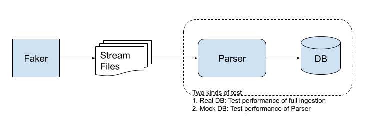

# Faker : Fake Data Generator

Faker is a tool for generating fake data for Mirror Node.
Currently, it can generate following kinds of data:

-   Entities
-   Transactions
    -   Crypto: CRYPTOCREATEACCOUNT, CRYPTOUPDATEACCOUNT, CRYPTOTRANSFER, CRYPTODELETE
    -   Files: FILECREATE, FILEAPPEND, FILEUPDATE, FILEDELETE
-   Account balances

Generating and loading data into PostgreSQL is a two step process.

1. Generate and write data to CSV files.
2. Load CSV files into Postgres using COPY command.


## Running

```bash
./faker/run.sh
```

Using custom Postgres:

```bash
./faker/run.sh -pgh HOST -pgp PORT -pgu USERNAME -pgw PASSWORD -pgd DBNAME
```

To import pre-generated data, add `--import-dir DIR` arg.

## Configuration

Faker is highly configurable. It exposes many configurations which can be tweaked to control fake data's
generation and characteristics.

Faker uses [Spring Boot](https://spring.io/projects/spring-boot) properties. As as a result, you can use properties
files, YAML files, environment variables and command-line arguments to supply configuration. See the Spring Boot
[documentation](https://docs.spring.io/spring-boot/docs/current/reference/html/spring-boot-features.html#boot-features-external-config)
for the location and order it loads configuration.

Base configuration file is `src/main/java/resources/application.yml`.

##### Types of configuration

Configurations will be of one of the following types:

-   Java primitives: int, long, string, boolean, etc
-   NumberDistribution: This configuration allows specifying a numerical distribution rather than a fixed value.
    Supported distribution types are:

    -   Constant: Configure using \
        `<configuration name>:constant: value` \
        When collecting samples, all values will be the given `value`.
    -   Range: Configure using \
        `<configuration name>:rangeMin: minValue` \
        `<configuration name>:rangeMax: maxValue` \
        When collecting samples from this distribution, a random value between `[minValue, maxValue)` will be returned.
    -   Frequency: Configure using \
        `<configuration name>:frequence[n1]: f1` \
        `<configuration name>:frequence[n2]: f2` \
        `.....` \
        When collecting samples from this distribution, `n1` will be returned `f1/(f1+f2...)` times, `n2` will be
        returned `f2/(f1+f2+...)` times, and so on. \

#### Database configurations

| Name                           | Default          | Description                                            |
| ------------------------------ | ---------------- | ------------------------------------------------------ |
| `hedera.mirror.db.host`        | 127.0.0.1        | The IP or hostname used to connect to the database     |
| `hedera.mirror.db.port`        | 5432             | The port used to connect to the database               |
| `hedera.mirror.db.name`        | mirror_node      | The name of the database                               |
| `hedera.mirror.db.username`    | mirror_node      | The username the faker uses to connect to the database |
| `hedera.mirror.db.password`    | mirror_node_pass | The database password the faker uses to connect        |
| `hedera.mirror.db.apiPassword` | mirror_api_pass  | The database password the API uses to connect          |
| `hedera.mirror.db.apiUsername` | mirror_api       | The username the API uses to connect to the database   |

#### Faker configurations

| Name                                          | Type               | Default                          | Description                                                                                                                                                                                                                         |
| --------------------------------------------- | ------------------ | -------------------------------- | ----------------------------------------------------------------------------------------------------------------------------------------------------------------------------------------------------------------------------------- |
| `faker.startTimeSec`                          | long               | `Instant.now().getEpochSecond()` | Transactions' consensus time will start from this Instant                                                                                                                                                                           |
| `faker.totalDuration`                         | Duration           | 1d                               | Transactions for given time duration are generated                                                                                                                                                                                  |
| `faker.transactionsPerSecond`                 | NumberDistribution | rangeMin: 3 rangeMax: 8          | Number of transactions to generate per second                                                                                                                                                                                       |
|                                               |                    |                                  |                                                                                                                                                                                                                                     |
| **Configure Crypto transactions**             |                    |                                  |                                                                                                                                                                                                                                     |
| `faker.transaction.crypto.frequency`          | int                | 990                              | Relative frequency of crypto transactions w.r.t all transactions                                                                                                                                                                    |
| `faker.transaction.crypto.numSeedAccounts`    | int                | 10000                            | When generating transactions, first 'numSeedAccounts' number of transactions will be of type CRYPTOCREATEACCOUNT only. This is to seed the system with some accounts so crypto transfer lists can sample receiver accounts ids      |
| `faker.transaction.crypto.numTransferLists`   | NumberDistribution | rangeMin: 1, rangeMax: 10        | Distribution to sample number of crypto transfers to populate in a CRYPTOTRANSFER transaction                                                                                                                                       |
| Configure distribution of Crypto transactions |                    |                                  |                                                                                                                                                                                                                                     |
| `faker.transaction.crypto.createsFrequency`   | int                | 10                               | Relative frequency of CREATECRYPTOACCOUNT transactions w.r.t all crypto transactions                                                                                                                                                |
| `faker.transaction.crypto.transfersFrequency` | int                | 988                              | Relative frequency of CRYPTOTRANSFER transactions w.r.t all crypto transactions                                                                                                                                                     |
| `faker.transaction.crypto.updatesFrequency`   | int                | 1                                | Relative frequency of CRYPTOUPDATEACCOUNT transactions w.r.t all crypto transactions                                                                                                                                                |
| `faker.transaction.crypto.deletesFrequency`   | int                | 1                                | Relative frequency of CRYPTODELETE transactions w.r.t all crypto transactions                                                                                                                                                       |
|                                               |                    |                                  |                                                                                                                                                                                                                                     |
| **Configure File transactions**               |                    |                                  |                                                                                                                                                                                                                                     |
| `faker.transaction.file.frequency`            | int                | 10                               | Relative frequency of file transactions w.r.t all transactions                                                                                                                                                                      |
| `faker.transaction.file.numSeedFiles`         | int                | 1000                             | When generating transactions, first 'numSeedFiles' number of transactions will be of type FILECREATE only. This is to seed the system with some files so that file append/update/delete transactions have valid files to operate on |
| `faker.transaction.file.fileDataSize`         | NumberDistribution | rangeMin: 0 rangeMax: 5000       | Distribution to sample `fileData` size. Used for all file transactions                                                                                                                                                              |
| Configure distribution of File transactions   |                    |                                  |                                                                                                                                                                                                                                     |
| `faker.transaction.file.createsFrequency`     | int                | 800                              | Relative frequency of FILECREATE transactions w.r.t all file transactions                                                                                                                                                           |
| `faker.transaction.file.appendsFrequency`     | int                | 100                              | Relative frequency of FILEAPPEND transactions w.r.t all file transactions                                                                                                                                                           |
| `faker.transaction.file.updatesFrequency`     | int                | 80                               | Relative frequency of FILEUPDATE transactions w.r.t all file transactions                                                                                                                                                           |
| `faker.transaction.file.deletesFrequency`     | int                | 20                               | Relative frequency of FILEDELETE transactions w.r.t all file transactions                                                                                                                                                           |

## Java package hierarchy

Faker's data generation logic lives in `src/main/java/com/hedera/faker`. \
Package structure is as follows:

-   `com.hedera.faker.domain`: Generates fake data at `com.hedera.mirror.domain` abstraction so that data can be directly
    loaded into Postgres database.
    -   `DomainDriver.run()` contains top-level control logic.
    -   `com.hedera.faker.domain.generators`: Generators for fake transactions and entities.
    -   `com.hedera.faker.domain.writer`: `DomainWriter` interface to output generated fake data. `PostgresCSVDomainWriter`
        implementations of it writes fake data into CSV files. If needed in future, one can implement a writer to directly
        load data into Postgres tables.
-   `com.hedera.faker.common`: Code independent of `com.hedera.mirror.domain` so that it can be shared in future with
    streams data generator which will be at abstraction of `com.hederahashgraph.api.proto.java`.
-   `com.hedera.faker.sampling`: Various sampling distributions to help mimic real world data better.

## Future tasks

-   Generate failed transactions too. (minor)
-   Add contract transactions. (medium)
-   Mirror node streams : Generate fake streams' files to test Parser's performance. (major)
    
-   Simulation: Generate fake stream data in realtime to test Parser's steady-state performance. (major)
